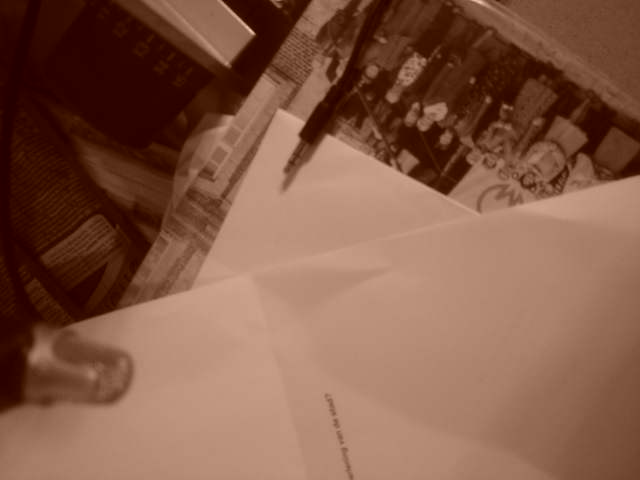
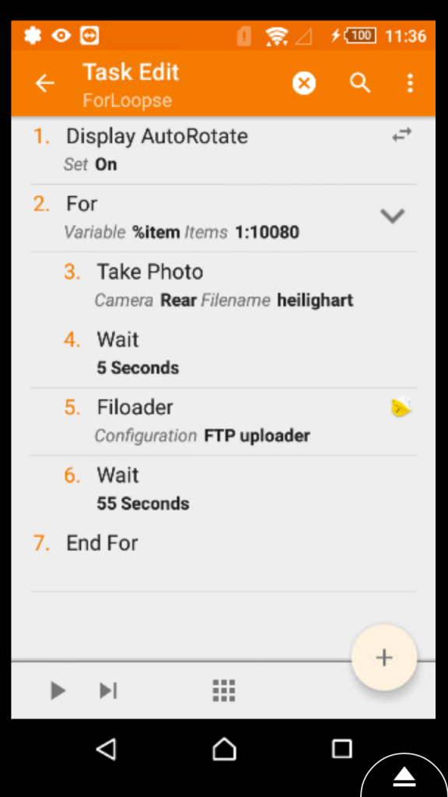

In [vorige berichten](/blog/live-uitzending-van-de-heilige-mis-proef-geslaagd/) kon je lezen hoe we in onze kerk een camera installeerden (eigenlijk een oude gsm) om de eucharistie via facebook uit te zenden. Vermits die camera er nu toch hangt, loopt hij de rest van de tijd als webcam. Op onderstaande pagina kan je 24/7 kijken wat er in de kerk gaande is. Meestal zal je merken dat het er stil is, want de kerk is door de week niet open. Toch laat de webcam je toe even een blik te werpen op het tabernakel, rechts bovenaan in beeld, en wie weet, werpt Hij wel een blik terug ;)

 

Technisch was het even zoeken om de webcam aan de praat te krijgen. Als je zoekt op internet is er voor Android maar één min of meer fatsoenlijke app om van je telefoon een webcam te maken: [IP Webcam](https://play.google.com/store/apps/details?id=com.pas.webcam&hl=nl). Die laat je toe om video te _streamen_, maar dat wil ik eigenlijk niet. Dat zou immers betekenen dat iedereen die wil kijken mijn gsm als server gaat gebruiken en dat ik daarvoor de router van ons lokaal netwerk moet openstellen en van een vaste domeinnaam voorzien. Allemaal veel te complex.

Omdat we de belangrijke gebeurtenissen toch al streamen is het voor de webcam voldoende als die om de minuut of zo een beeldje schiet. Daarvoor heb ik geen app gevonden, maar met Tasker kan je dat zelf programmeren. Elke minuut maakt mijn programmaatje een foto en laadt die vervolgens met FTP op naar mijn webserver. Je kan die zien op onderstaande pagina. Met twee regels javascript wordt de foto om de vijf seconden herladen, zodat je steeds het meest recente beeld ziet.

Ik ga nu Tasker nog proberen leren het beeld _on hold_ te zetten als het te donker wordt, want dan krijg je alleen maar zwart en dat heeft ook geen zin. Tenzij we  natuurlijk een permanente spot op het tabernakel zouden voorzien :)



Mijn webcam-programma
