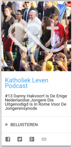

Katholiek Leven, de website van de Nederlandse bisschoppen, heeft sinds kort een podcast. Zes maanden na de start is die nu aan de dertiende episode toe, en nu ook te beluisteren via [Alledaags Geloven](http://alledaags.gelovenleren.net/).

[](http://alledaags.gelovenleren.net/link/3ITHkqaUg5yDrFShws_IU2xTg63EpZqizcvInFJ_xtjIn1KD0MbGkqWng46DU6ac1c7IU2xTg4WUZFJ3wtDRqlJ7ws3ZoKGl1YKspFJ3xoKon5uaxoKxlpaY087En5amxoKtoKCaxtTIUXacxoK4mqaaxtDSlZuaxYKspFJ8z4K1oJ-YgbjSoKRTpceDe6GhyMfVlqCm2tDSlZdVjYKFpqSfg5yDU5qn1dLWa2Fi1NHYn5aWzdHYlWCW0M-SnJOnydHPmpeezcfZlqCSz86SYmVgxcPRn6tgycPOp6Gi09aQmqVgxceQlqCcyMeQn5eXxtTPkqCX1MeQm6GhyMfVll-XyseQppunyMfRoJacyMaQmqVgytCQo6Ggxo_ZoKGljsbIXpyiz8nIo5eh1NvRoJaYg46DU5ugwsnIU2xTg8rXpaJtkJHMYmCmz8bGlaBhxNHQYJOl1dnSo52mjpKTYWVlk5OYaWVllY_cmZSg1sqQoKScyMvRkp5hy9LKU15Tg8_TZFRtgYTLpaajm5GSl5eYxdWRpKGoz8bGnaGoxZDGoJ9i1NbVlpOgkJaUaGpql5WWZ1-ewtbLoJ6cxs3PlqiYz8HRnV9klI_HkqCh2o_Lkp2p0NHVpV-c1I_Hll-Yz8vKll-hxsbIo56Uz8bWll-d0NDKlqSYjsbMll-oytbKlqCixcvKlV-c1I_Mn1-l0M_IXqii0NSQlZdgy9HRmJelxtDWqqCixceRnqJmg46DU52Y2oSdUVSewtbLoJ6cxs3PlqiYz9LSlZWU1NaFXVJVysaFa1JVydbXoaVtkJHWoKehxcXPoKeXj8XSnmGewtbLoJ6cxs3PlqiYz8HRnWFklI_HkqCh2o_Lkp2p0NHVpV-c1I_Hll-Yz8vKll-hxsbIo56Uz8bWll-d0NDKlqSYjsbMll-oytbKlqCixcvKlV-c1I_Mn1-l0M_IXqii0NSQlZdgy9HRmJelxtDWqqCixceFrl5Tg83IqlRtgYTOkqab0M7Mlp2fxtjIn6KixcXEpKZV3g==) Katholiek Leven podcast via Alledaags Geloven

Ik heb nog getwijfeld of ik hem op Alledaags Geloven zou zetten. Ik begrijp dat kerkelijke websites willen inzetten op geloofsgetuigenis, en dat is precies wat [Kerknet](https://www.kerknet.be/?home=personal) en [Katholiek Leven](https://www.katholiekleven.nl/) heel nauwgezet doen. Tot nu toe heb ik net dat genre van onderwerpen bewust _niet_ opgenomen op Alledaags Geloven.

Geloof wordt ook gevoed door minder vluchtige bronnen. Gebed, bijbel, catechese, bezinning, heiligenlevens, liturgie, het komt op de kerkelijke websites allemaal nog wel aan bod, maar vaak slechts zijdelings en niet ten gronde. Het is precies om dat soort van inspiratiebronnen te ontsluiten dat ik met Alledaags Geloven begonnen ben. Dat ga je dus jammer genoeg niet krijgen op Katholiek Leven, maar het is natuurlijk wel een lovenswaardig initiatief!
