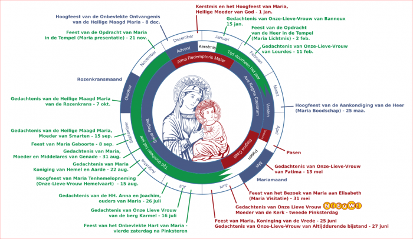

Bij het schrijven van het [artikel over maria-antifonen](/blog/heb-je-deze-week-al-mariaal-geantifoond/), dacht ik: kan dat niet aanschouwelijk worden voorgesteld? Van het een kwam het ander, en hier is een schema van de volledige liturgische jaarcyclus, met aanduiding van de periodes waarin de verschillende maria-antifonen worden gezongen, alsook de belangrijkste mariafeesten.

Liturgische seizoenen, mariale antifonen en mariafeesten doorheen het ganse jaar

En eigenlijk, nu ik toch zo ver ben, zou het niet slecht zijn om bij elk mariafeest een beetje achtergrondinformatie aan te bieden. De links zijn waar mogelijk _niet_ van Wikipedia genomen, wat aantoont dat mariavereerders actieve bloggers zijn en er een ruime verscheidenheid van mariale  geloofsbronnen op internet te vinden is!

- **Feest van Maria, Moeder van God, Feest van de (heilige) Naam van (de Maagd) Maria** (1 januari) (= 1 week na Kerstmis)  
    Ingesteld ter gelegenheid van het 15de eeuwfeest van het Concilie van Efeze door paus Pius XI op 11 oktober en door paus Paulus VI verplaatst naar 1 januari.  
    [www.kro.nl](https://www.kro.nl/katholiek/abc/hoogfeest-van-maria-moeder-van-god)  

- **Onze-Lieve-Vrouw van Banneux** (15 januari)  
    Ingesteld ter gedachtenis van de verschijning van Onze Lieve Vrouw in het Belgische Banneux in het jaar 1933 aan de elfjarige Mariette Beco.  
    [www.geestvangebed.nl](http://www.geestvangebed.nl/index.php?option=com_content&task=view&id=367&Itemid=55)

- **Maria Lichtmis of Opdracht van de Heer Jezus in de tempel of Dag van het Godgewijde leven** (2 februari) (= 40 dagen na Kerstmis)  
    [www.gezinspastoraal.be](http://www.gezinspastoraal.be/page/lichtmis/)

- **Onze-Lieve-Vrouw van Lourdes** (11 februari)  
    Ingesteld door paus Leo XIII ter gedachtenis van de verschijning van Onze Lieve Vrouw in Lourdes in het jaar 1858 aan de veertienjarige H. Bernadette Soubirous.  
    [www.vrienden-van-lourdes.org](https://www.vrienden-van-lourdes.org/lourdes-2/)

- **Aankondiging van de Heer (Maria Boodschap, Annunciatie)** (25 maart) (= 9 maanden vóór Kerstmis)  
    [rkliturgie.nl](https://rkliturgie.nl/kerkelijk-jaar-jaar-c/aankondiging-van-de-heer-maria-boodschap)

- **Onze-Lieve-Vrouwe Terd den tee(n) of Kapellekensdag of Onze-Lieve-Vrouw van Wijnendale** (25 maart)  
    [nl.wikipedia.org](https://nl.wikipedia.org/wiki/Onze-Lieve-Vrouwekapel_van_Wijnendale)

- **Onze-Lieve-Vrouw van Vlaanderen** (9 mei)  
    [www.onze-lieve-vrouw-van-vlaanderen.be](http://www.onze-lieve-vrouw-van-vlaanderen.be/)

- **Onze-Lieve-Vrouw van Fátima** (13 mei)  
    Ingesteld ter gedachtenis van de verschijning van Onze Lieve Vrouw in het Portugese Fatima in het jaar 1917 aan drie kleine herders: de Zalige Francisco Marto, Zalige Jacinta Marto en Dienares Gods Lúcia Santos.  
    [www.tongerlo.org](https://www.tongerlo.org/2016/06/06/onze-lieve-vrouw-van-fatima/)

- **Maria Visitatie (Maria Bezoek aan haar nicht Elisabeth of Maria Middelares)** (31 mei)  
    [zustermarianne.wordpress.com](https://zustermarianne.wordpress.com/tag/maria-visitatie/)

- **Feest van Maria, Koningin van de Vrede** (25 juni)  
    Gedachtenis van een Mariaverschijning in Italië in het jaar 1432. 
    [www.beeldmeditaties.nl](http://www.beeldmeditaties.nl/0/3/80/0387.php?v=kk2m33)

- **Gedachtenis van Onze-Lieve-Vrouw van Altijddurende Bijstand** (27 juni)  
    Ingesteld voor de verering van het "bijstandsicoon", een eeuwenoud icoon met een bewogen geschiedenis, door paus Pius IX in 1865 toevertrouwd aan de orde der Redemptoristen.  
    [www.geloofenleven.be](http://www.geloofenleven.be/page195.html)

- **Onze-Lieve-Vrouw (Maria) van de berg Karmel** (16 juli)  
    Ingesteld in 1726 door paus Benedictus XIII ter gedachtenis van de verschijning van Onze Lieve Vrouw in het jaar 1251 aan Simon Stock, overste van de Karmelietenorde,  
    [leenderkapel.nl](http://leenderkapel.nl/page.php?pageID=120)

- **Heiligen Joachim en Anna van Jeruzalem, ouders van Maria** (26 juli)  
    [www.hetkatholiekegeloof.nl](http://www.hetkatholiekegeloof.nl/sub/hh-joachim-en-anna/)

- **Maria-Hemelvaart (Onze-Lieve-Vrouw Tenhemelopneming, Tenhemelopneming van Maria)** (15 augustus)  
    In 863 stelde paus Nicolaas I het feest op gelijk niveau met Pasen, Kerstmis en Pinksteren.  
    [www.tenbunderen.be](http://www.tenbunderen.be/geschiedenisfeest.html)

- **Heilige Maagd Maria, Koningin van de Vrede (Vaticaanstad)** (22 augustus)  
    Ingesteld in 1954 door paus Pius XII bij de afsluiting van het mariajaar, als gedachtenis van de kroning van Maria in de Hemel, na haar hemelvaart.  
    [beeldmeditaties.nl](http://beeldmeditaties.nl/0/3/80/0387.php)

- **Maria, Moeder en Middelares van Genade** (31 augustus)  
    [hetlegioenkleinezielen.wordpress.com](https://hetlegioenkleinezielen.wordpress.com/2016/06/22/maria-middelares-en-mede-verlosseres/)

- **Geboorte (en uitverkiezing) van Maria** (8 september)  
    Voor het eerst ingesteld door paus Sergius I rond het jaar 700, als gedachtenis van de inwijding van een kerk in Jeruzalem ter ere van de heilige Anna, moeder van Maria.  
    [www.heiligen.net](http://www.heiligen.net/heiligen/09/08/09-08-03--0016-maria-geboorte.php)

- **Heilige Naam van Maria (vrije gedachtenis)** (12 september)  
    Door paus Johannes Paulus II opnieuw op de kalender geplaatst nadat de gedachtenis met de liturgiehervorming na het tweede Vaticaans Concilie was verdwenen.  
    [www.arsacal.nl](https://www.arsacal.nl/?p=contentitem&id=1550)

- **Onze-Lieve-Vrouw van Smarten – Maria staat onder het kruis (Zeven Smarten van Maria), Mater Dolorosa (15 september) Vlaamse variant: Onze-Lieve-Vrouw der Zeven Weeën**  
    Ingesteld in 1814 door paus Pius VII als gedachtenis voor de hele kerk, maar oorspronkelijk uit de vijftiende eeuw.  
    [deboog.nl](https://www.deboog.nl/Onze-Lieve-Vrouw-van-smarten.html)

- **Onze-Lieve-Vrouw van La Salette** (19 september)  
    Gedachtenis van de verschijning van Onze Lieve Vrouw in La Salette, een berg in de Franse Alpen aan 2 ongeletterde herderskinderen Melanie en Maximin in het jaar 1846. 
    [lasalette.jimdo.com](https://lasalette.jimdo.com/)

- **Onze-Lieve-Vrouw van Barmhartigheid** (23 september)  
    Tiens, over deze gedachtenis vind ik niks terug :(

- **Onze-Lieve-Vrouw van de Heilige Rozenkrans (Heilige Maagd Maria van de Rozenkrans)** (7 oktober)  
    Ingesteld door paus Pius V ter gedachtenis en dankzegging aan de Maagd voor haar steun bij de overwinning op de Turken bij Lepanto, op 7 oktober 1571. 
    [heiligerozenkrans.blogspot.be](http://heiligerozenkrans.blogspot.be/2016/10/de-rozenkrans-en-de-zeeslag-van-lepanto.html)

- **Maria Opdracht (Maria’s Opgang)** (21 november) Opdracht van Maria in de tempel  
    Een oud feest in de orthodoxe Kerk en in de katholieke Kerk in 1585 op de kalender geplaatst door paus Sixtus V.  
    [www.bijbelin1000seconden.be](http://www.bijbelin1000seconden.be/menu/tiki-index.php?page=Maria+presentatie)

- **Onbevlekte Ontvangenis van Maria (Maria Onbevlekt Ontvangen)** (8 december)  
    Het feest werd in de 9de eeuw vanuit Constantinopel ingevoerd in Italië en in 1708 voor de hele kerk algemeen voorgeschreven door paus Clemens XI. Op 8 december 1854 verklaarde paus Pius IX de onbevlekte ontvangenis van Maria tot dogma.  
    www.bisdom-roermond.nl

- **Maria Moeder van de Kerk** (tweede pinksterdag)  
    Ingesteld door paus Franciscus I in het jaar 2018. De Mariafeestdag werd voordien al in landen als Polen en Argentinië gevierd.  
    [www.kerknet.be](https://www.kerknet.be/kerknet-redactie/nieuws/tweede-pinksterdag-wordt-mariafeestdag)

- **Onbevlekt Hart van Maria** (vierde zaterdag na Pinksteren)  
    De devotie tot het Onbevlekt Hart van Maria heeft zich ten gevolge van de verschijningen van de Maagd in Fatima in 1917 zeer verbreid. Bij de vijfentwintigste verjaardag hiervan in 1942 wijdde Pius XII de Kerk en de mensheid toe aan het Onbevlekt Hart van Maria en in 1944 werd het feest van het Onbevlekt Hart van Maria uitgebreid tot heel de Kerk.  
    [rkliturgie.nl](https://rkliturgie.nl/kerkelijk-jaar-jaar-c/gedachtenis-van-het-onbevlekt-hart-van-maria)

Bovenstaande afbeelding kan je [downloaden in PDF-formaat](https://storage.googleapis.com/geloven-leren/printerboekjes/liturgische-seizoenen.pdf).

Voor een volledig overzicht van de liturgische kalender vond ik dit document op Kerknet. Er zijn nog meer mariafeesten dan die op het schema worden weergegeven, zoek ze maar op!

[Heiligenkalender op Kerknet](https://www.kerknet.be/sites/default/files/Heiligenkalender%20%26%20dagen%20en%20periodes%20die%20steeds%20op%20dezelfde%20datums%20vallen.pdf)

[Heiligenkalender en dagen die steeds op dezelfde datum vallen](https://docs.google.com/document/d/1NBxLfSoyyLiF7szXxk5pn0ebGNLu_fBkYOqHqqT0cm8/edit)

Als je trouwens op zoek zou zijn naar een liturgische kalender met de schriftlezingen dag per dag, hebben ze die ook op Kerknet:

[Liturgische kalender met schriftlezingen](https://www.kerknet.be/iclz/artikel/liturgische-kalender?utm_source=dlvr.it&utm_medium=twitter)
