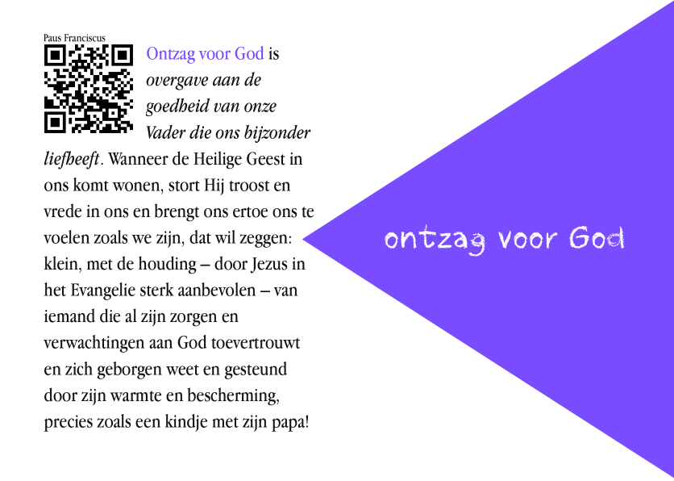

Vorige zondag, tijdens de vormselmis voor onze twee jongste kinderen, klonk tijdens de [lezingen](http://www.bijbelcitaat.be/lezing/lezingen-van-de-dag-zondag-29-april-2018/) een woord dat mijn aandacht trok. **De "vreze Gods".** Als ik me goed herinner gebruikte het lectionarium deze ietwat archaische woordkeuze. Een voordeel, want dat vestigt sneller de aandacht dan het "ontzag voor de Heer" dat andere bijbelvertalingen op dezelfde plaats gebruiken. Het begrip kwam voor in de eerste lezing uit de Handelingen van de Apostelen, over de eerste christengemeenschappen:

> De gemeente leefde in vrede en kwam tot bloei. De gelovigen leefden in **ontzag voor de Heer**, en dankzij de bijstand van de heilige Geest nam hun aantal steeds meer toe.

 

Toevallig is de "vreze des Heeren" ook een van de [zeven gaven van de heilige Geest](https://www.rkdocumenten.nl/rkdocs/index.php?mi=650&dos=393), die over de vormelingen uitgestort wordt bij het Vormsel. Die zeven gaven gaan terug op een profetie van Jesaja, in het elfde hoofdstuk van zijn boek in de Bijbel:

> Dan zal een twijg aan de stronk van Jesse ontspruiten, Een scheut uit zijn wortel ontkiemen. De geest van Jahweh zal op Hem rusten: De geest van wijsheid en verstand, De geest van raad en sterkte, De geest van kennis en godsvrucht, en **de vrees voor Jahweh** zal Hem vervullen.

 

Ik houd wel van die lijstjes. Vroeger waren dit soort van **lijstjes** de kapstok waaraan de catechese werd opgehangen. Nu zijn ze helemaal uit de mode. In een eerder artikel over het [gewetensonderzoek](/blog/gewetensonderzoek-2/) heb ik de belangrijkste lijstjes opgesomd die je kan gebruiken om na te gaan of je christelijk leven nog wel op het juiste spoor zit. In een ander artikel over [christelijke volmaaktheid](/blog/volmaakte-katholieken/) heb ik zelfs een hele _bucketlist_ voor beta-katholieken gecompileerd op basis van de katholieke lijstjes. Achter de lijstjes gaat immers veel theologische rijkdom schuil. Die ontdek je niet zomaar, je moet wel even opletten in de les!

Waar ik op wil terugkomen is die laatste gave van de heilige Geest, de vreeze Gods. Het begrip lijkt op het eerste zicht niet erg compatibel met een **hedendaagse** geloofshouding. Wijsheid, verstand, sterkte, kennis, ja daar kunnen we wel wat mee, maar waarom moet die laatste gave er nog bij? Wat een afknapper! Hebben we ons helemaal opgewerkt, moeten we toch weer bekennen hoe klein we zijn, (bang?) opkijkend naar God! Toch zal de Kerk leren dat al die gaven samenhangen. Weiger je er één, weiger je ze allezeven.

Weer één van die **ongerijmdheden**, die het signaal zijn dat je op iets wezenlijks stuit in het begrip van het geloof! Om hun betekenis te ontsluiten, ga ik altijd [dankbaar](https://www.rkdocumenten.nl/rkdocs/index.php?page=3) te rade bij [rkdocumenten.nl](http://www.rkdocumenten.nl). De [catechismus](https://www.rkdocumenten.nl/rkdocs/index.php?mi=600&doc=1&id=1288&highlight=ontzag#al1831) laat ons echter ditmaal in de steek, daar verschijnt het begrip wel in de lijst van de zeven gaven van de heilige Geest, maar het wordt niet nader verklaard. Gelukkig zijn er nog de pausen.

**Paus Benedictus XVI** hield in 2008 een catechese over de vreze Gods. De vreze Gods is het begin van alle wijsheid (\*), ze gaat dus de andere gaven van de heilige Geest vooraf. Bovendien is ze de beste remedie tegen menselijke angsten.

[Paus Benedictus: Vreze Gods - Menselijke Angst](https://www.rkdocumenten.nl/rkdocs/index.php?mi=600&doc=2389&id=0&highlight=vreze)

**Ook paus Franciscus** sprak erover in zijn reeks catecheses over de gaven van de heilige Geest in 2014. Hij ziet ontzag voor God als "overgave aan de goedheid van onze Vader die ons bijzonder liefheeft", een houding die moed en kracht in ons opwekt. Tegelijk is het een "een alarmsignaal ten aanzien van de hardnekkigheid van de zonde".

[Paus Franciscus: De Gaven Van De Heilige Geest - Ontzag Voor God](https://www.rkdocumenten.nl/rkdocs/index.php?mi=600&doc=5509&highlight=Ontzag)

Het is onze eigen zonde die het beeld van de toornige God oproept. Dat leert het duidingsartikel bij de **Prentencatechismus**. Misschien hebben we dat beeld wel nodig als een zetje om ons te kunnen overgeven aan zijn barmhartigheid.

[Prentencatechismus: De Toornige God](http://prentencatechismus.org/about/de-toornige-god/)

Een kort stukje uit de catechese van paus Franciscus is opgenomen in het boekje **"Gevormd!"** dat op deze site [verkrijgbaar](/portfolio/gevormd/) is. Jammer als je de kans gemist hebt het aan je petekind te schenken als die deze maand zijn of haar vormsel heeft gedaan ;)

 Gevormd!

* * *

(\*) "Het begin der wijsheid is de Heer te vrezen", zo staat in het [eerste hoofdstuk van _Wijsheid van Jezus Sirach_ volgens de Petrus-Canisiusvertaling](https://bijbel.gelovenleren.net/wijsheid-van-jezus-sirach.html). Dat boek wordt trouwens doorlopend gereciteerd op een eigen twitteraccount: [@JezusSirach](https://twitter.com/jezussirach).

Beluister de passage over  de vreze Gods uit het boek _Wijsheid van Jezus Sirach_, hoofdstuk 1, vers 14-20 (uit _Totdat Hij Komt_, abdij Maria Toevlucht Zundert):

http://gelovenleren.net/track-3/
