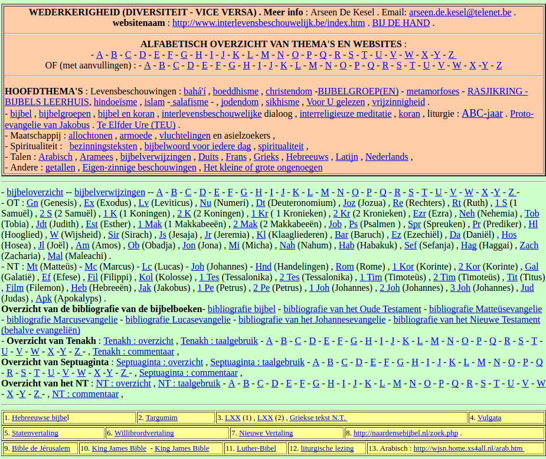

Een paar dagen geleden vroeg me iemand of ik zou weten of je de schriftlezingen van de mis enkele weken vooruit online kan vinden. Een online Lectionarium dus.

Eerlijk gezegd kon ik niet meteen antwoorden. Er zijn twee bekende websites waar de schriftlezingen dagelijks verschijnen, maar die gaan hoogstens enkele dagen in de toekomst. Daar heb je niet veel aan als je de eucharistie van een zondag in een volgende maand wil voorbereiden.

- [Evangelizo](https://dagelijksevangelie.org/NL/gospel) - dagelijkse liturgische lezingen in meerdere talen, maar de website laat je slechts zeven dagen verder bladeren in de kalender.
- [Dagelijks Bijbelcitaat](http://www.bijbelcitaat.be/) - de dagelijkse lezingen uit de mis worden pas de dag zelf gepubliceerd. Er is wel een truuk om de teksten op te zoeken voor een mis binnen enkele weken: je gaat in het archief op zoek naar dezelfde mis drie jaar geleden! Als de cyclus en de liturgische dag dezelfde zijn, vind je zo ook de juiste teksten terug.

Toch is er meer te vinden op internet als je verder zoekt. Je moet dan op google niet ingeven dat je op zoek bent naar een "online lectionarium", maar bijvoorbeeld naar een concrete liturgische dag, bv. "tiende zondag door het jaar" (da's op 10 juni e.k.). Dan vind je tussen de treffers o.a. volgende websites, die wel degelijk als "online lectionarium" mogen gelden:

- [Bijbelhuis Zevenkerken](https://www.bijbelhuiszevenkerken.be/blog/2013/01/01/overzicht-zondagslezingen/) - eigenlijk een Brugs bezinningscentrum, maar de website is helemaal wat we zoeken! Voor elke zondag de volledige teksten van de lezingen. Je kan er zelfs de lezingen beluisteren! https://youtu.be/ARx-6bfxPTU
- [Bijbel in 1000 seconden](http://www.bijbelin1000seconden.be/menu/tiki-index.php?page=Liturgische+kalender) - eigenlijk een catecheseproject met verwerkingsmateriaal gebaseerd op bijbelteksten, maar onder de hoofding "kalender" vind je de meeste teksten van de zondagslezingen (echter niet in de vertaling die gangbaar is in de liturgie)
- [Nicolaaskerk in Baarn](https://parochienet.nl/nicbaarn/index.php?Nav=6) - een parochiale website die een module bevat waarin je de volledige kalender kan doorlopen en per dag de lezingen raadplegen.
- [Sint-Willibrordusparochie](http://www.sint-willibrordusparochie.nl) - een parochiale website waar je het lectionarium kan downloaden in PDF-formaat. De links vond ik enkel via google, niet op de website zelf: [Jaar A](http://www.sint-willibrordusparochie.nl/wp-content/uploads/2014/07/jaarA.pdf), [Jaar B](http://www.sint-willibrordusparochie.nl/wp-content/uploads/2014/07/jaarB.pdf) en [Jaar C](http://www.sint-willibrordusparochie.nl/wp-content/uploads/2014/07/jaarC.pdf).
- [Dionysiusparochie](http://www.dionysiusparochie.nl/spiritualiteit/lezingen-heilige-mis/lezingen-jaren-a-b-en-c/) - weeral een parochiewebsite waar naarstig gewerkt wordt aan een online Lectionarium, maar het is nog niet helemaal af.
- [Interlevensbeschouwelijk](http://www.interlevensbeschouwelijk.be/liturgie%20b-jaar.htm) - een persoonlijk project van [Arseen de Kesel](https://www.linkedin.com/in/arseen-de-kesel-a0ba5173/), een geëngageerd theoloog met een breed interesseveld. De website oogt rommelig en wordt wellicht niet meer actief onderhouden, maar dat neemt niet weg dat je er naast de wekelijkse schriftlezingen, waarnaar we eigenlijk op zoek waren, tal van interessante verwijzingen zal aantreffen! Neem bv. deze [Griekse tekst](http://www.interlevensbeschouwelijk.be/proto-evangelie%20van%20Jakobus.html) van het proto-evangelie van Jakobus :) Het lijkt wel een stoffig boekenwinkeltje waar je uren kan doorbrengen.
    
     Een rommelig boekenwinkeltje met verborgen schatten
- [Missale](http://www.missale.net/of/nl) - ook ik heb mijn duit in het zakje gedaan en op de website die voor elke zondag enkele mooie illustraties aanbiedt bij de lezingen, kan je onderaan de pagina op de knop "Bijbel" klikken om het betreffende hoofdstuk na te slaan in de Canisiusvertaling.

Zo zie je maar: wie zoekt die vindt! (Lc 11:9) Heel bijbels... en ook heel typisch voor het katholieke internetlandschap. Zou je niet verwachten dat iemand die op zoek is naar een online lectionarium, kan aankloppen bij [Kerknet](http://www.kerknet.be), de portaalsite van de katholieke Kerk in Vlaanderen? Daar vind je slechts [één pagina met enkele "Nuttige liturgische links"](https://www.kerknet.be/icl/artikel/nuttige-liturgische-links), maar helemaal niet de bronnen die ik na veel zoeken op internet aanboorde (om maar te zwijgen van de vele websites die ondanks mijn zoeken aan mijn aandacht ontsnapt zijn!).

De behoefte voor een online lectionarium bestaat en blijkbaar ook de wil om aan zo'n project te werken (veelal vrijwilligerswerk), dat is duidelijk, maar het blijven allemaal kleine eilandjes met veel potentieel dat onder de korenmaat verborgen blijft.
