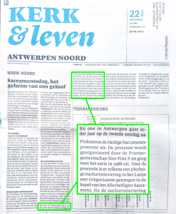

Als ik door de straten van Borgerhout wandel, zie ik affiches uithangen met aankondigingen van allerhande evenementen in het kader van de Ramadan. Het is fijn voor onze islamitische stadsgenoten dat zij zich in het straatbeeld op een mooie manier kunnen manifesteren.

Wist je echter dat er in Antwerpen ook nog een katholieke gemeenschap huist? Je zou het niet zo meteen zeggen, want ze blijven verborgen achter de muren van doodse kerkgebouwen, waarvan je je vaak afvraagt of ze eigenlijk nog wel actief gebruikt worden. Ik vermoed dat het bisdom een aantal gebouwen in waakvlammodus houdt, al is het maar om te voorkomen dat ze verkocht moeten worden om als moskee te dienen (wat trouwens van stadswege ook met [postgebouwen](http://www.standaard.be/cnt/dmf20171208_03232288) gebeurt).

In elk geval: veel manifestatie moet je van onze katholieke gemeenschap niet verwachten. En nee, de jaarlijkse [kerstversieringen](/blog/ramadanversiering-in-borgerhout/) beschouw ik niet als een manifestatie van ons geloof.

Komende zondag echter, 3 juni, kan het niet op met katholieke manifestaties! Dan gaan er **tegelijk twee Sacramentsprocessies** uit in de stad. Niet omdat de gelovigen zo talrijk zijn dat ze niet in één processie zouden passen, maar omdat de eerste processie uitgaat van de Pius-X-priesterbroederschap.

Ik heb voor mijn plezier eens rondgesnuisterd op internet om te zien of die manifestaties wel goed worden aangekondigd. De Kerk is namelijk niet zo erg sterk in goede communicatie. Het gaat hier niet om de inhoud, maar gewoon over de bandbreedte van de communicatie. (Let wel: ik gebruik geen facebook, dus het kan best dat op dat medium het plaatje er helemaal anders uitziet)

Al bij al is de bilan redelijk erbarmelijk en in het voordeel van de priesterbroederschap. Hoewel ze---tot hun schande---geen uitgebouwde (Nederlandstalige) website hebben, vind je een aankondiging voor hun processie terug op twee publieke evenementenwebsite, waar je het evenement via Google snel kan terugvinden: [Leca](http://www.lecavzw.be/tradities/feesten/heilige-sacramentsprocessie-antwerpen) en [Uit in Vlaanderen](https://www.uitinvlaanderen.be/agenda/e/sacramentsprocessie/2039a648-6edf-434a-aa08-6d666084fdbf). Het lokale [parochieblaadje](https://fsspx.be/nl/news-events/news/parochieblad-antwerpen-gent-mei-2018-37325) verschijnt niet op Google.

Voor de processie van de diocesane parochies uit de binnenstad vind je slechts op één plaats een aankondiging, namelijk op de [blog van de Sint-Jacobskerk](http://www.sintjacobantwerpen.be/aankondiging-sacramentsprocessie-door-antwerpen), vanwaar de processie uitgaat. Ik val in herhaling als je vorige artikels op dit blog leest, maar ik stel me de vraag: waarom vind je hiervan niks terug op Kerknet?

Omdat ik nu toch op al die websites zit, heb ik de gaten opgevuld. Er is een aanvraag ingediend om beide processies aan te kondigen op de in Vlaanderen te weinig bekende website [RK Activiteiten](https://www.rkactiviteiten.nl/?selper=18&selcat=processie). Ook op [Uit in Vlaanderen](https://www.uitinvlaanderen.be/agenda/alle/antwerpen?search=sacramentsprocessie) staan beide processies nu broederlijk naast mekaar :). Ik heb ze ook op de website [Adoremus.maptiming.com](http://adoremus.maptiming.com/51.214533,4.416415,15z,989px/all) gezet, waar je alle aanbiddingsevenementen in Vlaanderen kan terugvinden.

 

Ook wie alvast de sfeer wil opsnuiven via YouTube, vindt enkel twee filmpjes met beelden van vorige processies van de Hemelstraat.

https://youtu.be/TJX6QCUNtFw

https://youtu.be/lesX6vUZLbs

Tot zondag, op de 'juiste' processie :)

* * *

UPDATE op 30 mei:

Om aan te tonen dat bovenstaande bemerkingen bij de gebrekkige promotie van de processie vanuit de Sint-Jacobskerk niet ongegrond zijn, kan ik niet nalaten het artikel te delen dat vandaag op de voorpagina van Kerk en Leven verscheen (editie Antwerpen-Noord). De lokale redacteur had blijkbaar de opdracht gekregen iets te schrijven over Sacramentsdag en heeft zich vlijtig van die taak gekweten door enkele lapjes tekst vanop het internet te compileren. Jammer genoeg voor hem had hij blijkbaar niet door dat het lapje tekst over de processie handelt over de processie die door de Pius-X-priesterbroederschap wordt georganiseerd, wat hem in bepaalde kerkelijke kringen ongetwijfeld niet weinig euvel geduid zal worden.

Als er was gekopieerd van de website van Sint-Jacob, was dit mooie tekstje verschenen in het parochieblad:

> Waarom komen we op straat in processie met een monstrans en een geconsacreerde hostie? Ten eerste omdat we in de reële aanwezigheid in de heilige Hostie geloven van Jezus, de Zoon van God. Vervolgens, omdat we niet bang zijn om ons geloof te laten zien aan onze stadsgenoten.
> 
> Gesterkt door de Communie die we ontvingen en op weg naar het hemelse Vaderland, herkennen we ons in het volk van God dat door de woestijn heeft gestapt op weg naar het beloofde land, geleid door Mozes en met het manna als brood uit de hemel. De geestelijke betekenis van de processie is dat Jezus ons vergezelt op de weg naar het hiernamaals en zich geeft aan ons als voedsel voor onze ziel.

Ik bedacht mezelf: laat ik eens googlen of ook dit tekstje niet gekopieerd is van elders, en dat bleek niet het geval, maar de serendipiteit heeft me wel een katholieke website leren kennen die ik nog nooit bezocht had, waar de [aankondiging](http://www.baasweb.com/site-rknieuws/2018/04/12/aankondiging-sacramentsprocessie-door-antwerpen/) van de processie van Sint-Jacob was overgenomen: [Cogitationes Cordis Ejus](http://www.baasweb.com/site-rknieuws/) (Gedachten van Zijn Hart). Merkwaardig genoeg heeft deze website helemaal geen colofon! Een beetje doorklikken via het domein [baasweb.com](http://baasweb.com/) ("Auxiliante Deo" - om God te helpen) voert naar een reeks andere interessante sites:

- [Gedenkboek Parochie Heilige Margarita Maria - Tilburg](http://www.gaudete.info/site-westend-wp/)
- [Kerkkoor Margarita Maria](http://www.westend.baasweb.com/)
- [Gemengd Koor Sint-Caecilia Riel](http://www.riel.baasweb.com/)
- Koninklijk Sint-Ceciliakoor Turnhout
- [Kerkelijke bouwkunst](http://www.gaudete.info/site-kerkelijkebouwkunst/index.php) (met foto's van [mijn eigen kerk](http://www.gaudete.info/site-kerkelijkebouwkunst/index.php?folder=/Belgie/Antwerpen%20-%20Heilig%20Hart)  en tal van andere kerken, waar komen die vandaan, ik dacht misschien geript van kerkeninvlaanderen.be, maar dat is blijkbaar niet zo?)
- [Kerkmuziekdatabase](http://www.baasweb.com/site-kerkmuziek/)
- en nog een trits volkskundige organisaties

Aan katholieke webmasters blijkbaar geen gebrek!
