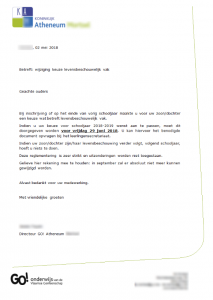

Al jarenlang wordt er [getoeterd](https://www.facebook.com/vzwLEF/) over het vak levensbeschouwing in de Vlaamse scholen. Noch het model van de katholieke scholen, waar praktiserend katholieke leerlingen (en leerkrachten) in de (katholieke) godsdienstles een minderheid vormen, noch het model van het openbaar onderwijs, waar de leerkracht katholieke godsdienst de populaire Jan moet uithangen om zijn klasjes gevuld te krijgen, spreken me bijzonder aan. Als kinderen (of hun ouders) bewust kiezen voor een katholieke school of voor de katholieke klas in het vak levensbeschouwing, ga ik ervan uit dat het zwaartepunt van de geloofsoverdracht eigenlijk in het gezin ligt of in de parochie. Hoogstens krijgen ze op school een _second opinion_ voorgeschoteld en komen ze---wie weet---in contact met gelovige _peers_.

 Keuze levensbeschouwing

Onze zoon zit op een atheneum en kreeg deze week een brief met de vraag welke levensbeschouwing hij volgend jaar wil volgen. Voor hem was de keuze---eerder gemakzuchtig---snel gemaakt, hij blijft katholiek. Ik bekeek die brief echter even _out of the box,_ vanuit het oogpunt van een ambitieuze leerling, die niet vies is van een persoonlijke uitdaging en die een open blik heeft op de toekomst van onze samenleving. Een jongere die graag zijn puberale contramine wil bevredigen en die niet bang is daarmee in het middelpunt van de belangstelling te komen.

**Waarom zou zo'n leerling, hoewel hij helemaal niet in het islamitische geloof wordt opgevoed, niet durven kiezen voor de [islamklas](http://www.centrumislamonderwijs.be/leerplannen.html) in zijn of haar school?** Het zou vast en zeker een verrijkende ervaring zijn. Eenvoudig zal de keuze niet zijn, want je zal onderwerp zijn van tegenspraak en ik vermoed niet dat zo'n keuze met gejuich onthaald zal worden onder medeleerlingen, binnen en buiten de Islamklas of onder de leerkrachten.

Zouden ze bestaan, de transconfessionele leerlingen? Ik hoop stilletjes van wel. Echte intellectuelen in de dop, die de "dialoog vanuit een eigen identiteit" niet voorgekouwd ingelepeld hoeven te krijgen en die niet op bemoederende toon willen leren hoe ze "objectief, kritisch en pluralistisch" moeten denken, maar die dat in praktijk willen brengen door gewoon zelf in het koude water te springen. Jongeren met lef die spraakmakend zijn en niet wars van persoonlijke uitdagingen. Vormgevers van onze toekomst.
