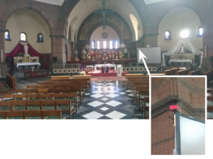
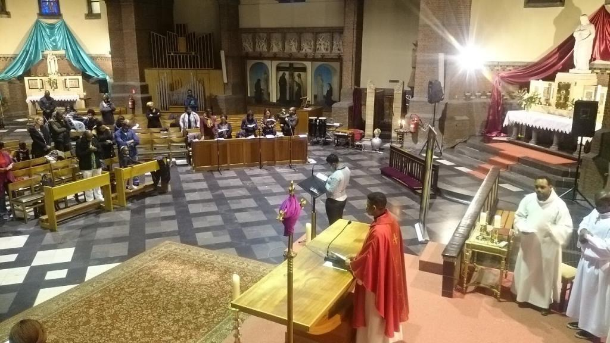
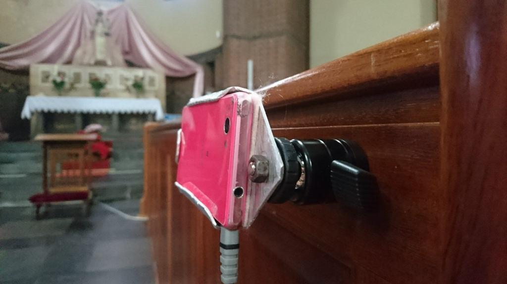
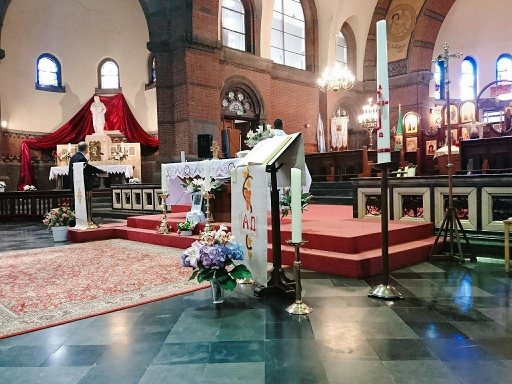

In twee [vorige artikels](/blog/webcam-in-de-heilig-hartkerk/) op dit blog kon je lezen hoe we in onze kerk een oude gsm installeerden om de heilige Mis _live_ uit te zenden, eerst via [Facebook](https://www.facebook.com/antonius.heilighart.antwerpen/) en nadien via [YouTube](https://www.youtube.com/channel/UCHEqX9lP-1Ro2zHy0kIdWwA?view_as=subscriber).

 Originele opstelling, schuin boven het altaar

Omdat onze kerk geen pilaren heeft, bevestigden we de camera aan een projectiescherm dat schuin naast het altaar staat. Dat gaf een origineel aanzicht van bovenuit op het altaar (ik noemde het geen vogelperspectief, maar "engelenperspectief") en ook het tabernakel in het zijltaar was in beeld.

Wat ook in beeld kwam, was een deel van de linkse beuk en dus ook de aanwezige gelovigen. Van één van de gelovigen kregen we de feedback dat zij niet wenste in beeld te worden gebracht.

 In beeld: het altaar, het tabernakel, het volk

Persoonlijk heb ik er geen moeite mee in beeld te komen, want per slot van rekening is de kerk een publiek gebouw en is er via de camera niets te zien dat een wildvreemde ook niet zou zien als hij de kerk gewoon binnenwandelt. Voor veel mensen ligt _privacy_ echter heel gevoelig en daarom wordt die ook wettelijk beschermd. Als je soms hoort wat er op Facebook allemaal de ronde doet, misschien maar best ook.

 Nieuwe opstelling: op het frontpaneel van de voorste knielbank

Daarom hebben we dus een nieuwe locatie voor de camera gezocht. Nu zit hij op de voorste knielbank van rechtse zijbeuk. Het zicht op het altaar is nu natuurlijker en het tabernakel is nog steeds in beeld. De gelovigen komen niet in beeld, zelfs niet als ze de communie ontvangen. Ergens vind ik dat wel jammer, want ik vond dat de zichtbaarheid van de biddende (en soms ook niet biddende) gemeenschap de opnames tot leven liet komen, terwijl het nu heel wat sterieler gaat worden.

Toch hoop ik dat dit een definitieve oplossing wordt, waarmee we onze liturgie per internet kunnen uitdragen op een manier waarbij niemand zich ongemakkelijk voelt!

 In beeld: het altaar, het tabernakel, geen volk, klaar om de volgende heilige Mis te streamen!
