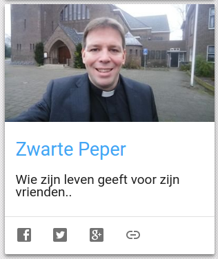

"Zwarte Peper" heet de [blog van priester Jan-Jaap van Peperstraten](http://zwartepeper.blogspot.be/), met (bijna) wekelijks de preek van de zondag. Die kan je nu ook volgen op [Alledaags Geloven](http://alledaags.gelovenleren.net/).

\[caption id="attachment\_4385" align="aligncenter" width="316"\] De wekelijkse 'kaart' van Zwarte Peper\[/caption\]

### Wat is Alledaags Geloven voor een site?

Alledaags Geloven is geen website die eigen content levert. De toegevoegde waarde van Alledaags Geloven zit hem in de verbetering van jouw workflow. De luttele minuten die je dagelijks kan of wil vrijmaken voor gebed moeten efficiënt besteed worden. Als je elke dag meer tijd verspilt om je gebedsmateriaal bijeen te zoeken dan dat je tijd kan besteden aan je eigenlijke gebed, ben je verkeerd bezig, dus dat doet Alledaags Geloven voor jou! Je hebt maar je tablet te pakken, de pagina te openen en met een enkele klik bereik je al je gebeden, bijbelteksten, catechese en bezinningen, opengeslagen op de pagina van vandaag, of waar je laatst gebleven was.
