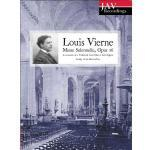

Ik beluister graag _ambient music_. Sinds kort volg ik het kanaal [r/ambientmusic](https://www.reddit.com/r/ambientmusic/) op Reddit, wat een bezoekje waard is als je een vleugje _ambient_ wil meepikken. Voor mijn huisgenoten is het soms "ambetante" muziek, maar dat trek ik me niet aan.

Bij het rondsurfen kwam ik vandaag op een bijzondere website [mynoise.net](https://mynoise.net). Daarop vind je een heel aantal _"noise machines"_. Een _noise machine_ is opgebouwd op een beperkt aantal korte tracks die 'live' gemixt worden.

Deze blog gaat niet over muziek, maar over geloof, dus de lezer zal het niet verbazen dat je er ook _noise machines_ vindt met een geestelijke inslag. Enkele voorbeelden:

[Gregorian Voices, Early Roman Catholic Church Song Generator](https://mynoise.net/NoiseMachines/gregorianChoirGenerator.php)

[Chapel Voices, Calming Generative Player](https://mynoise.net/NoiseMachines/chapelVoicesSoundscape.php)

[Beatae Memoriae, Church Soundscape Generator](https://mynoise.net/NoiseMachines/churchAtmosphereSoundGenerator.php?c=0&l=0040234330303926300000&d=0)

 Louis Vierne, Messe Solennelle, A recreation of a traditional Latin Mass at Saint-Sulpice

Het is een leuke gadget, maar ik kan er ook geen uren naar blijven luisteren. Met name die laatste _noise machine_ echter, deed me denken aan een bijzondere CD-opname die ik enkele jaren geleden bemachtigde, die nu jammer genoeg uitverkocht is:

[VIERNE MASS USED FOR EASTER SUNDAY MASS AT SAINT-SULPICE](https://pipe-organ-recordings.com/product/vierne-mass-saint-sulpice-paris-daniel-roth/)

Het is geen 'klassieke' uitvoering van een gecomponeerde mis. De opname probeert zoveel mogelijk de ervaring te benaderen van de liturgie zoals die honderd jaar geleden werd uitgevoerd, met klokgelui aan het begin en al. Vrij uniek, medunkt.

Ik heb er enkele opeenvolgende tracks uitgelicht die je hier kan beluisteren. De titels van de tracks zijn Sanctus, Elevation, Benedictus, Improvisation en Pater Noster.

[Vierne-mass-sanctus-consecration-pater-noster_MP3WRAP.mp3](https://storage.googleapis.com/geloven-leren/audiobooks/Vierne-mass-sanctus-consecration-pater-noster_MP3WRAP.mp3)

Je hoort dus iets wat in onze hedendaagse liturgie heel ongewoon is: de consecratie die door de priester in stilte wordt voltrokken, slechts begeleid door een ijle orgelklank en belgerinkel. Als je je afvraagt wanneer de consecratie plaatsvindt: bijzonder in deze uitvoering is dat het Benedictus wordt gezongen _na_ de consecratie, een praktijk die blijkbaar enkel [gangbaar](http://www.ccwatershed.org/blog/2014/oct/29/sanctus-benedictus-should-it-be-divided-mass/) was in gezongen missen met polyfone muziek.

Als je die mis beluisert, voel je hoe de muziek de liturgische ervaring ondersteunt. Net als een stukje hedendaagse electronische _ambient music_ je kan helpen je gedachten te concentreren op iets _buiten_ de muziek, heeft de liturgische muziek als taak je gedachten te richten op het bovenaardse dat aan het altaar plaatsvindt, zonder er met je neus pal op te zitten.

Dat is niet zo dom, want zelfs als we alles perfect zouden horen en zien wat de priester zegt en doet, zouden we toch niet beter _begrijpen_ welk een mirakel er gebeurt tijdens de consecratie. Voor onze ogen blijven het immers brood en wijn die de priester hanteert. We moeten tijdens de liturgie andere zintuigen hanteren om te _weten_ wat er in de werkelijkheid van ons geloof gebeurt: het lichaam van Jezus dat volgens zijn belofte tegenwoordig is. Dan wordt de mis een echt gebed. 

Toch iets dat we vandaag af en toe missen, nu we er met onze neus pal opzitten...
