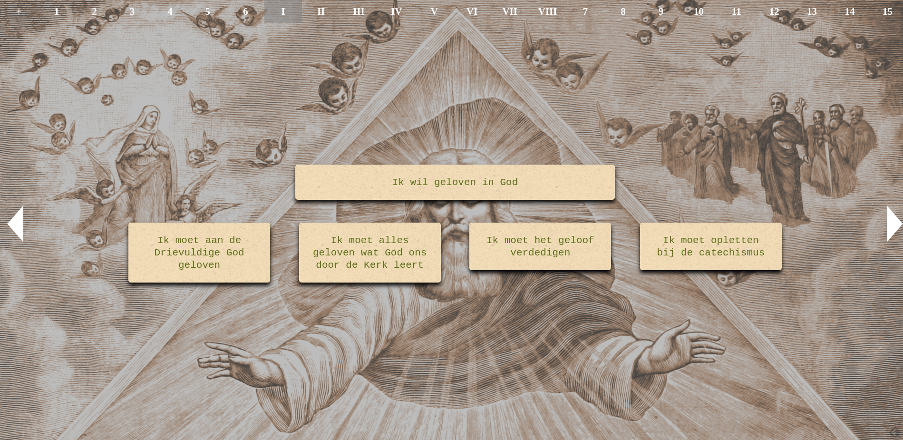

Laatst bekeek ik nog eens de website [Mijn Eerste Communie](http://eerstecommunie.gelovenleren.net), die een stramien bevat voor een traditionele catechese als voorbereiding op de eerste communie. Het viel me eens te meer op volgens welk een knappe logica de catechese is opgebouwd. Neem bijvoorbeeld de pagina die het [eerste gebod van God](http://eerstecommunie.gelovenleren.net/#gebodgod1) uitlegt. Op het eerste zicht lijken de voorgestelde zinnetjes stroef, maar er zit toch heel wat diepgang in, waar zelfs een kind niet onontvankelijk voor kan zijn, hoewel misschien beter op iets latere leeftijd dan zes.

Neem nu het eerste scherm, dat deze zinnetjes als leidraad bevat:

Ik wil geloven in God

- Ik moet aan de Drievuldige God geloven
- Ik moet alles geloven wat God ons door de Kerk leert
- Ik moet het geloof verdedigen
- Ik moet opletten bij de catechismus

Daaruit kan een volwassen gelovige ook nog heel wat lessen puren!

Veelzeggend vind ik het woordgebruik. "Ik **wil** geloven in God". Dit zinnetje drukt de doelstelling uit van de les, het geloof op te wekken, maar tegelijk ook een beginvoorwaarde: de wil om te geloven. Geloven doe je uit vrije wil. Geloven doe je niet op bevel. Zo leert ook de [Catechismus](https://www.rkdocumenten.nl/rkdocs/index.php?mi=600&doc=1&id=1010): "Het geloof is een persoonlijke daad: het vrije antwoord van de mens op het initiatief van God, die zich openbaart."

Als je trouwens een stapje terug zet, is het woordgebruik in onze geloofsbelijdenis even veelzeggend. Als we die uitspreken zeggen we: "Ik **geloof** in God, Schepper van Hemel en aarde". We zeggen niet "God **is** schepper van Hemel en aarde". Zelfs kinderen zijn gevoelig voor het debat tussen geloof en wetenschap, waarin theologen zich vaak naïef laten meeslepen. Louter semantisch kan een wetenschapper niets opbrengen tegen onze geloofsuitspraak. Als ik zeg: "Ik geloof in God", is dat een vaststelling die niemand kan ontkennen. Je kan het bestaan van God ontkennen, maar niet mijn geloof in Hem. Einde discussie…

Terug naar de les. Wat moet je doen om je geloof op te wekken? De leerling die **wil** geloven, krijgt vier opdrachten, elk geformuleerd als opdrachten: "Ik **moet**…". Het zijn wijze richtlijnen die moeten voorkomen dat het geloof lauw en oppervlakkig blijft.

Ik **moet** aan de Drievuldige God geloven

Het is de grootste uitdaging van het geloof een relatie op te bouwen met de drie personen van de Drievuldigheid. Om een relatie op te bouwen met Iemand, moet je die beter leren kennen. We leren de personen van de Drie-eenheid kennen doorheen de ganse heilsgeschiedenis van de mensheid, de "gewijde geschiedenis" zoals dat vroeger heette. De Vader laat in het Oude Testament de komst van de Zoon voorzeggen door de profeten en de Zoon op zijn beurt voorzegt de komst van de Geest. Het is de Geest die in ons leeft en ons de kracht geeft om te leven volgens ons geloof.

Ik **moet** alles geloven wat God ons door de Kerk leert

De Kerk is de draagster van ons geloof, doorheen de geschiedenis. Geloof kan je slechts beleven in eenheid met de Kerk. Het is de Kerk die de Heilige Schrift heeft voortgebracht, die ons de heiligen leert kennen en die ons voorziet van de sacramenten.

Ik **moet** het geloof verdedigen

De verdediging van het geloof komt normaalgezien pas aan de orde bij het Vormsel. Dan word je, dankzij de gaven van de Heilige Geest, in staat geacht je geloof zelfstandig te beleven en ook te verdedigen. Voor ons lijkt het nog vanzelfsprekend dat ons geloof niet echt verdedigd hoeft te worden en als het nodig is, laten we het graag over aan kerkelijke ambtdragers, die er immers voor worden betaald. In andere delen van de wereld en misschien ook hier in de toekomst is het een dagelijkse uitdaging voor elke gelovige. Een gelovige dient strijdvaardig te zijn, gewapend met de waarheid, de rechtvaardigheid, de blijde boodschap, de Geest van de verlossing en het gebed.

Ik **moet** opletten bij de catechismus

Geloof komt niet vanzelf aanwaaien. Het is een vak als een ander en vereist studie, verdieping en oefening. Dat moet de voedingsbodem zijn om de drie voorgaande taken goed te kunnen vervullen. Wie zijn geloof dagelijks kneedt in gebed, bezinning en studie zal merken dat het stilaan uitgroeit tot een handig en bruikbaar hulpmiddel in het leven.
