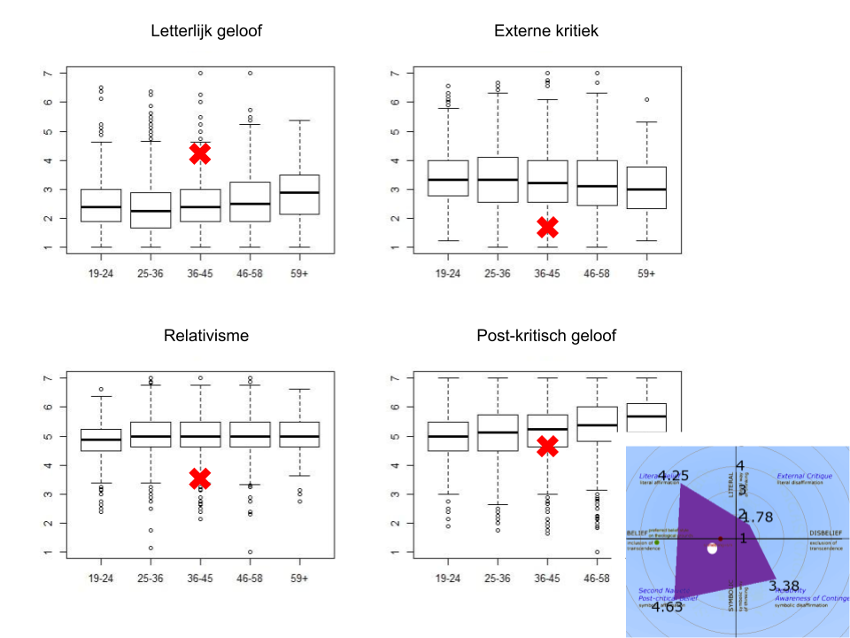
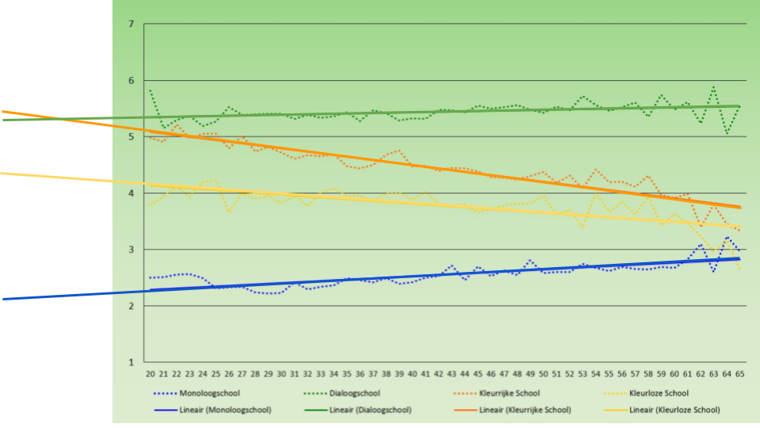

Tertio publiceert de resultaten van een uitgebreide bevraging over de geloofshouding onder het personeel van katholieke scholen. In het [rapport](https://www.kuleuven.be/thomas/page/effect-age-scales-study/) wordt de vraag onderzocht of die geloofshouding afhangt van de leeftijd. Blijkbaar is dat niet het geval.

Met name binnen de meest actieve leeftijdscategorieën blijkt die afhankelijkheid verwaarloosbaar. De conclusie in de [commentaren](https://www.tertio.be/magazines/957/artikels/Onderbroken%20traditie) is dat er geen generatiekloof meer is. Een zestigjare leerkracht denkt nagenoeg hetzelfde als een twintigjarige over geloof en de plaats ervan in de school. Of beter gezegd: onder zestigjarigen is er eenzelfde diffusiteit van geloofshoudingen als onder twintigjarigen.

Vier jaar geleden heb ik die bevraging zelf ook [ingevuld](/blog/geroosterd-geloof/). Ik vind het wel interessant om mijn resultaten in te passen in de statistische gegevens die nu gepubliceerd zijn. Bijgaande grafiek toont voor de vier polen van de Post-Kritische Geloofsschaal (PKG) het gemiddelde en de standaardafwijking. Met de rode kruisjes zijn mijn persoonlijke resultaten gemarkeerd. Blijkbaar bevind ik me voor alle polen buiten het gebied van de standaarddeviatie (waarbinnen 68% van de gemiddelde populatie valt) en voor drie van de vier polen zelfs buiten het gebied van tweemaal de standaardafwijking (waarbinnen 95% van de gemiddelde populatie valt). 

 Statistische resultaten van de PKG-schaal, en mijn persoonlijke resultaten

In het onderwijs zou ik dus alvast een buitenbeentje zijn. Gelukkig maakt het rapport van de studie ditmaal geen waardeoordeel over de verschillende posities binnen het geloofsspectrum. Dat was [vorige keer](http://www.schoolidentity.net/docs/The%20Post-Critical%20Belief%20Scale%20for%20dummies%20(EN)%20v1.21.pdf) wel anders, toen er duidelijk sprake was van een "preferred belief style on theological grounds". Dat vond ik eerlijk gezegd nogal tendentieus.

De meeste aandacht in de commentaren gaat naar de Victoriaschaal, die de visie op de positie van het geloof in het onderwijs onderzoekt. Daar heeft het concept van de "dialoogschool" onder alle leeftijdscategorieën de [duidelijke voorkeur](https://www.katholiekonderwijs.vlaanderen/nieuws/onderzoek-ku-leuven-toont-aan-katholieke-dialoogschool-heeft-ook-groot-draagvlak-bij-jongere) en daarvan wordt door de katholieke onderwijskoepel natuurlijk luid [kond gedaan](https://twitter.com/KathOndVla/status/1006804923797909504?s=19).

 Trendlijnen voor de verschillende schoolmodellen op de Victoriaschaal, met extrapolatie naar de toekomst

Als je echter de trendlijnen tien jaar extrapoleert naar links, dus naar de toekomst (OK, dat zal wel niet wetenschappelijk zijn), blijkt dat het concept van de "kleurrijke school" de overhand zal nemen. Ook de "kleurloze school" zit in de lift. Dit zijn de [definities](http://www.schoolidentity.net/docs/The_Victoria_Scale_for_dummies_EN_v1.2.pdf) van de verschillende schoolconcepten, u mag zelf de conclusies trekken:

- The [monologue school](http://www.sint-ignatius.be/) (maximal Catholic identity, minimal solidarity)
- The dialogue school (maximal Catholic identity, maximal solidarity)
- **The colourful school (minimal Catholic identity, maximal solidarity)**
- **The colourless school (minimal Catholic identity, minimal solidarity)**
