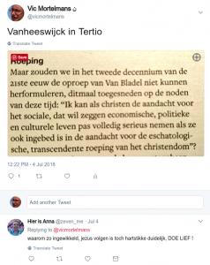

### Keuleneer vs. mensenrechten

Beroepskritikaster Fernand Keuleneer stelt in Tertio de vraag of het wel gezond is dat in ons rechtssysteem zo'n grote rol wordt toegekend aan de mensenrechten. Het interview is enkel toegankelijk voor abonnees, maar hoofdrecteur Van Lierde vat het voor u samen in zijn hoofdartikel "[Doos van Pandora](https://www.tertio.be/magazines/960-961/artikels/Doos%20van%20Pandora)".

Keuleuneer heeft geen bezwaar tegen de filosofische inhoud van de mensenrechten, maar wel tegen de ongebreidelde toepassing ervan in rechtsspraak. Door politici uitgevonden abstracte mensenrechten worden door rechters volgens hun eigen inzichten toegepast in veel te concrete zaken en ondergraven zo zelfs de democratie!

Van één vraag maakt Keuleneer zich in het interview wel heel snel af. _"Terug naar de filosofische grond van de mensenrechten. De universele verklaring wordt een kind van het christendom genoemd. Akkoord?"_ Antwoord: _"Het kan best zijn dat de mensenrechten een kind van het christendom zijn. ---"_ en dan gaat hij weer verder op het discours dat de functie van de mensenrechten in het juridische systeem helemaal niet meer correspondeert met de filosofische grond ervan.

Ik vraag me af of de band tussen de mensenrechten en het christendom---nee, zelfs eerder het katholicisme---niet veel nauwer is dan het vage antwoord van Keuleneer, ook zelf overtuigd katholiek, laat uitschijnen, en niet alleen op het filosofische vlak, maar ook op het institutionele.

### Mensenrechten vs. katholicisme

Ik zie immers grote gelijkenissen tussen het systeem van het 'katholicisme' en het systeem van de 'mensenrechten'. Beide systemen maken de aanspraak universeel te zijn. Beide systemen vertrekken vanuit een beperkte set abstracte stellingen, dogma's aan de ene kant, grondrechten aan de andere kant. Beide systemen laten toe dat die abstracte beginselen worden toegepast in de 'dagelijkse werking' van het systeem, in heel concrete gevallen waar de toepassing van dat abstracte beginsel niet meteen lijkt te beantwoorden aan de achterliggende filosofie. Als gevolg daarvan en _last but not least_, de gelijkenis dat beide systemen juist daarom kritiek krijgen.

De kritiek die Keuleneer heeft op het systeem van de mensenrechten, kan je rechtstreeks overzetten op het systeem van de Katholieke Kerk. Meer nog: met dezelfde redenering die Keuleneer volgt om het systeem van de mensenrechten op de korrel te nemen, wordt dagdagelijks de Katholieke Kerk op de korrel genomen en wel van binnenuit.

### Progressief vs. conservatief

Neem nu bijvoorbeeld de discussie in de Kerk in Duitsland (of zeg beter: "de Duitse Kerk"), waar de bisschoppen na enig over-en-weer met Rome nu toch mogen beslissen de [communie uit te reiken](http://www.patheos.com/blogs/deaconsbench/2018/07/german-bishop-invites-all-protestant-spouses-to-receive-communion-at-jubilee-masses/) aan protestantse echtgenoten. Let op: volgens de hierboven uiteengezette logica, zijn het de progressieve Duitse bisschoppen, die _wel_ de communie willen uitreiken, die op dezelfde lijn zitten als Keuleneer. Zij zijn de kritikasters van het systeemdenken en vinden dat de systematische toepassing van de kerkelijke leer omtrent de eucharistie te ver gaat. Tegenover hen staan conservatieve bisschoppen, zoals [mgr. Eijk](http://www.ncregister.com/blog/edward-pentin/cardinal-eijk-pope-needed-to-give-clarity-to-german-bishops-on-intercommuni), die het 'universele beginsel' van de kerkelijke leer willen toepassen, zonder onderscheid (of zeg beter: "zonder onderscheiding" :-).

Progressieven tegenover conservatieven, daar gaan we weer..., ja, het is een brutale vereenvoudiging, maar hier krijg je dus aan de ene kant de conservatieve katholieken die _tegen_ het systeemdenken zijn als het mensenrechten betreft, maar _voor_ het systeemdenken als het de katholieke leer betreft, en aan de andere kant progressieve katholieken die net de tegenovergestelde inconsequentie beoefenen. Grappig, toch? 

### Onderscheiding

Ik denk dat ik stilaan beter begin te begrijpen waar het principe van de "onderscheiding" om draait. Eigenlijk is het heel eenvoudig te verwoorden als: "eerst denken, dan doen". Het is een ziekte van de tijd (of van alle tijden, wie weet?) om die eerste stap te willen overslaan. Eerder deze week had ik nog een heel korte twitterdiscussie die dit perfect illustreert:

 DOE LIEF!

Guido Vanheeswijck is blijkbaar ook een supporter van het verfoeide systeemdenken in de Kerk, vind je niet? Niet zo! Waartoe hij oproept is een evenwicht, tussen denken en doen. Je kan niet zomaar het goede _doen_, zonder daar eerst ten gronde over _na te denken_. Door na te denken kan je immers pas leren wat het _verschil_ (het "onderscheid") is tussen het goede en het kwade. Zonder na te denken loop je het ernstige risico dat je het kwade doet, terwijl je ervan overtuigd bent het goede te doen!

### Doordesemde generatie

Voor een generatie die gekneed is in een christelijke samenleving is dat "onderscheid" als het ware ingebakken. Dat gold dus ook voor de generatie die de rechten van de mens heeft neergeschreven. Zij hoefden er niet meer over na te denken: dat hadden ze al gedaan! Voor onze generatie, die het christelijke zuurdesem niet meer bevat, is die noodzaak er wel. Wie in onze generatie uitroept dat we "gewoon het goede moeten doen", getuigt van een gevaarlijke voortvarendheid! Wie uitroept dat we "de mensenrechten moeten toepassen", evenzo.
