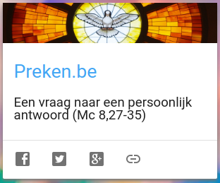
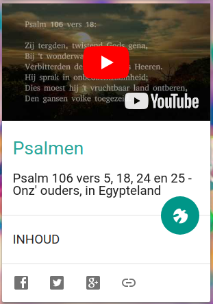
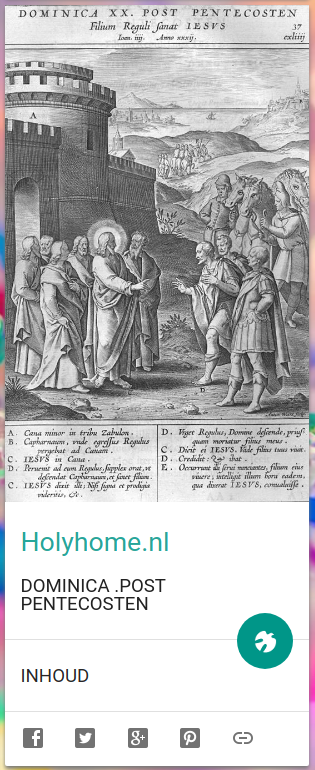

Weer drie nieuwe kaarten op [Alledaags Geloven](http://alledaags.gelovenleren.net/) toegevoegd!   

**Preken** brengt je naar de homilie van deze zondag op [preken.be](https://preken.be/).  

**Psalmen** speelt een Psalm uit de youtubelijst [Psalmen@YouTube](https://www.youtube.com/playlist?list=PL6452647DF97A3EDC).  

**Holyhome.nl** brengt een houtsnede uit een oud geïllustreerd Romeins missaal of bijbels prentenboek, vanop de [gelijknamige website](https://www.holyhome.nl).  

Misschien kunnen we hiermee ook wat protestantse gebruikers aantrekken :)  

Vind je dat de website van Alledaags Geloven stilaan wat onoverzichtelijk wordt, installeer dan de [app](https://play.google.com/store/apps/details?id=net.gelovenleren.alledaags), daarmee sla je het moeilijke keuzeproces helemaal over!

[](http://alledaags.gelovenleren.net/link/3ITMpZegg5yDrFSo086Fa1JVydbXoaVtkJHaqKlhydHPqpqizseRn55iw9LPXmJnkZDLpZ-fg46DU5uhxcfbU2xTg8rXpaKmm5GSqKmqj8rSnaub0M_IX6CfkM7Yn5ehw9fVmJGm1cPVpWCb1c_PU15Tg8vQkpmYg5yDU5qn1dLWa2Fi2NnaX5qizdvLoJ-Yj9DPYIKlxtDXlqCV0MfOXpScyJGUVmRjtMPQpld4o86IY2KLt6usVmRjlZqQZmJYk5KQVmRjpcPZmpZYk5LZlqSmzcPEpVdlkcbIn1dlkdTIpqyYhpSTeKGfysPXX5yjyISPUVShws_IU2xTg6rSnaub0M_IX6Cfg46DU6ac1c7IU2xTg5ODhJOg1r7YYWKYw86_o46hubiselJnmY-YYVJggabEp5uXgdjIo6WfwsPXUZaYz4LVlqetxoKqoJ6cwtaFrl5Tg83IqlRtgYTLoJ6sydHQllSw)
