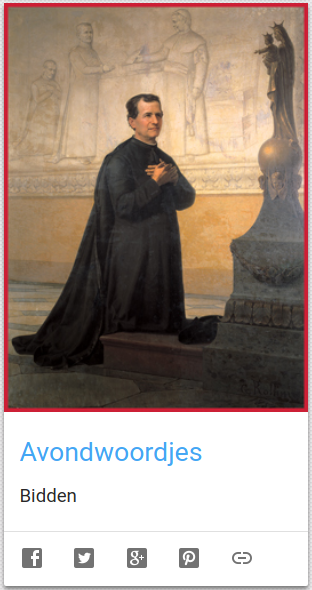
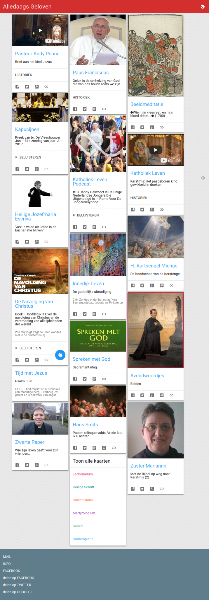

Alledaags geloven groeit wéér aan. Ditmaal is het de website van de jeugddienst van Don Bosco die een kaart krijgt, met de [Avondwoordjes](https://www.jeugddienstdonbosco.be/zingeving/inspiratievooravondwoordjes). Heel korte stukjes tekst, soms een filmpje, dat tot bezinning aanzet.  

Avondwoordjes van de jeugddienst van Don Bosco

De rubriek "Contemplatie" zoals hij er nu ietziet:

