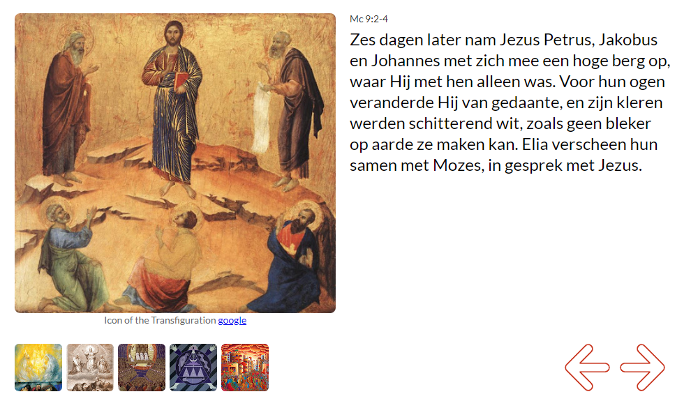

Op de website [missale.net](http://www.missale.net/nl) kan je voor elke zondag of feestdag een stukje van de lezingen uit de mis vinden met een bijpassende illustratie. De website bevat intusen meer dan 1000 illustraties, meesterwerken uit de schilderkunst, tekeningen, foto's en meer verbeeldend materiaal.  

De liturgische kalender is nu verder aangevuld tot 2024.

Missale.net

Een spin-off van deze website zijn de liturgische kalenders die je kan **opladen in je persoonlijke agenda**, bijvoorbeeld op je mobiel, via Google of andere online agenda's. Ook die is nu ingevuld tot 2024. Je kan kiezen voor de liturgische kalender volgens de gewone vorm van de ritus (novus ordo) of volgens de buitengewone vorm van de ritus (tridentijnse ritus) en je kan ook kiezen of je enkel de zondagen en feestdagen wil, of ook de weekdagen.  

De links om de online kalender op te laden, vind je op deze pagina:  

http://gelovenleren.net/page/liturgische-kalenders/
