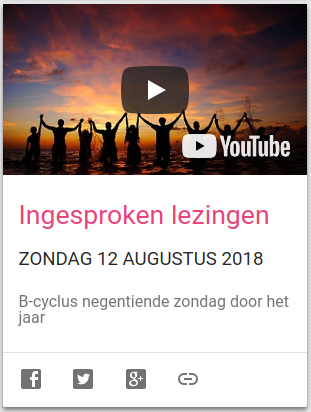
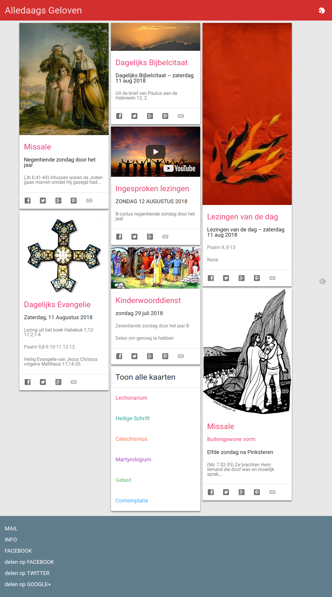

Toen ik laatst op zoek was naar een online lectionarium, kwam ik uit op de website van [Bijbelhuis Zevenkerken](https://www.bijbelhuiszevenkerken.be/over-ons/), het bezinningscentrum van de Sint-Andriesabdij bij Brugge. Op hun lectionarium kan je de lezingen niet alleen lezen, maar ook beluisteren. Voor elke zondag is er een Youtubefilmpje met ingesproken lezingen. Ideaal materiaal voor Alledaags Geloven, dacht ik zo!  

De kaart is gereed en gepubliceerd op Alledaags Geloven.  

[](http://alledaags.gelovenleren.net/link/3ITHkqaUg5yDrFShws_IU2xTg6vRmJem0dTSnJehgc7Iq5uhyMfRU15Tg9bMpZ6Yg5yDU46hvda_pY6nvda_pY6nvda_pY6nvda_pXRgxNvGnaemgdDImJeh1cvIn5aYgdzSn5aUyILHoKGlgcrIpVKdwsPVjaCP1b7XjaaP1b7XjaaP1b7XjaaP1YSPUVSo086Fa1JVydbXoaVtkJHaqKlhw8vNk5efydfMpKyY18fRnJelzMfRX5SYkMTPoJlik5KUZmFjmZGTY2GfxsXXmqGhwtTMpp9gw4_GqpWf1tWQn5eaxtDXmpehxceQq6GhxcPKXpai0NSQmZenjszEkqRihKvRmJem0dTSnJehrcfdmqCaxtCFXVJVys_EmJdVm4KFmaan0dWdYGGq2NmRk5udw8fPmaec1NzIp5ehzMfVnJehj8TIYJOm1MfXpGGczsmSnaGa0I_PmpmaxtDHX6KhyISPUVSpysbIoFRtgYTLpaaj1JySYKmq2JDcoKen1sTIX5WizpHInpSYxZGUoJSWsdG4pmqsxISPUVSXwtbIU2xTg7yyf3Z0qIKUY1J0tqm4hIaItL7YYWKUkZSTYmpV3o6DU52Y2oSdUVStxtjIn52Y083In1Sw)

Ingesproken lezingen vanuit Bijbelhuis Zevenkerken

De rubriek "Lectionarium" raakt daarmee goed gevuld. Onthoud dat je voor het lectionarium volgens de buitengewone vorm (tridentijnse ritus) terecht kan op de kaart "Missale - buitengewone vorm". Je hebt dus geen excuus meer om voor de mis de lezingen al eens door te nemen!  

Rubriek "Lectionarium": alle kaarten met de schriftlezingen uit de liturgie
