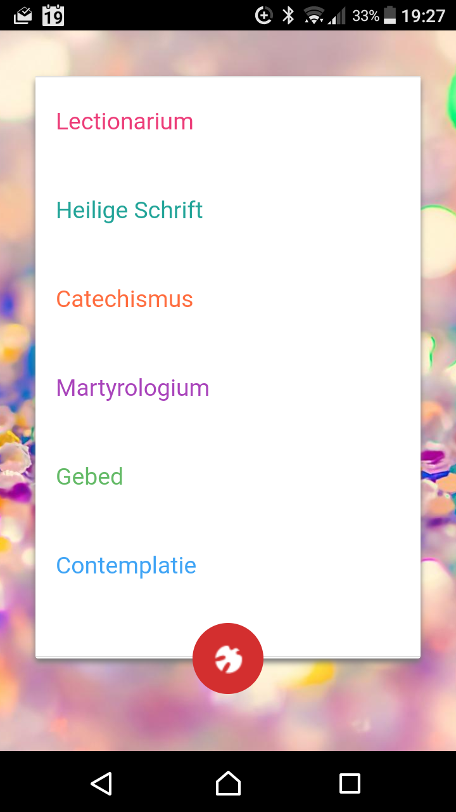
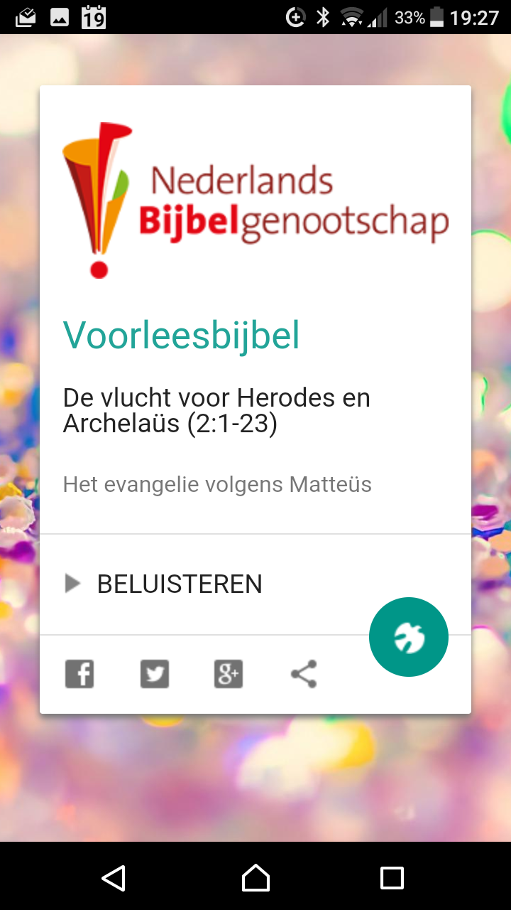

Op de website [Alledaags Geloven](http://alledaags.gelovenleren.net/), vind je tientallen kaarten met verwijzingen naar korte, hapbare stukjes geloofsvoer her en der op het internet. Als je **dagelijks een beetje** **tijd vrijmaakt voor gebed, bezinning of studie**, wil de website je helpen en schotelt ze je elke dag nieuw materiaal voor. Het "tolle, lege" (neem en lees) van Augustinus is daarmee werkelijker dan ooit :)  

Omdat de keuze overweldigend is, zie je op verschillende plaatsen op de website het icoon van een duif: het symbool van de Heilige Geest. Als je daarop klikt, krijg je willekeurige inhoud te zien. Ik zeg "willekeurig", en in termen van het achterliggende computeralgoritme is dat natuurlijk zo, maar de praktijk leert dat je net dan vaak de meest inspirerende artikels te lezen krijgt, als je je tenminste openstelt voor **de werking van de Geest**.  



Dat aspect van de workflow is nu verder uitgewerkt tot een heuse [app op Android](https://play.google.com/store/apps/details?id=net.gelovenleren.alledaags). Eerst wilde ik gewoon de website omzetten tot een app, maar dat brengt weinig toegevoegde waarde; dan kan je evengoed een shortcut naar de website op je homescreen zetten.  

Als je in het algemeen websites vergelijkt met apps, zie je een patroon. Websites zetten in op **functionaliteit**, je kan er heel veel verschillende dingen mee doen, maar soms zijn ze tamelijk ingewikkeld. Apps daarentegen zijn veel eenvoudiger, ze hebben minder functies, maar bieden je een heel efficiënte **workflow**.  

Zo is het ook met de app van Alledaags Geloven. Je krijgt geen overzicht van alle beschikbare kaarten, maar je kan enkel willekeurige kaarten opvragen, per categorie. De kaarten zijn ondergebracht in rubrieken, waarmee je de weergave kan filteren, afhankelijk van het soort inhoud dat je best ligt: "Lectionarium", "Heilige Schrift", "Catechismus", "Martyrologium", "Gebed" en "Contemplatie".  

Dat werkt het snelste, want de volledige lijst met kaarten is toch niet overzichtelijk op een klein schermpje. De enige voorwaarde om de app volledig tot zijn recht te laten komen is dat je je openstelt voor het toeval, correctie: voor **de hulp van de Heilige Geest**.  

Als je de app gebruikt met je kinderen en je meestal kaarten zoekt op hun maat, de Prentencatechismus, YouCat, Eerste Communie, Avondwoordjes, Kinderwoorddienst, Taize,.... zal je misschien schrikken als je plots een stukje tekst uit de Mechelse Catechismus of de Navolging van Christus krijgt voorgeschoteld, of van de H. Jozef Maria Escriva, of over de orde der Engelen. Wees niet bang, je mag die uitdaging aangaan! En omgekeerd ook: als je zelf houdt van stevige kost, kan het geen kwaad om ook eens te bezinnen over een klein Avondwoordje.  

- 
    
    In het welkomscherm kies je een specifieke categorie waarvoor je een kaart wil zien, of je klikt op het ikoontje onderaan om een willekeurige kaart te krijgen.
    
- 
    
    Als je op de kaart klikt, ga je naar de achterliggende website. Kaarten met audio- of videoinhoud kan je meteen afspelen. Met de ikoontjes onderaan deel je de kaart op sociale media. Sommige kaarten hebben ook een ikoontje om een andere pagina van dezelfde website te nemen.
    

Dit zijn de categorieën:

- **Lectionarium**: de lezingen van de mis volgens het missaal
- **Heilige Schrift**: de Bijbel
- **Catechismus**: de geloofsleer van de katholieke Kerk
- **Martyrologium**: de heiligen van de Kerk, volgens de heiligenkalender
- **Gebed**: teksten om te bidden
- **Contemplatie**: beschouwingen over het geloof

Veel plezier ermee!
