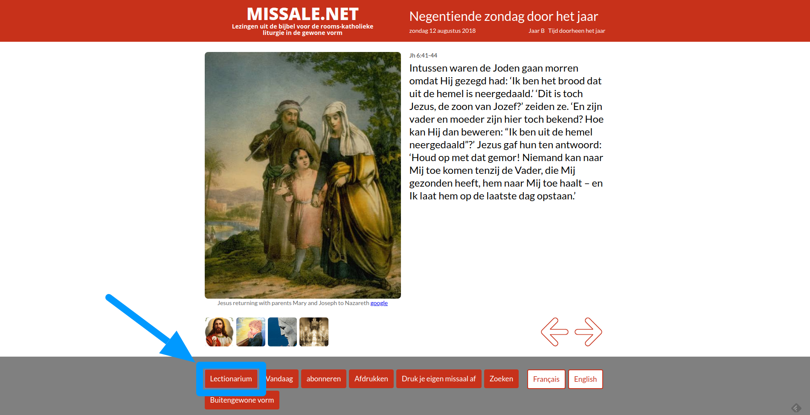

In een [vorig artikel](/blog/online-lectionarium-gevonden-onder-de-korenmaat/) was ik op zoek gegaan naar een online lectionarium. Na enig zoekwerk bleek dat wel degelijk te bestaan.  

Enkele dagen geleden las ik een tweet met de vraag wat de lezingen die zondag zouden zijn volgens de buitengewone vorm (tridentijnse mis). Mijn zoekwerk van vorige keer had enkel lectionaria opgeleverd volgens de gewone vorm van de mis.  



Temeer omdat de vraagstelster van deze tweet een hatelijk antwoord kreeg van een gerenommeerde katholieke trol (wiens twitteraccount tot mijn voldoening slechts door zichzelf gevolgd wordt), dacht ik: dat zou nog een mooie uitbreiding zijn voor missale.net. Die geeft reeds de [liturgische kalender](/blog/de-liturgische-kalender-van-missale-is-ingevuld-tot-2024/) voor beide vormen van de liturgie en bevat in de database ook alle schriftlezingen die bij elke mis horen.  

Vanaf nu vind je op [missale.net](http://www.missale.net/nl) op elke pagina een knop "Lectionarium", die een nieuwe pagina opent met de bijbelteksten die in de mis worden gelezen. Het zijn niet echt de teksten volgens het officiële lectionarium, want dat zijn redactionele bewerkingen van de bijbeltekst. De teksten worden opgehaald uit een online bijbel (dat maakt dat de laadtijd van de pagina niet erg snel is). Voor het Nederlands is dat de Petrus Canisiusvertaling.  



Nieuwe knop "Lectionarium"

Voor de techneuten: de pagina met het lectionarium is eigenlijk een front-end voor een generieke service die teksten ophaalt uit online bijbels. Een URL is opgebouwd als volgt:  

```
http://alledaags.gelovenleren.net/lectionarium?title=H.+Laurentius%2C+diaken+en+martelaar&subtitle=vrijdag+10+augustus+2018&language=nl&Eerste+lezing=2Cor+9%3A6-10&Evangelie=John+12%3A24-26&edition=CAN
```

- title: de titel in de hoofding kan je zelf invullen
- subtitle: ondertitel, ook zelf in te vullen
- language: "nl" voor Nederlands, andere talen werken ook, bv "fr" of "en"
- edition: "CAN" voor de Petrus Canisiusvertaling en "WV95" voor de Willibrordvertaling (via [rkbijbel.nl](https://rkbijbel.nl/kbs/home)) --- de Nieuwe Bijbelvertaling kan niet worden opgehaald, want die zit op slot en grendel achter een login op [debijbel.nl](https://www.debijbel.nl/).
- de overige parameters bevatten voor elke bijbelpassage die je wil opvragen als naam de kop, die je zelf kan invullen, en als waarde de verwijzing naar de bijbelpassage

Je kan dus ook zelf de API gebruiken om verwijzingen naar de bijbel te maken.
