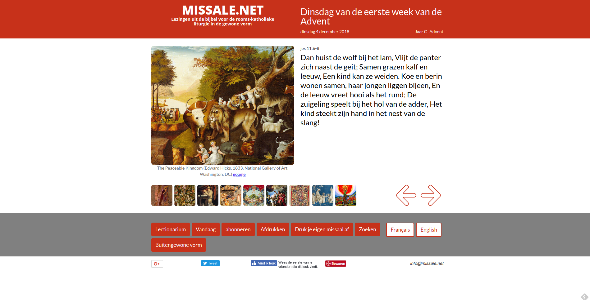

De weekdagen van de Advent zijn toegevoegd aan de website Missale. Tot voor kort waren enkel de dagen uit het missaal voor zon- en feestdagen zichtbaar. Nu verschijnen de eerste dagen uit het missaal voor weekdagen, met bijpassende illustraties.  

Dinsdag van de eerste week van de Advent

De weekdagen van de Advent volgen een bijzonder schema. Tot 17 december zijn ze gekoppeld aan de voorafgaande zondag. Zo heb je bijvoorbeeld de "Dinsdag in de tweede week van de Advent". Vanaf 17 december liggen de dagen vast op de kalender. Dat zijn de acht dagen voor Kerstmis, waarop als tussenzang de zogenaamde [O-antifonen](/portfolio/o-antifonen/) gezongen worden.  

De eerste lezingen komen voornamelijk uit het boek Jesaja en overlopen alle voorspellingen die verwijzen naar de komst van Christus.  

Aan de pagina's voor de buitengewone vorm had ik geen werk, want het tridentijns missaal voorziet geen aparte missen voor de weekdagen in de Advent. Er zijn wel de quatertemperdagen in de derde week van de Advent, maar die zaten er al in.
