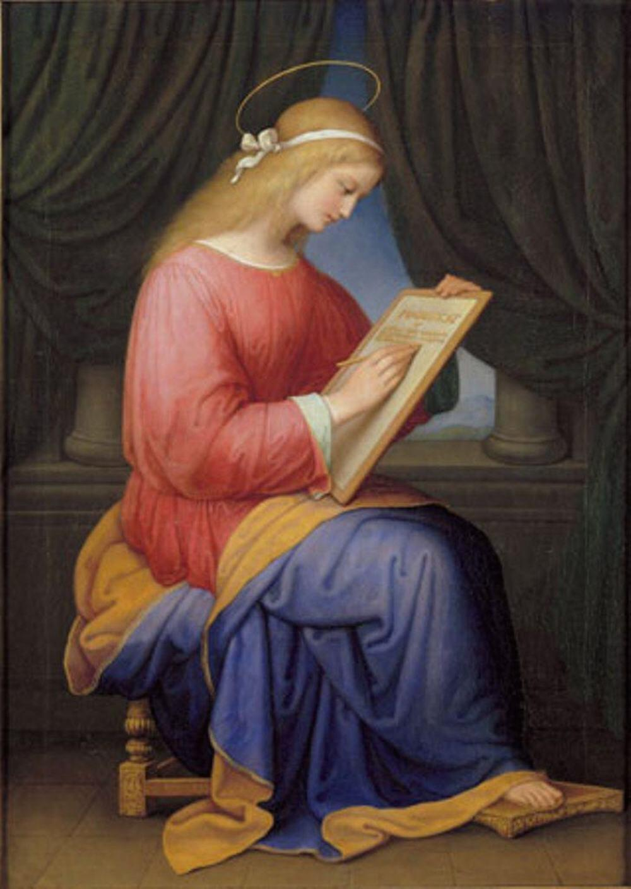

Vandaag stond er een interessante heilige op de kalender: Ignatius van Antiochië. Hij stierf in 106, dus hij is bij de oudste heiligen die we kennen. Zo oud dat hij volgens de overlevering de apostel Johannes nog heeft gekend.

Onderstaande passage uit zijn levensverhaal op [heiligen.net](http://heiligen.net/heiligen/10/17/10-17-0107-ignatius.php) intrigeerde me:

> Volgens de overlevering was hij nog een leerling geweest van de apostel Johannes. Jacobus de Voragine († 1298; feest 13 juli) vertelt in zijn gouden legendeboek dat Ignatius als geloofsleerling een brief zou hebben geschreven aan de heilige Maagd Maria. Hij zou daarin hebben gevraagd of alle wonderen die Johannes over Jezus vertelde echt waar waren. In een antwoordbrief zou Maria hem op het hart hebben gedrukt dat hij geloof kon hechten aan alles wat Johannes over Jezus zei.

Waarom is dit een relevante nota?

De MST (_mainstream theology_ - eigen terminologie, nvdr) van vandaag gaat er prat op dat er in de laatste decennia, dankzij het historisch-kritisch bijbelonderzoek, tal van bijbelverhalen ontmaskerd zijn als "geloofsverhalen". Die hebben niet noodzakelijk een historische basis, maar werden---net als veel heiligenlevens---gestoffeerd om een boodschap over te brengen op de lezer. De mensen van vandaag, en dus ook de gelovigen van vandaag, zijn immers veel kritischer dan hun voorgangers in de voorbije twintig eeuwen, die kritiekloos de grootste fabels als waar aannamen. Zo doet men ons voorkomen.

De anekdote over Ignatius toont het tegendeel aan. De dertiende-eeuwse legendeschrijver heeft een verhaal geschreven dat ongetwijfeld de historisch-kritische toets niet zal doorstaan, waarin de jonge Ignatius correspondeert met de heilige Maagd. De inhoud van die correspondentie legt echter bloot dat, tenminste in de dertiende eeuw, de vraag leefde naar de historische echtheid van de wonderverhalen over Jezus in het Evangelie.

Ik ben ervan overtuigd dat de gelovigen in die twintig eeuwen altijd even kritisch hebben gestaan tegenover de historiciteit van de Bijbel en dat wij in onze tijd daarop geen uitzondering zijn. Het enige verschil is dat wij nu een ander, wetenschappelijk, begrippenapparaat hebben uitgewerkt om die twijfel uit te drukken.

Het antwoord van de legendeschrijver op die twijfel, namelijk dat de heilige Maagd de historiciteit persoonlijk heeft bevestigd tegenover de jonge aspirant-Heilige, verwijzen wij natuurlijk meteen naar de prullenmand.

Spiritueel is het echter een veel mooier resultaat dan welk historisch-kritisch onderzoek ooit zal boeken. Eeuwen voor de afkondiging van de grote dogma's over Maria klinkt erin reeds het _per Mariam ad Jesum_. Maria zet de historisch-kritische onderzoeker een hak door per brief hun vragen te beantwoorden dat een jonge geloofsleerling die onderhevig is aan twijfel, de Evangeliën wel degelijk mag lezen als de waar gebeurde verhalen van het leven van haar Zoon Jezus.

Ik heb hier een afbeelding gevonden van een schilderij van de heilige Maagd die het Magnificat schrijft. Misschien zal historisch-kritisch onderzoek ooit aantonen dat zij in werkelijkheid het antwoord op de brief van Ignatius aan het neerpennen is!

Marie Ellenrieder: "Mary Writing the Magnificat" 1833, Staatliche Kunsthalle Karlsruhe
