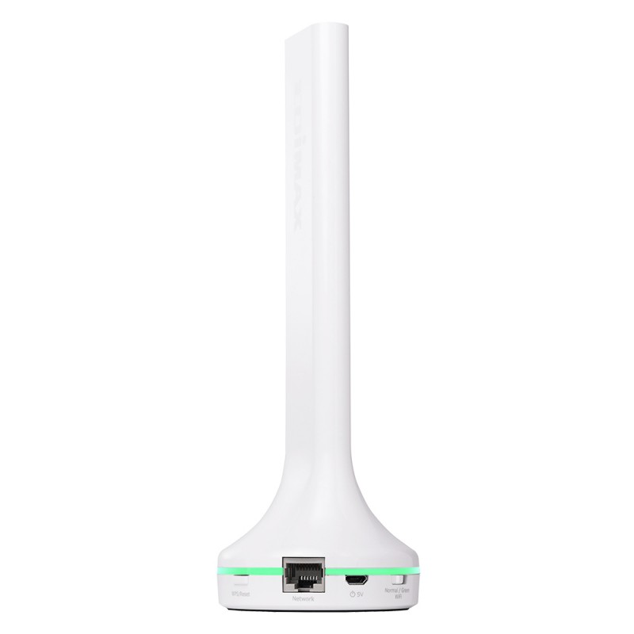
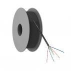
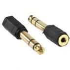
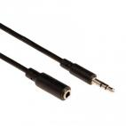
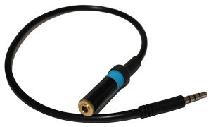
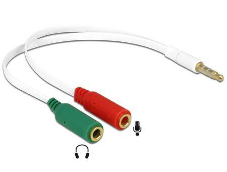
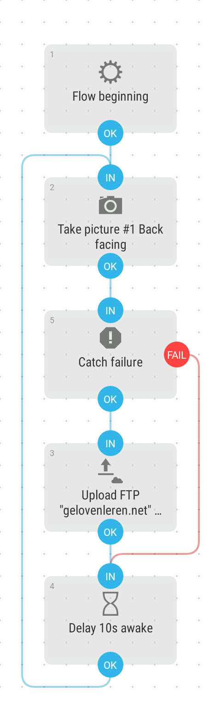

_UPDATE juni 2019: YouTube heeft besloten dat kanalen met minder dan 1000 subscribers niet meer live kunnen streamen via de mobiele app. Daarom gebruik ik nu Periscope van Twitter, zoals beschreven in_ [_deze update van dit artikel_](/blog/een-oude-gsm-gebruiken-als-camera-voor-webcam-en-live-streaming-copy/)_._

Telefoons zijn eigenlijk heel krachtige multimediatoestellen, dus waarom zou die geen dienst kunnen doen als webcam en voor live streaming?

Met relatief goedkope middelen en een beetje technische creativiteit, zet je een multimedia-omgeving op voor live uitzending via streaming. We gebruiken een vaste opstelling met afstandsbediening. Een 24/7 webcam krijg je er gratis bij!

Hier is het schema van hoe het zal werken:  


Enkele uitdagingen van het project op een rijtje:  

### Netwerk  

Zonder verbinding met het internet gaat het natuurlijk niet lukken. Het mobiel netwerk gebruiken zou wel eens een dure onderneming kunnen worden. We gaan een kabel leggen die de een modem zal verbinden met een access point op de plaats waar de camera wordt opgesteld. Zo'n kabel kan tot 100m lang zijn. De camera-gsm, die wordt gebruikt voor de uitzending, zal via het access point toegang hebben tot internet. Ook de telefoon die wordt gebruikt als afstandsbediening zal via het wifi-netwerk verbinding kunnen maken met de camera. Dit is meteen het duurste aspect van de onderneming, want een access point kost al snel 40 euro en 100m UTP-kabel 80 euro.  

### Positie van de camera  

Om de opstelling te gebruiken als webcam, is een vaste opstelling noodzakelijk. Volgende overwegingen moet je in acht nemen bij het kiezen van een goeie positie voor de camera-gsm:

- Kadrering. De camera is vast opgesteld, dus je moet zorgen dat alle belangrijke elementen altijd in beeld zijn. Anderzijds moet je er ook rekening mee houden dat de camera van een telefoon een brede beeldhoek heeft, dus je wil de camera zo dicht mogelijk bij je onderwerp houden, anders zal het centrum van de actie heel klein in beeld komen.
- Beveiliging. Zelfs een tweedehandse gsm die eigenlijk stuk is, zou wel eens gestolen kunnen worden. Kies dus best een positie of een bevestigingsmethode die niet uitnodigt tot diefstal. Ik heb voor mijn camera uit een plaat aluminium een soort hoesje geplooid dat vastgeschroefd wordt aan het meubilair.

### Geluid voor de live streaming  

Het microfoontje van een gsm is goed genoeg om van dichtbij in te spreken, maar hopeloos als je al het geluid in een grote ruimte wil opnemen. Je moet dus een geluidsinstallatie hebben met een versterker en een of meerdere microfoons en we gaan proberen die in te pluggen op de gsm. Het geluid dat opgevangen wordt door de opgestelde microfoons zou dan goed hoorbaar moeten zijn, maar het omgevingsgeluid zal wellicht moeilijk hoorbaar zijn.  

Er zijn twee manieren om geluid op je gsm op te nemen van een externe bron. 

#### Via hoofdtelefoonaanluiting  

Je kan de jack-aansluiting gebruiken, waar je meestal je hoofdtelefoon of headset inplugt. Daarvoor heb je wel enkele hulpstukken nodig, want zo'n gsm-jack is een 4-polige stekker (één pool is aarde, één pool is mono-geluid voor de microfoon en twee polen zijn stereogeluid voor de hoofdtelefoon) en een gewone audiokabel zoals die waarmee je de aansluiting op je geluidsinstallatie kan maken is 3-polig (gewone stereo).  

Je kan proberen te werken met een jack-splitter, die de 4-polige gsm-stekker splitst naar twee aparte 3-polige stekkers, één voor microfoon en één voor hoofdtelefoon. Je moet nog goed opletten, want er zijn twee types van 4-polige jacks en afhankelijk van welke gsm je hebt, moet je een splitter nemen van type [OMTP](https://www.allekabels.be/jack-kabel/4/1193117/jack-y-kabel.html) of van type [CTIA](https://www.allekabels.be/jack-kabel/4/1279697/jack-splitter-kabel-microfoon-en-audio.html). Dat laatste is bij moderne gsm's het meest courant. Op internet vind je dat vast wel terug.  

Ervaring leert echter dat niet in alle omstandigheden je telefoon je kabel zal 'herkennen'. Zelfs al heb je een verloopstuk van het juiste type, dan nog kan het gebeuren dat je gsm  de aangesloten kabel niet 'herkent' en dus gewoon blijft opnemen met zijn interne microfoon. Dat komt omdat de gsm op de microfoonlijn een bepaalde impedantiewaarde verwacht, die typisch is voor het microfoontje van een headset, maar niet aanwezig is als je de kabel rechtstreeks aansluit op de lijnuitgang van een versterker. Daarvoor bestaat er een speciale "line out" verbindingskabel met ingebouwde impedantie, speciaal bedoeld om op de gsm geluid op te nemen dat rechtstreeks van de versterker komt.

Anderzijds heb ik ervaren dat een lange verlengkabel ook een zekere impedantie veroorzaakt en dan werkt zo'n kabel met ingebouwde impedantie juist tegen, want die verzwakt het geluid.  

Opletten geblazen is het ook met storingen op lange verlengkabels die naast andere geleiders liggen. Zo is het niet aangeraden een audiosnoer in hetzelfde kabelgootje te leggen waar al een luidsprekersnoer ligt, dat heb ik ook geleerd.  

De opname van het geluid is dus niet zo eenvoudig en je zal wat moeten experimenteren. Tal van factoren zijn in het spel: de manier waarop je gsm een aangesloten kabel met microfoonlijn herkent, de lengte van je kabelverbinding tot de versterker, de kwaliteit van je signaal, storingen van andere kabels,...  

#### Via USB  

Een andere methode om een externe geluidsbron aan te sluiten is via de USB-aansluiting van je gsm. Daarvoor heb je een [USB sound adapter](https://www.allekabels.be/usb-adapter-omvormer/177/3663/usb-20-naar-surround-adapter-51.html). Nadeel van deze methode is dat je niet tegelijk je gsm in de voeding kan steken en geluid kan laten opnemen. Je zal dus tijdens het streamen de USB-aansluiting op de geluidsbron moeten aansluiten en dan nadien weer overpluggen naar de voeding om de batterij op te laden.  

### Streaming  

Voor streaming zijn er twee voor de hand liggende keuzes: Facebook en YouTube.  

Op Facebook maak je best een pagina aan en via de Facebook-app [Paginabeheer](https://play.google.com/store/apps/details?id=com.facebook.pages.app&hl=nl) kan je met twee klikken "live gaan". Je opname wordt dan live uitgezonden via je pagina op Facebook en na afloop kunnen bezoekers ze ook opnieuw afspelen.  

Op YouTube maak je een eigen kanaal aan en via de YouTube-app op je gsm kan je de livestream opstarten. Die wordt dan later ook bewaard op het kanaal. Je kan met de app de uitzendingen op voorhand inplannen.  

YouTube is de beste optie voor streaming, omdat je kanaal voor iedereen gemakkelijk toegankelijk is, terwijl je uitzendingen op Facebook eigenlijk enkel bedoeld zijn voor andere gebruikers van Facebook. Als je op Facebook toch veel mensen bereikt, kan je je uitzendingen op YouTube delen via je Facebookpagina, zo vang je twee vliegen in een klap.  

### Bediening  

Vermits de camera-gsm permanent wordt opgesteld op een misschien moeilijk bereikbare positie, moet je die vanop afstand kunnen bedienen. Daarvoor bestaan heel handige apps. Op de camera-gsm kan je [TeamViewer Host](https://play.google.com/store/apps/details?id=com.teamviewer.host.market) installeren. De persoon (of personen) die de opnames zullen starten en stoppen, moeten op hun gsm [TeamViewer for Remote Control](https://play.google.com/store/apps/details?id=com.teamviewer.teamviewer.market.mobile&hl=nl) installeren. Als je daarmee inlogt op de camera-gsm kan je die volledig bedienen alsof je hem in je hand hebt.  

### Webcam  

Een eenvoudige webcam is eigenlijk gewoon een foto die je kan tonen in een webpagina, zoals er miljarden online te vinden zijn, maar die om de zoveel seconden wordt vervangen door een nieuwe. Op je gsm kan je met een app zoals Automate een scriptje maken dat elke minuut een foto neemt en die vervolgens met FTP oplaadt naar je webserver. Met twee regels javascript op je website, wordt de foto om de vijf seconden herladen, zodat je steeds het meest recente beeld ziet.  

### Alle onderdelen op een rijtje gezet:

- 
    
    Een oude gsm met werkende camera, hoofdtelefoonaansluiting en netwerk.
    
- 
    
    Extra access point
    
- 
    
    Heel wat meters netwerkkabel
    
- 
    
    Verloopplug voor de versterker
    
- 
    
    Audio-verlengsnoer
    
- 
    
    Line out verbindingskabel met de hoofdtelefoonaansluiting van de gsm
    
- 
    
    jack-splitter, die de 4-polige gsm-stekker splitst naar twee aparte 3-polige stekkers, één voor microfoon en één voor hoofdtelefoon
    

Let op: je gebruikt dus _of_ de Line-out-kabel _of_ de jack-splitter! 

De meeste hulpstukken vind je bij [https://www.allekabels.nl](https://www.allekabels.nl/), maar de Line-out verbindingskabel heb ik enkel op [Amazon](https://www.amazon.com/gp/product/B00OAW85ZG/ref=oh_aui_detailpage_o00_s00?ie=UTF8&psc=1) teruggevonden.

Dit zijn de benodigde apps:

 









Zo ziet een scriptje op Automate eruit, dat voor de registratie van de webcambeelden zorgt:



Dit korte stukje javascript-code op je website zal zorgen dat de webcamfoto vanzelf update om de 5 seconden:

```
<script type="text/javascript">
setInterval(function() { 
  var myImageElement = document.getElementById('heilighart'); 
  myImageElement.src = '/heilighart/heilighart.jpg?rand=' + Math.random();
}, 5000);
</script>
```

Veel succes! 

Dit artikel verscheen reeds in een [eerdere versie](/blog/de-heilige-mis-live-uitzenden-met-een-oude-gsm/), maar is hier aangevuld met extra informatie.
