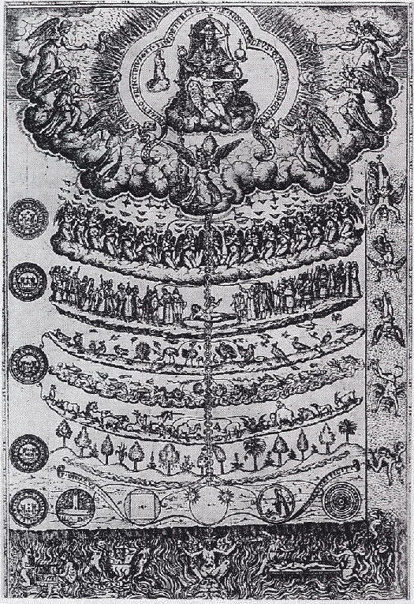

## Horizontalisme  

We roemen graag onze samenleving omdat ze horizontalistisch is. We hebben een democratie met algemeen enkelvoudig stemrecht waarin elke stem even zwaar weegt. We hebben een samenleving zonder standsverschillen en met gelijke kansen, zodat je geboorte of afkomst niet bepaalt welke rol je zal opnemen. We hebben tal van emancipatorische bewegingen achter de rug waardoor bepaalde bevolkingsgroepen uit hun achtergesteldheid zijn kunnen ontsnappen. Slavernij is al lang afgeschaft en met sociale uitbuiting is korte komaf gemaakt. We zijn niet langer onderworpen aan de grillen van hogere klassen waartoe we nooit zullen behoren.  

Toch is dat horizontalisme relatief. Een meerderheid van de bevolking verbindt  zich als werknemer contractueel tot een organisatie die wél verticalistisch is. In een bedrijf heb je bazen en ook die bazen hebben op hun beurt bazen en die wensen te worden gehoorzaamd. Jongeren bewegen zich in scholen en in jeugdbewegingen of sportclubs waar ze, onder andere, leren omgaan met gezag. Dat vinden we, ondanks ons roemen op het horizontalisme, normaal.  

We hebben immers de keuze. Wie een inkomen wil zonder onder gezag te staan, kan zelfstandig werken. Wie een diploma wil zonder naar school te gaan, kan studeren voor een middenjury. Wie wil voetballen zonder onder het gezag van een trainer te staan, kan op het pleintje met zijn vrienden een balletje trappen. Hij zal dan echter nooit met een ploeg een zege behalen…  

## Christus Koning  

Op het einde van de maand november viert de kerk het feest van Christus Koning. Ik wil de gelovigen de kost niet geven, die eigenlijk niet goed weten wat ze met dit feest aan moeten. Om het feest beter te begrijpen, moeten we even in gedachten ons horizontalistisch wereldbeeld afwerpen en ons inbeelden hoe het zou zijn als onze samenleving een natuurlijke hiërarchie zou kennen waarin alle gezag uiteindelijk van God afhangt. Dat is moeilijk, vandaag nog veel moeilijker dan het al was in 1925, het jaar waarin dit feest werd ingevoerd.  

Niettemin is dat het uitgangspunt van de encycliek _Quas Primas_ van paus Pius XI. Als grondslag van Jezus' koningschap citeert de paus de heilige Cyrillus van Alexandrië: _„Want Hij bezit - in één woord gezegd - de heerschappij over alle schepselen, zonder dat Hij ze door geweld heeft afgedwongen of van buiten heeft ontleend, maar als Zijn eigen recht krachtens Zijn wezen en natuur.”_ Jezus' koningschap is erfrechterlijk. Hij heeft het niet verdiend, niet veroverd en---laat ons toevoegen---niet democratisch verworven. Jezus is Koning omdat Hij de zoon van zijn Vader is. En wij hebben dat niet te kiezen.  

Laat dat alvast maar eens doordringen in ons eigen wereldbeeld, want ook wanneer onze kleine gedachtenexperiment ten einde is en het feest van Christus Koning achter de rug, dienen we Jezus te erkennen als een koning die heerst en regeert en aan wie we, net zoals in een ridderroman, ons leven verschuldigd zijn, dankzij zijn verlossingswerk.  

De lectuur van de encycliek gaat echter verder. De paus betoogt dat het koningschap van Jezus weliswaar voornamelijk een geestelijk karakter heeft, maar dat weerhoudt hem er niet van Christus het eigendomsrecht toe te kennen op alle aardse goederen (waarvan Hij immers de Schepper is) en ook niet alle mensen (ook die niet tot het christelijk geloof behoren) en alle gemeenschappen en alle volkeren onder zijn heerschappij te plaatsen. Logisch gevolg: wie aan het hoofd staat van een gemeenschap of wie een volk bestuurt, dient gepaste gehoorzaamheid te betonen aan Christus' gezag en diens voorbeeld van nederigheid en rechtvaardigheid te volgen.  

Paus Pius XI zag echter ook wel in dat dit, gezien de secularisering van de maatschappij, utopische ideeën zijn en besluit dus maar het feest van "Christus Koning van het Heelal" in te stellen als jaarlijks geheugensteuntje voor alle gelovigen dat zij de plicht hebben eerlang "_de wereld voor Christus te heroveren"._

## Derde getuigenis  

Wat ons in de wereld niet lukt, zou in de beslotenheid van onze eigen Kerk toch mogelijk moeten zijn? Stellen we binnen de Kerk het koningschap van Christus voldoende voorop? Al het gezag, ook het kerkelijk gezag, moet uiteindelijk verantwoording afleggen aan Christus.  

Dat is de retoriek die mgr. Vigano gebruikt in zijn [derde 'getuigenis'](https://www.lifesitenews.com/news/archbishop-viganos-third-testimony), die hij besluit met de woorden _"You can trust Him who told us, "the truth will set you free." I do not say it will be easy to decide between silence and speaking. I urge you to consider which choice-- on your deathbed, and then before the just Judge -- you will not regret having made"_. Die retoriek, misschien meer dan de inhoud van de getuigenis, heeft mgr. Charles Pope, een Amerikaans priester die al lang op internet publiceert en die ik zeer apprecieer, diep bewogen. Hij spreekt over Vigano's getuigenis als [_"something that is destined to be one of the great pastoral and literary moments of the Church’s history"_](http://www.ncregister.com/blog/msgr-pope/reflections-on-archbishop-viganos-courageous-third-letter), dit in schril contrast met andere publicisten die Vigano [_"a small and bitter man"_](https://www.ncronline.org/news/accountability/distinctly-catholic/vigan-s-third-screed-unintentionally-reveals-his-true) noemen.  

Misschien zal de geschiedenis uitwijzen wie gelijk had, maar uiteindelijk is er maar Eén die het finale oordeel zal vellen over de kerkelijke opiniemakers die nu het strijdtoneel bevolken en de vraag is alle spelers zich daarvan ten volle bewust zijn. Wij, mensen, zijn niet vies van gezag, zolang het ons maar goed uitkomt. Zo ving ik onlangs in een gesprek op hoe bewonderaars van paus Franciscus mekaar monkelend toegaven dat "hij toch een kleine dictator is" als het over zijn stijl van besturen ging. Onder de vorige paus was dezelfde vaststelling, zo ze al grond had gehad, bij diezelfde personen allerminst gepaard gegaan met een monkellach. Dat is onze _condition humaine_: als het gezag van hogerhand ons toelaat vandaag onze zelfverwezenlijking vaart te geven, leggen we zonder blozen de grote principes aan de kant waarmee we gisteren nog datzelfde gezag weerstreefden. Daarin vergeten we dat er slechts één oorsprong is van alle gezag: Christus.  

## Synodaliteit

Het pleidooi voor meer synodaliteit in de Kerk, dat op de jongste synode is bevestigd, wordt verantwoord door de stem van de Heilige Geest die vanuit zo'n synode spreekt. Mijns inziens kan die stem alleen maar spreken in personen die hun drang tot zelfverwezenlijking hebben afgelegd en verantwoording afleggen aan Christus. Laat ons hopen dat de Heilige Geest ook daarover waakt.  

De orde van alle dingen
