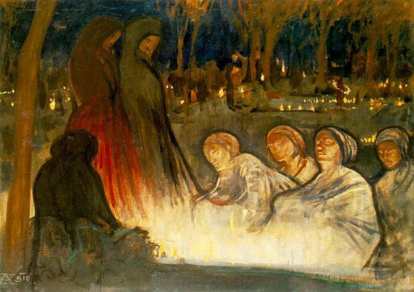

Ik ga dit heel kort houden. Klagen en kwaadspreken over liturgische wantoestanden, daar bestaan andere blogs voor, daar doe ik niet aan mee. Als je er echter persoonlijk mee wordt geconfronteerd, wordt het [moeilijk jezelf in te tomen](/blog/misbegrepen/). Dus ik schrijf.  

Vrijdag 2 november 2018, herdenkingsdienst voor de overledenen in een niet nader bepaalde Vlaamse parochie.  

Het blijkt een gebedsdienst met vier leken-voorgangers, van wie één getooid in albe. Het was een heel verzorgde viering. Je merkte duidelijk dat er een grondige voorbereiding aan voorafgegaan was, de keuze van de teksten en de liederen en voor de choreografie van enkele rituele elementen zoals het branden van wierook, het opnoemen van de namen van alle overledenen en het ontsteken van heel wat kaarsjes. Geen uitreiking van de communie echter---achteraf bekeken maar beter ook. De viering werd bezocht door heel wat familieleden van overledenen van het voorbije jaar, die blijkbaar wel geraakt werden door het ganse opzet van de viering.  

De teksten en gebeden, allemaal vrij gekozen, verwezen, op één korte voorbede na, op geen enkele manier naar de zielen van de overledenen of hun verrijzenis. **OP GEEN ENKELE MANIER!** Alle gebeden en teksten waren gericht op onszelf, _ons_ verdriet, _onze_ eenzaamheid, _onze_ herinneringen aan de overledene. We hebben gebeden tot God dat Hij _ons_ zou bijstaan, maar we hebben _niet_ gebeden voor onze overledenen.  

**Hebben de overledenen onze gebeden niet nodig?**  

All Souls' Day (Aladar Korosfoi-Kriesch, 1910, Hungarian National Gallery, Budapest)

De mis van Allerzielen (en volgens het missaal zijn dat er zelfs drie, die elke priester gerechtigd is op te dragen op dezelfde dag!) is toch juist bedoeld om te bidden voor de zielen van de overledenen? Deze mis bij uitstek laat ons toe deel te nemen aan hun verrijzenis door voor hen te bidden en te offeren. Dit gebed bij uitstek laat ons toe daadwerkelijk met hen verbonden te blijven over de dood heen en _juist daaruit_ de christelijke hoop te putten die ons zal helpen ons verdriet te verwerken.  

Als je deze herdenkingsdienst meemaakte, werd het heel moelijk om je verrijzenisgeloof te bewaren! Mijn indruk na de viering was dat er na de dood niets meer op ons wacht. **Dat we als nabestaanden niets overhouden dan ons verdriet en enkele herinneringen en een kruisje voor op het dressoir.** Alle hoop werd mij ontnomen. Hoe ontluisterend onchristelijk is dat niet!?  

Op Doorbraak verscheen trouwens een [soortgelijke vaststelling](https://doorbraak.be/begrafenis-laudatio-of-requiem/) over de inhoud van de gemiddelde begrafenisliturgie, waar de lofprijzingen over de overledene het gebed voor zijn of haar verrijzenis verstikken.  

Ik vind het oprecht jammer! Zo'n vieringen zijn de doodsteek voor wat er nog rest van het geloof in de Vlaamse katholieke Kerk. Ik wil nog aannemen dat men ervoor terugdeinst om nabestaanden te confronteren met [hun verantwoordelijkheid voor de zielen in het vagevuur](http://alledaags.gelovenleren.net/link/MTU5OTk1NDMzNjQ1MDAz) en dat de retoriek van de strijdende, lijdende en triomferende Kerk geen harten meer sneller doet slaan, maar deze totale negatie van de verrijzenis en van de [kerkelijke leer over de uitersten](https://www.rkdocumenten.nl/rkdocs/index.php?mi=600&doc=1&id=1150) slaat werkelijk alles dood. Ik koester dan ook de vurige hoop dat kerkelijke gezagsdragers actie zullen ondernemen om dit soort diensten opnieuw te kerstenen.

Ons geloof verdient meer dan goede bedoelingen blijkbaar kunnen waarmaken.
