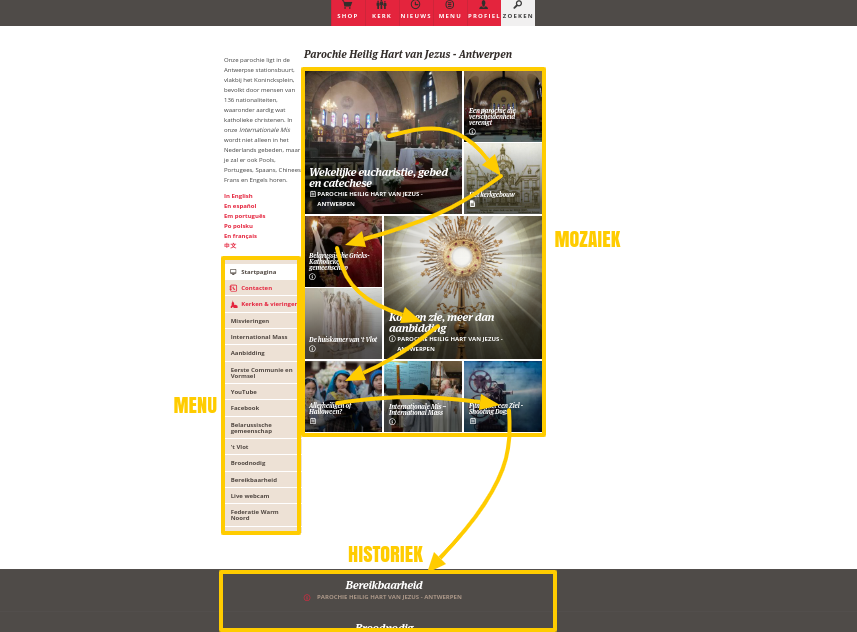

De huur van de serverruimte voor onze oude parochiewebsite liep af. De host die we gebruikten was nogal prijzig en vroeg meer dan 200 euro per jaar. Dat kan natuurlijk veel goedkoper. Voor mijn eigen websites gebruik ik de hosting van [Versio.nl](https://www.versio.nl/webhosting). Daar kan je al voor 25 euro per jaar serverruimte huren met meer dan genoeg ruimte voor meerdere Wordpresswebsites.  

Mijn eerste voorstel was om daar een nieuwe website op te zetten. Hoewel het helemaal niet moeilijk is om met Wordpress aan de slag te gaan, moet je toch elke keer weer een beetje het warm water uitvinden. Welke layout (thema) kies je, waar plaats je menu's en widgets op je site, welke extra plugins heb je nodig om te koppelen met sociale media, om je site beter te beveiligen en om je vindbaarheid op zoekmachines te verbeteren (SEO, search engine optimization)? Ik zag er dus toch een beetje tegen op.  

Er was echter nog een ander alternatief: Kerknet. Ook daar kan je [webruimte huren om een eigen website op te zetten](https://www.kerknet.be/kerknet-redactie/artikel-informatie/ik-wil-een-microsite-beheren-op-kerknet). Het heet dan een 'microsite', want je eigen website wordt ingepast in de _look-and-feel_ van Kerknet. Je hebt dus niet dezelfde vrijheid om layouts en tools zelf te kiezen, maar aan de andere kant bespaart je dat wel een hoop kopzorgen.  

De prijs van zo'n microsite bedraagt jaarlijks 108 euro. Ook niet meteen de goedkoopste oplossing, maar de integratie met de portaal van de katholieke Kerk in Vlaanderen is ook wat waard. Ik heb al vaak gemerkt hoe moeilijk het is informatie op te zoeken over parochies in ons land, want hoewel veel parochies eigen websites hebben, zijn ze vaak moeilijk te vinden en telkens anders gestructureerd. Het zou eigenlijk vanzelfsprekend moeten zijn dat je op Kerknet op zoek kan gaan naar informatie over alle parochies te lande en hoe kan dat beter dan door parochies een stek te geven op datzelfde platform?  

Zo gezegd, zo gedaan. Onze [parochie van het Heilig Hart van Jezus](https://www.kerknet.be/organisatie/parochie-heilig-hart-van-jezus-antwerpen) heeft nu een eigen website en ook de [federatie Antwerpen-Noord, "Warm Noord" genoemd](https://www.kerknet.be/organisatie/federatie-antwerpen-noord), waar tegenwoordig het zwaartepunt van de organisatie van het parochieleven ligt, kreeg een eigen stek. Wat volgt zijn enkele persoonlijke notities bij de opzet van zo'n microsite, als warmmaker, want er is natuurlijk een [volledige handleiding](http://bit.ly/kerknet-handleiding).  

## Statische en actuele informatie  

Een microsite heeft altijd een **hoofdpagina** en een reeks **pagina's**. Om een goeie website te maken is het belangrijk dat je goed nadenkt welke informatie je vanuit de hoofdpagina bereikbaar wil maken. Als je website groeit zullen immers niet al je pagina's zichtbaar zijn op je hoofdpagina. Op elke website vind je twee soorten informatie: actuele informatie en statische informatie.  

**Statische informatie** is in principe onveranderlijk. Dat geldt bijvoorbeeld voor contactgegevens, kennismakingsartikels en vaste kalenders (bv. de wekelijkse zondagsmissen). Het kan soms nodig zijn die pagina's aan te passen, maar dezelfde pagina blijft altijd relevant.  

**Actuele informatie** is meer tijdgebonden. Dat geldt voor aankondigingen van evenementen (bv. de missen tijdens de komende Kerst- of Paasperiode, concerten) of voor verslagen van gebeurtenissen.  

Als je een pagina opmaakt, zorg je er best voor dat je op voorhand bepaalt welke soort van informatie je aanbiedt. Ga je de twee mengen, dan zal je na verloop van tijd moeilijkheden krijgen met het onderhoud van je site.  

## Opmaak van de hoofdpagina  

Als je een microsite bezoekt, krijg je een overzicht van de pagina's in drie blokken: het menu, de mozaïek en de historiek (onderaan).  

**Het menu** vul je naar believen met links die de bezoekers van je website snel de weg wijzen naar de informatie die ze zoeken. Links kunnen verwijzen naar pagina's op je eigen microsite, maar ook naar andere plaatsen op het web. Je kan er dus ook een link voorzien naar de facebookpagina van je parochie of naar websites van organisaties die aan de parochie verbonden zijn.  

**De mozaïek** en **de historiek** horen bij elkaar. Volgens het basismechanisme van Kerknet verschijnt elke nieuwe pagina die je maakt automatisch links boven in de mozaïek en alle oudere pagina's schuiven dan een plaatsje op, eerst doorheen alle blokken van de mozaïek en daarna verschijnen ze in de historiek onderaan de pagina.  

De natuurlijke chronologie van de gepubliceerde pagina's op de hoofdpagina

Die chronologie kan je doorbreken door bepaalde artikels vast te prikken in de mozaïek. De belangrijkste pagina's op je microsite blijven zo steeds bovenaan staan op de hoofdpagina en de illustratie in de muziek geeft ze een mooie _eye-catcher_.  

## Artikels en evenementen  

Op Kerknet kan je twee soorten pagina's aanmaken: artikels en evenementen. **Evenementen** hebben de bijzondere eigenschap dat je kan ingeven waar en wanneer het beschreven evenement plaatsvindt.  

Op je eigen website valt dat verschil niet meteen op, maar het platform van Kerknet laat toe specifiek op zoek te gaan naar evenementen en maakt dus een soort van evenementenkalender op. Als je je aankondigingen opmaakt als evenementen zullen die daar automatisch verschijnen.  

## Metadata  

Elke pagina, of het nu een artikel is of een evenement, kan je metadata meegeven. Er zijn drie soorten metadata: type, thema en trefwoorden.  

**Het type** geeft weer wat voor soort van artikel je maakt. Een artikel kan nieuws zijn, een fotoreportagie, inspiratie, persbericht, blog... en nog een dozijn meer types van berichten.  

**Het thema** geeft weer waar het artikel over gaat: cultuur, filosofie, gezin, liturgie en catechese, wereldkerk, kerk in Vlaanderen, solidariteit,...  

Types en thema's moet je kiezen uit een voorgeschreven lijst. **Trefwoorden** kan je zelf ingeven. Hier kies je woorden waarvan je vermoed dat bezoekers van Kerknet ze zullen gebruiken wanneer ze jouw informatie zoeken.  

Deze metadata maken geen verschil in de presentatie als je eigen microsite doorbladert, maar ze zorgen er wel voor dat je informatie gemakkelijk gevonden kan worden via de zoekfunctie van Kerknet. Je kan er ook zelf nuttig gebruik van maken, bijvoorbeeld als je in het menu een link wil voorzien naar alle artikels op je site die met een bepaald thema te maken hebben. Zo ben je zeker dat je bezoekers steeds de meeste actuele informatie zullen terugvinden.  

## RSS-feeds  

Er zijn nog enkele functies die ik mis op Kerknet. **RSS-feeds** horen daar zeker bij. Ik maak dagelijks gebruik van [Feedly](https://feedly.com), een app waarmee ik me abonneer op de RSS-feeds van alle websites die me interesseren. Zo krijg ik altijd een overzicht van de nieuwe artikels die zijn verschenen. Het zou een kleine moeite zijn om te zorgen dat microsites op Kerknet een eigen RSS-feed krijgen. Als lapmiddel kan je [voorlopig een externe tool gebruiken](http://createfeed.fivefilters.org/).  

## Emaillijsten  

Een extra toepassing van RSS-feeds is dat ze toelaten de site te koppelen met tools zoals IFTTT en MailChimp. Met IFTTT kan je je website koppelen aan **sociale media** zoals Twitter of Facebook, zodat nieuwe berichten daar automatisch vermeld worden. Met MailChimp kan je een **emaillijst** opmaken waarop mensen zich kunnen inschrijven om zo per mail op de hoogte te blijven van nieuwe publicaties.  

Voor de gemiddelde Kerknetwebmaster is dat wellicht al hoog gegrepen, maar ook daarvoor zou Kerknet zelf kunnen instaan, want de gebruikers van Kerknet hebben nu reeds de mogelijkheid zich aan te melden en zich te abonneren op een dagelijkse nieuwsbrief van de globale site, dus waarom ook niet van microsites?  

## Zoek in de buurt  

De zoekfunctie is technisch heel mooi uitgebouwd, maar niet erg gebruiksvriendelijk. Met de metadata die nu reeds beschikbaar is, zou het perfect mogelijk moeten zijn om een zoekfunctie te maken waarmee je kan filteren op thema en op geografische regio ("wat voor lezingen zijn er in mijn buurt") en ook weer opnieuw met de optie om daarvan automatisch op de hoogte te blijven. Je kan nu bijvoorbeeld al zoeken naar [evenementen in bisdom Antwerpen](https://www.kerknet.be/zoeken/events?f%5B0%5D=field_article_organisation%3A203), maar ik ga dat niet elke week opnieuw doen om te zien of er niks interessants is toegevoegd!  

Kerknet dus een aanrader voor parochies die een efficiënte en stabiele webhost zoeken. De website wordt nog verder ontwikkeld dus in de toekomst zullen de functies en mogelijkheden zeker uitbreiden.
