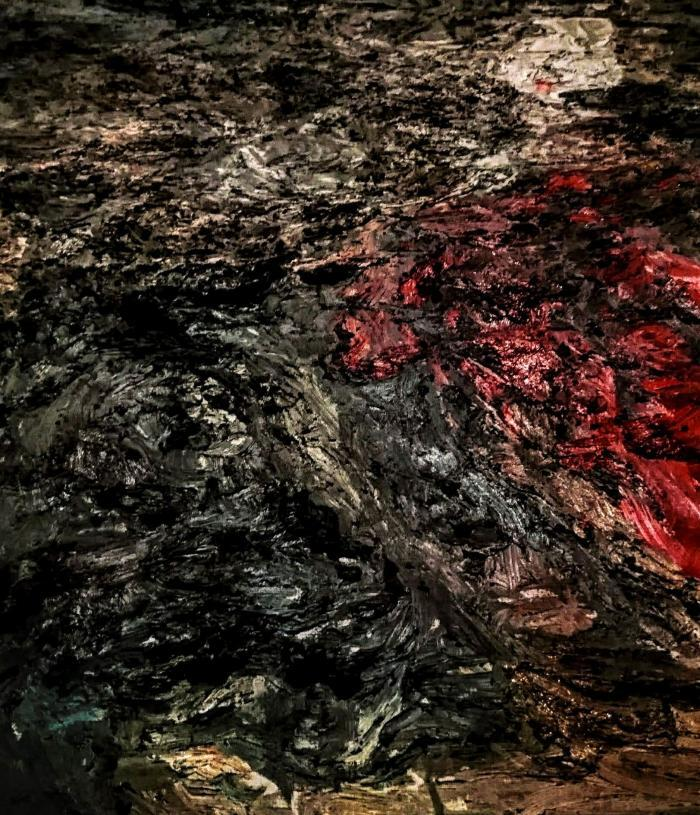

In de kathedraal van Antwerpen is een nieuw schilderij onthuld. Naast de bekende [Kruisafneming van Rubens](https://nl.wikipedia.org/wiki/Kruisafneming_(Rubens)), hangt nu een [moderne interpretatie](https://klara.be/kruisafneming-van-sam-dillemans-naast-die-van-pp-rubens) van hetzelfde werk en op hetzelfde formaat, van de hand van [Sam Dillemans](http://www.sam-dillemans.com/).  

Pastoor Bart Paepen is al jarenlang pleitbezorger van moderne kunst in zijn kerk. In 2015 haalde hij met "[De Man die het Kruis Draagt](https://www.youtube.com/watch?v=u25mnfBasWs)" reeds een werk van Jan Fabre binnen.

In zijn toespraak tijdens de onthulling van het nieuwe kunstwerk, gaf hij de tip om het schilderij van Dillemans ook eens te bekijken door er pal onder te gaan staan. In het nauwelijks figuratieve werk komt dan het verdriet en het gevoel van rouw pas goed tot uiting, want in het reliëf van het ruw bepleisterde canvas herken je het landschap van een slagveld na de oorlog. Niet toevallig als je weet dat Dillemans ook een hele reeks werken maakte rond het thema "[Paintings of the Great War](https://www.vrt.be/vrtnws/nl/2018/03/09/-goodbye-to-all-that---sam-dillemans-opent-nieuwe-tentoonstellin/)".

Hieronder vind je enkele fotografische impressies genomen tijdens de onthulling van het werk op zaterdag 23 november 2018, wat meteen ook de gelenheid was om de kathedraal eens te bezoeken in een stemmige nachtelijke atmosfeer.

    
De "nieuwe" Kruisafneming in het rechtse transept, vlak naast de versie van Rubens
    

    
Het schilderij van de Kruisafneming bekeken als een landschap.

Ik bedenk me trouwens, als dit kikvorsperspectief inderdaad zo'n interessante ontsluiting is voor het kunstwerk, heeft de kunstenaar nooit overwogen om het niet aan de muur te hangen, maar horizontaal te plaatsen, zoals een maquette?

  

    

  

