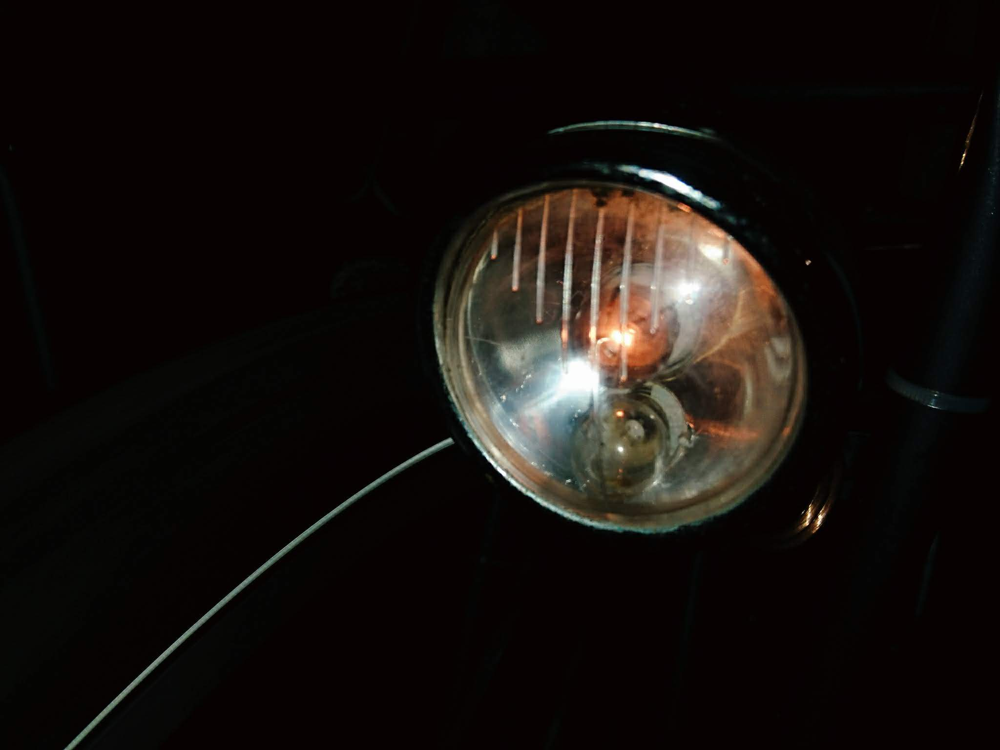
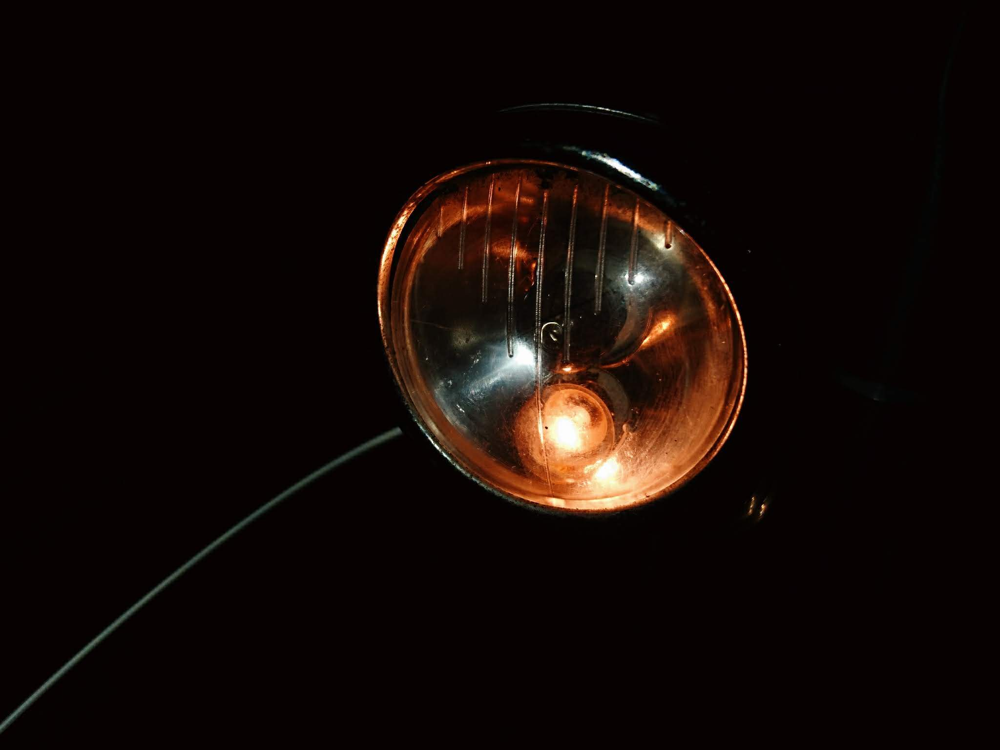

Mijn nieuwe fiets kwam uit de winkel, uitgerust met lichten op batterijen. Dat vond ik niet zo praktisch, want je moet regelmatig de batterijen vervangen en ze blijken altijd leeg te zijn wanneer je ze net nodig hebt. Daarom heb ik me bij [vlechtservice.nl](https://vlechtservice.nl/) een nieuw voorwiel aangeschaft met naafdynamo. Als koplamp heb ik een antiek exemplaar geïnstalleerd dat nog in mijn rommelschuif lag te verstoffen, met echte gloeilampjes. Ik zeg "gloeilampjes" in het meervoud, want de lamp heeft er twee. Met een schakelaar bovenop de lamp kan je ofwel het ene ofwel het andere lampje laten branden.  

Ik herinner me nog dat ik, toen ik klein was, ook zo'n lamp op mijn fiets had, en dat ik me er toen de kop heb over gebroken waarvoor die twee lampjes dienden. Ik dacht dat het misschien bedoeld was zoals bij een auto, dat de ene lamp het dimlicht is en de andere het groot licht. Tot mijn teleurstelling was dat niet het geval, want zelfs het felste van beide lampjes geeft maar net genoeg licht om niet van de weg te rijden. Ik vond het ook raar dat de schakelaar, die drie standen heeft, altijd ofwel het ene ofwel het andere lampje laat branden, maar niet allebei, terwijl dat technisch perfect mogelijk zou zijn. Ik had het wel _cool_ gevonden, een koplamp te hebben met wat meer spectaculaire _features._  

Tegenwoordig zijn koplampen van fietsen veel krachtiger. Dat had je al met halogeenlampen, maar met die nieuwe ledverlichting heb je bovendien het voordeel dat die haast nooit stuk gaan. Het gloeilampje in mijn antieke koplamp zal het misschien ook wel een jaar of zo uithouden, maar vroeg of laat zal het gloeidraadje de geest geven.  

Van die eindigheid had ik vroeger geen besef. Als je jong bent, kijk je zo ver niet vooruit. Wanneer ik me nu opnieuw de vraag stel waarom mijn koplamp uitgerust is met twee lampjes en waarom de schakelaar geen gesofistikeerdere functies heeft, hoef ik me er de kop niet meer over te breken. Het tweede lampje is gewoon reserve. Als mijn licht het begeeft, hoef ik maar aan de schakelaar te draaien en het tweede lampje neemt het over. Iets zwakker, want het geeft geen mooie stralenbundel, maar wel voldoende om zonder ongelukken enkele dagen te gebruiken, tot het andere lampje vervangen kan worden.  

Dat is een inzicht dat maar met de jaren komt, zo blijkt. Het verhoogt wel mijn appreciatie van de wijze waarop werktuigen vroeger ontworpen werden. De lampjes hadden een veel kortere levensduur dan vandaag, maar mijn licht is 100% bedrijfzeker en ontworpen om een eeuwigheid mee te gaan. Die nieuwe ledlampen geven wel de illusie dat ze een eeuwigheid zullen meegaan, maar er zal ook een dag komen dat ergens in de electronica die eromheen zit een circuitje barst en dan kan de hele lamp in de vuilbak.  

Op mijn blogje gaat het niet over fietsverlichting, maar over geloof. Maar is het daarmee niet net zo? Vandaag begrijp ik beter waar het geloof voor dient dan toen ik klein was. Niet omdat het geloof zo moeilijk is, maar omdat het even nutteloos leek als dat tweede lampje dat nooit brandde.  

**Met ouder worden, krijg je meer aandacht voor zekerheid. Je fascinatie voor de onmiddellijke voldoening maakt plaats voor aandacht voor het eeuwige.**  

- 
    
    Het bovenste lampje brandt
    
- 
    
    Het onderste lampje brandt
