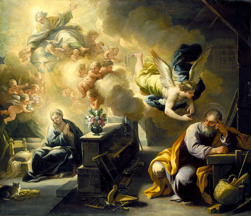
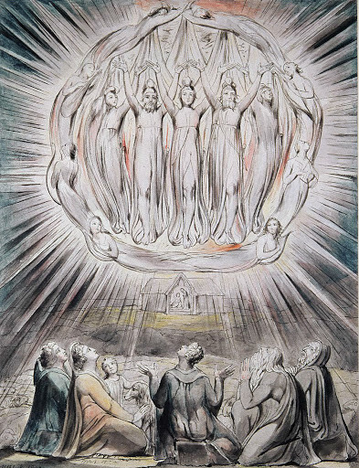
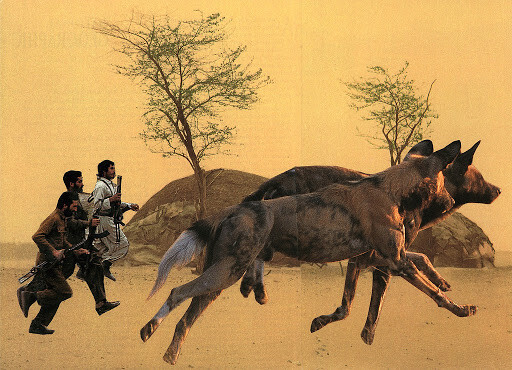
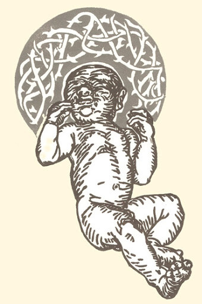

De meeste gelovigen gaan met Kerstmis maar éénmaal naar de mis en kiezen voor de mis van kerstavond, de middernachtmis of een mis op kerstdag zelf al naargelang dat uitkomt met de familiebezoeken. Gelukkig is er zoveel keuze! Dat is niet omdat de kerk zich graag plooit naar de grillen van haar 'klanten'. Het missaal schrijft voor Kerstmis een hele trits missen voor.  

Het feest van Kerstmis heeft vier aparte misformulieren, die elk gebonden zijn aan een bepaald tijdstip in de dag. Op de vooravond van Kerstmis, 24 december, heb je de mis voor het Vigilie van Kerstmis. Op kerstdag zelf, 25 december, zijn er drie missen voorgeschreven: de nachtmis (de bekende "middernachtsmis"), de dageraadsmis (dus bij zonsopgang, in onze streken omstreeks kwart voor negen, wintertijd) en de dagmis. Volledigheidshalve valt ook de dagmis van 24 december te vermelden, maar die hoort eigenlijk nog bij de Advent.  

Elke mis heeft een eigen set lezingen uit de Bijbel. Onlangs schreef ik nog een artikeltje over de [beschikbaarheid van een online Lectionarium](/blog/online-lectionarium-gevonden-onder-de-korenmaat/), waar je al die lezingen kan terugvinden. Van het tiental websites dat ik toen oplijstte, is er maar één die een volledig overzicht heeft van al die lezingen. De andere sites beperken zich tot één van de missen.  

Het online Lectionarium dat erin slaagt de drie missen van kerstdag te publiceren, is dat op de [website van de Sint-Nicolaasparochie in Baarn](https://parochienet.nl/nicbaarn/index.php?Nav=6&ID=20181225):  

Voor de Vigiliemis moeten we te rade op de eigen website met het Prentenmissaal.  

Hier zijn de lezingen op een rijtje:  

#### 1/ Mis voor 24 december (deze ochtendmis hoort eigenlijk nog bij de Advent, dus het is _geen_ kerstviering!)  

- **Eerste Lezing:** 2 Samuel 7:1-5,8-12,14,16 _"De Heer kondigt u aan dat Hij voor ú een huis zal oprichten. Wanneer uw dagen ten einde zijn, en gij bij uw vaderen ter ruste zult gaan, dan zal Ik het kind, dat van u is uitgegaan tot uw nazaat verheffen, en zijn koningschap bestendig doen zijn. Ik zal voor hem een vader zijn, en hij Mij een zoon. Zo zal uw huis en uw koninklijke macht altijd standhouden; uw troon staat vast voor eeuwig."_
- **Evangelie:** Lucas 1:67-79 _"In die dagen werd Zacharias, de vader van Johannes, vervuld met de heilige Geest en hij sprak in profetische woorden: Geprezen zij de Heer, Israëls God: want genadig zag Hij neer en verloste zijn volk. Hij heeft ons een reddende kracht verwekt in het huis van David, zijn dienaar, zoals Hij van oudsher voorzegd heeft bij monde van zijn heilige profeten."_

#### 2/ Vigilie van Kerstmis  

- **Eerste Lezing:** Jesaja 62:1-5 _"Want Jahweh heeft behagen in u, En uw land wordt gehuwd. Zoals een jongeman zijn meisje trouwt, Zal Hij, die u opbouwt, u huwen; En zoals een bruidegom zich verheugt in zijn bruid, Zal uw God zich verheugen in u."_
- **Tweede Lezing:** Handelingen 13:16-16,22-25 _"Uit zijn zaad heeft God, naar zijn belofte, voor Israël Jesus als Verlosser doen opstaan. Reeds vóór Hij optrad, had Johannes aan het ganse volk van Israël een doopsel van boete gepreekt; en toen zijn levenstaak ten einde liep, heeft Johannes gezegd "Hij, voor wien gij mij houdt, ben ik niet; maar zie, na mij komt er Een, wiens schoeisel ik niet waardig ben te ontbinden"."_
- **Evangelie:** Mt 1:1-25 _"Josef, zoon van David, vrees niet, Maria, uw vrouw, tot u te nemen; want wat in haar is geboren, is van den Heiligen Geest. Ze zal een zoon baren, en ge zult Hem Jesus noemen; want Hij zal zijn volk verlossen van hun zonden. Dit alles is geschied, opdat vervuld zou worden wat de Heer gesproken heeft door den profeet, die zegt: "Zie, de maagd zal ontvangen, en een zoon baren; en men zal Hem Emmánuel noemen"; dat is vertaald: God met ons."_

The dream of St. Joseph (Georges de la Tour, 1640, Musée des Beaux-Arts, Nantes)

#### 3/ Middernachtmis  

- **Eerste Lezing:** Jesaja 9:1-6 _"Het volk dat in het donker wandelt, ziet een groot licht"_
- **Tweede Lezing:** Titus 2:11-14 _"De genade van God, bron van heil voor alle mensen, is op aarde verschenen."_
- **Evangelie:** Lucas 2:1-14 _"Vreest niet, want zie, ik verkondig u een vreugdevolle boodschap die bestemd is voor heel het volk. Heden is u een Redder geboren, Christus de Heer, in de stad van David."_

The Angels appearing to the Shepherds (William Blake, 1809, Whitworth Art Gallery)

#### 4/ Dageraadsmis  

- **Eerste Lezing:** Jesaja 62:11-12 _"De Heer laat het over heel de aarde verkondigen: Spreek tot Vrouwe Sion: Uw Redder is op komst."_
- **Tweede Lezing:** Titus 3:4-7 _"De goedheid en mensenliefde van God onze Heiland is op aarde verschenen, en Hij heeft ons gered, niet omdat wij iets goeds gedaan zouden hebben, maar alleen omdat Hij barmhartig is."_
- **Evangelie:** Lucas 2:15-20 _"Zodra de engelen weer van hen weggegaan waren naar de hemel, zeiden de herders tot elkaar: Komt, laten we naar Betlehem gaan om te zien wat er gebeurd is en wat de Heer ons heeft bekend gemaakt."_

The Shepards Hurry to the Manger (David Adams, 2006, © David Adams)

#### 5/ Dagmis:  

- **Eerste Lezing:** Jesaja 52:7-10 _"De Heer heeft zijn heilige arm ontbloot voor de ogen van alle volkeren; en alle grenzen der aarde hebben het heil van onze God aanschouwd."_
- **Tweede Lezing:** Hebreeën 52:7-10 _"Nadat God eertijds vele malen en op velerlei wijzen tot onze Vaderen gesproken had door de Profeten, heeft Hij nu, op het einde der tijden, tot ons gesproken door de Zoon, die Hij erfgenaam gemaakt heeft van al wat bestaat en door wie Hij het heelal heeft geschapen."_
- **Evangelie:** Johannes 1:1-18 _"Het Woord is vlees geworden en heeft onder ons gewoond. Wij hebben zijn heerlijkheid aanschouwd, zulk een heerlijkheid als de Eniggeborene van de Vader ontvangt, vol genade en waarheid."_

Word Made Flesh (Tyrus Clutter, 2004, © Tyrus Clutter)

Vermits in de meeste parochies niet alle missen voor Kerstmis worden opgedragen, maakt men vaak een 'vrije keuze' uit de lezingen voor de verschillende missen. De evangelielezingen zijn alleszins afgestemd op het tijdstip van de dag, zeker die van de middernachtsmis en de dageraadmis. Beter dus de misformulieren te gebruiken waarvoor ze dienen!  

Dat kan je de gelovigen niet kwalijk nemen, die al lang niet meer met een missaal naar de mis gaan, waarin ze zelf de lezingen van de verschillende missen kunnen nalezen. Het is daarom jammer dat er geen volwaardig online lectionarium in de plaats is gekomen. Even jammer is het dat je voor het vinden van de mistijden evenmin een referentiepunt hebt op internet.  

Op Kerknet vind je alvast het schema van de missen op Kerstmis in de Antwerpse Kathedraal.  

En ook de [kerstvieringen in onze parochiefederatie in Antwerpen-Noord](https://www.kerknet.be/federatie-antwerpen-noord/evenement/naar-de-mis-op-kerstmis-antwerpen-noord).
