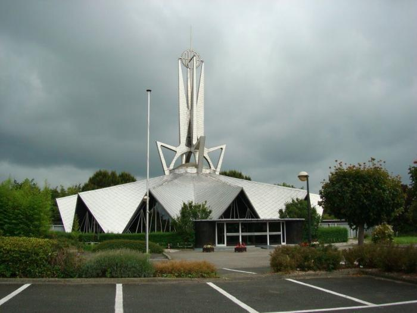
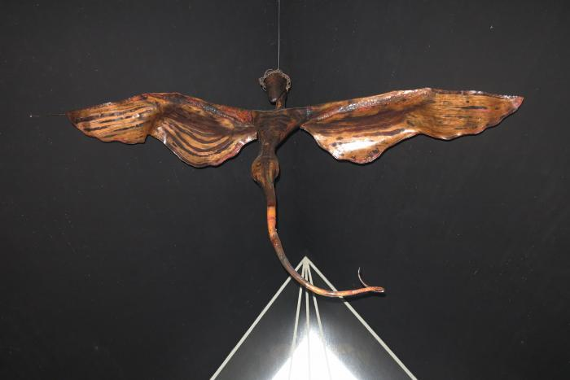
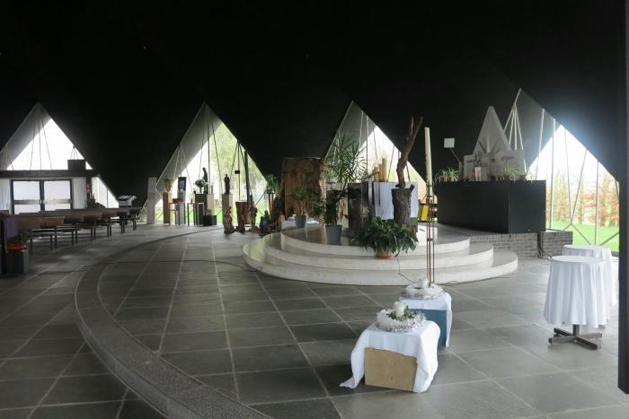
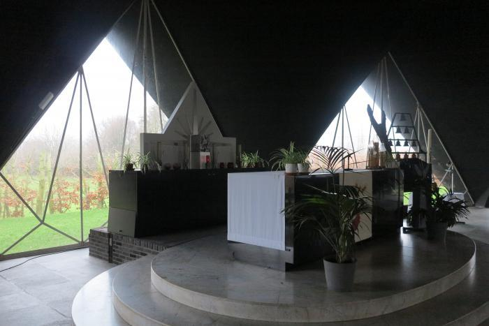
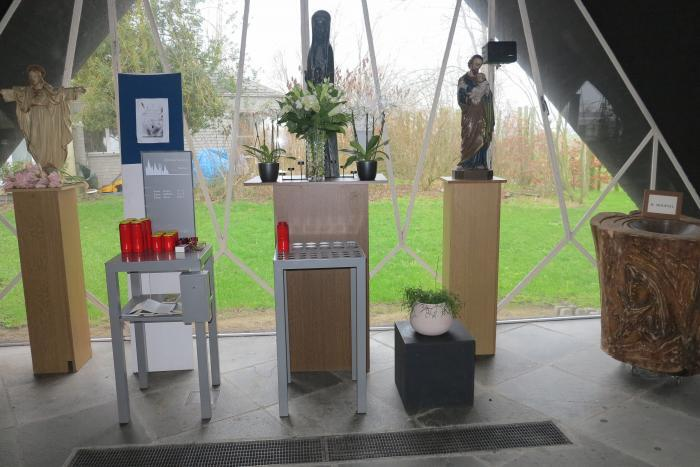
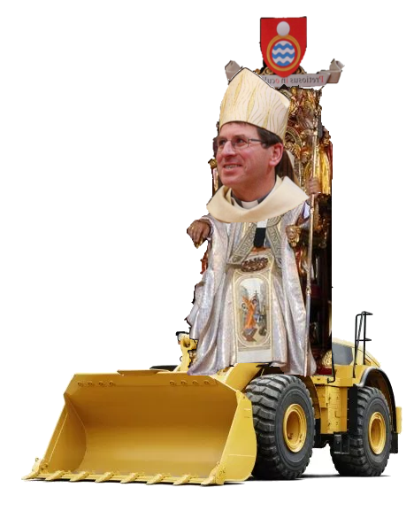

We maakten een reisje in de Westhoek en reden op de baan tussen Staden en Roeselare langs een bijzonder opvallend futuristisch bouwwerk dat een kerk bleek te zijn. Toch wel erg benieuwd maakten we een stop en wat bleek: de kerk was zelfs open! Ik dacht vol verwachting bij mezelf, zo'n moderne architectuur is niet mijn ding, maar dat kan vanbinnen wel best meevallen.  

Futuristische Christus-Koningkerk in Sleihage

Net achter het portaal passeer je onder dit kunstwerk door, aan het plafond opgehangen, aardig groot, want ik zou de spanwijdte op zo'n 2m schatten.

Beeld boven het portaal van de Christus-Koningkerk van Sleihage

Ik heb me al het hoofd gebroken over wat het zou kunnen voorstellen. Je herkent een christushoofd met doornenkroon, op een romp met vleugels als van een nachtvlinder in plaats van armen, een reptielachtig lichaam zonder benen (of moet ik zeggen: poten) en een lange staart. Het beeld is gericht naar het altaar.  

Is het een verbeelding van de verrezen Christus, die zoals een nachtvlinder uit zijn pop tot nieuw leven komt? Maar waarom dan de staart?  

Is het een verbeelding van een demon, die huist bij het portaal van de kerk, om de kerkgangers na hun sacramentele ontmoeting met Christus bij het buitengaan eraan te herinneren dat het Kwaad buiten die deuren loert?  

Is het een vermenging van bijbelse symboliek, de bronzen slang die Mozes op een paal bevestigde tot redding van de Israelieten, of de slang die Jezus aan zijn leerlingen als beeld van wijsheid voorhoudt, de vleugels van de cherubs waarvan zo vaak sprake in het oude testament, of van de adelaar in de apokalyps, of de worm die blijkens een artikel dat ik op mijn zoektocht aantrof diverse malen in de Bijbel als beeld wordt gebruikt?  

Ik ben benieuwd of ik er ooit een uitleg over zal krijgen, maar hoe goed die ook zou zijn: dit beeld is aartslelijk.  

De modernistische architectuur van de kerk was een uitdaging op zich, maar die wil ik graag aangaan zolang ze ten dienste staat van het geloof. Ik vind het haast jammer dat de kerk toegankelijk was, want de indruk die het beeld op me heeft achtergelaten (dat niet tot de oorspronkelijke inrichting kan hebben behoord, daarvoor is het een te grote stijlbreuk) straalt af op het hele gebouw.  

- 
    
- 
    
- 
    

De architect van het futuristische gebouw kan dit nooit gewild hebben. Ook de andere aanwezige kunstwerken van heel uiteenlopende al dan niet figuratieve aard kwamen niet in harmonie met het gebouw. Het bouwjaar 1960 en de blanke vloersteen van het presbyterium laten me eveneens betwijfelen of het aanwezige volksaltaar bij het originele ontwerp hoort, want als je voor het altaar staat heb je eerder de neiging de ober te wenken om een mojito te bestellen dan neer te knielen in aanbidding voor het tabernakel.  

Misschien had ik over het geheel milder geoordeeld als dat beeld niet bij de ingang had gehangen. Nu echter beeld ik me in dat ik als pas aangestelde bisschop van bisdom Brugge de parochie mijn plechtige intrede zou aankondigen, waarop ik een ferme bulldozer zou huren, me met staf en mijter aan de stuurknuppel zou zetten en vanuit Brugge naar Sleihage zou denderen om---tot verrassing van de verzamelde gelovige gemeenschap---de kerk frontaal binnen te rijden en ze met de grond gelijk te maken.  

Kerkelijke kunst moet [dienstbaar](/blog/sterke-beeldtaal-maar-nutteloos/) zijn, zelfs al is ze modern. Moderne kunst is geen vrijgeleide tot blasfemie. De Kerk zou daarover moeten waken. Punt.  

Plechtige intrede van de bisschop van Brugge in de Christus-Koningparochie in Sleihage
