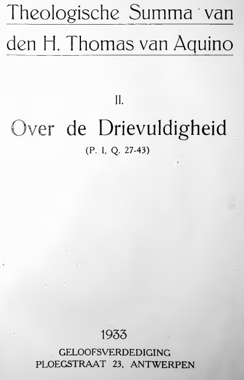
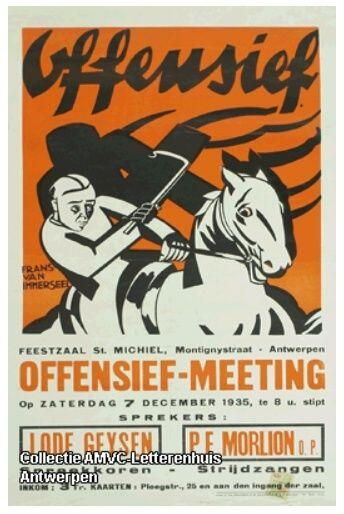

Vorige week werd ik op de Carnotstraat aangeklampt door een jongeman met baard en zo'n typisch noordafrikaans mutsje op zijn hoofd, die gratis boekjes over de Islam verdeelde, _"om te informeren, niet om te bekeren"_. Ik heb een boekje aangenomen en gevraagd of hij een bekeerling was, want in taal en uiterlijk leek hij een oervlaamse jongen. Dat was zo.  

Hij gaf enkele voorbeelden waarom hem de Islam meer aanspreekt dan het katholieke geloof, waarmee hij ongetwijfeld in zijn jeugd ook in aanraking is gekomen. De Islam is---volgens hem---veel eenduidiger. God die geboren wordt als een kind bijvoorbeeld, dat vond hij heel inconsequent. Ofwel is God een almachtige Schepper, en dan is er geen enkele reden waarom Hij ook nog eens als kind geboren zou worden, ofwel is God niet almachtig en zelf deel van de Schepping, maar dan is Hij ook geen God meer. Ook een God die sterft, vat hij niet.

Ik heb het gesprek nog verder onderhouden en geprobeerd uit te leggen hoe die ongerijmdheden toch zin hebben, tot het voor de jongeman tijd was om naar het gebed te gaan, maar ik moet ook toegeven dat het vragen zijn waarop geen pasklaar antwoord te geven is. Het zijn de _"_[_paradoxen van Kerstmis_](http://blog.adw.org/2018/12/paradoxes-of-christmas-4/)_"_, waarover zonet een interessant artikel in mijn RSS-bus rolde, van de hand van mgr. Charles Pope.

### Enkelvoudigheid van God

Ik kon het echter niet laten en heb een beetje verder rondgekeken op internet of er over dit soort vragen niet nog zinvoller dingen te zeggen zijn en ik kwam---via enkele esoterische omweggetjes---uit bij het concept van de "[divine simplicity](https://en.wikipedia.org/wiki/Divine_simplicity)" of de "enkelvoudigheid van God", een concept dat bekend is in christelijke, joodse en ook islamitische theologie. De enkelvoudigheid van God wordt door St. Thomas van Aquino betoogd in zijn Summa Theologiae ([Eerste deel, Derde vraag](http://www.newadvent.org/summa/1003.htm)). Verderop in de Summa vind je bijvoorbeeld het antwoord op de vraag: "Was het gepast dat God mens werd?" ([Derde deel, Eerste vraag](https://ilorentz.org/beenakker/Summa/Aquino_Summa_20.pdf)), gevolgd door nog zo'n slordige 700 pagina's disputen over de Menswording, waaronder ook de weerlegging dat de Menswording in strijd zou zijn met de enkelvoudigheid van God, waarmee ik mijn islamitische gesprekspartner van antwoord had kunnen dienen!

Thomas van Aquino, Summa Theologiae Theologische Summa Nederlandse vertaling door een groep Dominicanen, Antwerpen

### Uitgeverij "Geloofsverdediging"

Het grappige is nu dat de [enige online beschikbare publicatie van Thomas van Aquina's Summa in het Nederlands](https://ilorentz.org/beenakker/Summa/) een slordig ingeschande versie betreft van een boek uit 1933, gepubliceerd door de uitgeverij "Geloofsverdediging" van de paters Dominicanen in hun, nu leegstaande, Antwerpse klooster in de Ploegstraat, net achter de hoek dus van de plaats waar ik die jonge Vlaamse islamiet ontmoette, die ook aan geloofsverdediging doet met soortgelijke boekjes, precies 85 jaar later. Zo herhaalt de geschiedenis zich, maar nooit helemaal op dezelfde manier!  

### Offensiefbeweging

Offensief-meeting

"Geloofsverdediging" was als uitgeverij de voorloper van uitgeverij [Halewijn NV](http://www.halewijn.info/), die vandaag nog steeds tal van katholieke publicaties verzorgt. Weer een beetje verder zoeken op internet bracht me bij een artikel over "[De Offensiefbeweging in Vlaanderen](https://www.journalbelgianhistory.be/nl/journal/belgisch-tijdschrift-voor-nieuwste-geschiedenis-1986-1-2/offensiefbeweging-vlaanderen-1933)". Het artikel beschrijft hoe het Antwerpse dominicanenklooster de spil was in het katholiek ideologisch militantisme van het interbellum en de thuisbasis van katholieke documentatiecentra, een tijdscrift "De Waarheid", propagandacentrales en zogenaamde "offensiefbrigades" die zelfs bij gelegenheid als knokploeg opereerden.  

De tijden zijn veranderd… en misschien mogen we nog van geluk spreken dat onze islamitische stadsgenoten in de professionalisering van hun apologetische ijver slechts een flauwe afspiegeling zijn van de Dominicanen van weleer. Anderzijds mogen we ons de vraag stellen of we zelf tegenwoordig niet een beetje te weinig aan geloofsverdediging doen. Men zegt dat de jongeren van vandaag op vlak van religie onwetend zijn, maar wel heel ontvankelijk. Hoe spreken we hen echter aan? Zijn de---laat ons eerlijk zijn---eerder flauwe artikeltjes op [Kerknet.be](https://www.kerknet.be) voldoende wervend voor buitenstaanders? Ik vrees ervoor... Een youtubekanaal met apologetische filmpjes lijkt me wel wat, zoals dat van [Christelijke Apologetiek](https://www.youtube.com/channel/UCnIQJqPEfeYSDEO71XPDNcA).

Of is de [tijd rijp zijn om een Nederlandse paperback van de Summa uit te brengen](http://summacatholica.blogspot.com/2014/02/is-er-een-toekomst-voor-thomas-van.html) en een offensiefbrigade op te trommelen om ermee de straat op te gaan?
