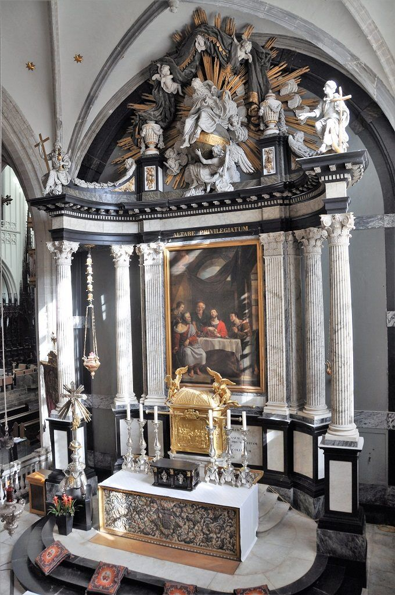

Enkele weken geleden heb ik iets bijgeleerd over tabernakels. Mijn nieuwsgierigheid werd geprikkeld door een tweet van Nikolaas Sintobin sj. Hij schreef een artikeltje op zijn blog over de abijkerk van van Sint-Benedictusberg in Vaals. Hij was verrast dat er geen tabernakel aanwezig is in de kerk.



Dat deed me al de wenkbrauwen fronsen, maar de retweet waarin confrater Jos Moons sj stelt dat _"een tabernakel sinds #VaticanumII niet meer de centrale plaats in de kerk heeft"_, zette me aan om wat verder te zoeken. De hashtag #VaticamunII in combinatie met boude beweringen heeft wel eens meer die uitwerking op mij.



De onschatbare informatiebron van [rkdocumenten.nl](https://www.rkdocumenten.nl/rkdocs/index.php?page=3) geeft elke leek de mogelijkheid zo'n uitspraken te checken. Lang leve de democratisering van het magisterium van de Kerk!

In de [documenten van het tweede Vaticaans Concilie](https://www.rkdocumenten.nl/rkdocs/index.php?mi=600&doc=570) worden echter geen schikkingen gesteld voor tabernakels, toch niet in directe verwoording. Navraag bij voornoemde twitteraars leerde me dat de [Algemene Instructie van het Romeins Missaal](https://www.rkdocumenten.nl/rkdocs/index.php?mi=600&doc=1798&id=7247) (ook een product van Vaticanum II, of toch van de 'geest' ervan) bepalingen bevat over de locatie van het tabernakel in een kerkgebouw.

Via google had ik intussen ook al een afbeeldingen gevonden van de [crypte in Vaals](https://books.google.be/books?id=TjBWDwAAQBAJ&pg=PA169&lpg=PA169&dq=tabernakel+vaals&source=bl&ots=quz2UNt2SK&sig=7xgHsz1I5HozO0xKaVp-wZrCTq0&hl=nl&sa=X&ved=2ahUKEwjIlfWI9_zeAhUFGuwKHUcmA6kQ6AEwC3oECAMQAQ#v=onepage&q=tabernakel%20vaals&f=false), waar het tabernakel wel degelijk centraal staat, maar in een aparte ondergrondse ruimte, zo groot als een kerk op zich, die dus volledig is toegewijd voor de aanbidding.

Trouwens, zo stelt Sintobin ons gerust, Vaals is een heel [conservatieve abdij](http://nikolaassintobin.blogspot.com/2018/11/een-abdijkerk-zonder-tabernakel-kan-dat.html), "hun liturgie is zo goed als volledig in het Latijn". Mijn ongeruste gevoelens dat het ging om een willekeurige interpretatie 'volgens de geest van het concilie', zijn dus netjes op hun plooi gekomen.

### **Gerustgesteld… Of niet helemaal?**

De psychologische uitwerking van de uitspraak dat _"een tabernakel sinds #VaticanumII niet meer de centrale plaats in de kerk heeft"_ gaat bij mij veel verder dan de boodschap die eigenlijk wordt gebracht. De ontvanger van de boodschap bepaalt immers mee de inhoud, dat weten historisch-kritische exegeten best.

Ik mag ervan uitgaan dat de boodschap in strikte zin daarin bestond dat de gewoonte om het tabernakel midden bovenop het hoofdaltaar van een kerk te plaatsen sinds de liturgische hervormingen van Vaticamum II geen algemene regel meer is bij de inrichting van een kerk, omdat er omwille van praktische schikkingen (de plaatsing van een volksaltaar voor het hoofdaltaar, bijvoorbeel) andere locaties beter in aanmerking komen om de voortdurende aanwezigheid van Christus volwaardig tot haar recht te laten komen.

Het is mijn eigen achterdocht die achter deze uitspraak een achterstelling vermoed van het belang van de manifeste aanwezigheid van het Allerheiligste Sacrament in een kerk. In mijn achterdocht hoor ik dat sinds Vaticanum II het belang van de blijvende aanwezigheid van Christus in de geconsacreerde hosties moet worden gerelativeerd, dat het dus niet zoveel uitmaakt waar die worden bewaard en dat ze middenin de Kerk eigenlijk een beetje in de weg staat van belangrijker attributen. Ook dat kwam verderop in de Twitterdraad tot uiting: _"Wie ter communie gegaan is, is zelf 'vlees van Christus' geworden, daarom staat het tabernakel niet centraal"_.



### **Magisterium over het tabernakel**

Op RKDocumenten vind je teksten uit het magisterium die handelen over de bewaarplaats van de heilige Rest, voor en na het Concilie:

- Preconciliair [decreet over de plaatsing van het tabernakel](https://www.rkdocumenten.nl/rkdocs/index.php?mi=600&doc=3777) uit 1957 (toen er dus nog geen sprake was van volksaltaren): _"De allerheiligste Eucharistie moet bewaard worden op de verhevenste en edelste plaats van de Kerk, en daarom als regel op het hoofdaltaar"_.
- [Algemene instructie van het Romeins Missaal](https://www.rkdocumenten.nl/rkdocs/index.php?mi=600&doc=1798&id=7247) uit 1969: _"moet men het allerheiligste Sacrament bewaren in een tabernakel in een gedeelte van de kerk dat voornaam is, onderscheiden, in het oog vallend, met luister versierd en geschikt voor het gebed"_, maar dus ook: _"Vanwege de tekenwaarde is het passend dat_ **_op een altaar waaraan de Mis gevierd wordt, geen tabernakel staat_** _waarin de allerheiligste Eucharistie bewaard wordt. Derhalve verdient het de voorkeur het tabernakel te plaatsen, \[...\] ofwel op het priesterkoor, buiten het altaar van de viering, in een vorm en op een plaats die meer passend zijn zonder het oude altaar uit te sluiten dat niet meer gebruikt wordt voor de viering; of ook in een kapel die geschikt is voor persoonlijke aanbidding en gebed door de gelovigen, die organisch met de kerk verbonden is en voor de gelovigen zichtbaar is."_
- Document [Inaestimabile Donum van de Congregatie van de Geloofsleer](https://www.rkdocumenten.nl/rkdocs/index.php?mi=600&doc=1381&id=7700&highlight=tabernakel#al24) uit 1980 (onder paus Johannes Paulus II, net voordat Joseph Ratzinger prefect van de conregatie zou worden): _"Het tabernakel, waarin de Eucharistie wordt bewaard, kan zich bevinden op een altaar of zelfs daarbuiten op een plaats in de Kerk die goed zichtbaar, werkelijk voornaam en passend versierd is, of in een aparte kapel die zich leent voor persoonlijk gebed en aanbidding door de gelovigen."_
- Exhortatie [Sacramentum Caritas van Paus Benedictus XVI](https://www.rkdocumenten.nl/rkdocs/index.php?mi=600&doc=1784&id=4485&highlight=tabernakel#al69) uit 2007: _"In kerken waar geen Sacramentskapel is en nog wel het hoofdaltaar met tabernakel aanwezig is, is het passend van die structuur gebruik te blijven maken voor het bewaren en aanbidden van de Eucharistie, \[...\]. In nieuwe kerken is het goed een Sacramentskapel te voorzien, dicht bij het priesterkoor."_ 

Het is duidelijk dat de tekst uit de Instructie van het Missaal passages bevat die bij selectieve lezing oorzaak kunnen zijn van het misverstand waardoor heel wat tabernakels in het verdomhoekje zijn geraakt tijdens de haastige herinrichtingen na het Concilie. Maar de latere teksten zetten dit misverstand recht.

Ik besluit dat sinds het Tweede Vaticaans Concilie het tabernakel inderdaad wordt losgemaakt van het altaar en dat laatste bewaart vanzelfsprekend de centrale positie in de kerk, die dus---in geometrische termen---niet langer gedeeld wordt met het tabernakel.

Als er in een kerkgebouw na het concilie een relocatie noodzakelijk is van het tabernakel, is dat omwille van die reden en met de bedoeling het Heilig Sacrament _prominenter_ aanwezig te stellen in functie van de nieuwe omstandigheden, als je de teksten welwillend leest.

### **Een gebruiksvriendelijke kerk**

Inrichters van kerken zouden een cursus [_interaction design_](https://nl.wikipedia.org/wiki/Interaction_design) moeten volgen voor ze in de kerk met altaren en tabernakels gaan schuiven.

Als je een programmeur een computerprogramma laat ontwerpen, loop je het risico dat het resultaat een ingewikkeld programma is dat vanalles kan, maar waar een gewone gebruiker geen weg mee weet, tenzij hij een heel dikke handleiding doorworstelt.

De toepassing van de principes van _interaction design_ helpen de programmeer een programma te maken dat eenvoudig te gebruiken wordt, zoals de apps op je gsm. Het bevat niet alle toeters en bellen van het ingewikkelde computerprogramma, maar de belangrijkste functies zijn prominent aanwezig en intuïtief bruikbaar zonder handleiding.

Als je een theoloog een kerk laat bouwen, krijg je een gebouw boordevol vormen, leegtes of abstracte kunstwerken met diepe symbolische betekenissen en functies, dat spiritueel heel rijk kan zijn, maar waar een gewone gelovige geen weg mee weet, tenzij hij eerst zelf een cursus theologie volgt waarin al die betekenissen uitgelegd worden.

Katholieke gelovigen weten dat een kerk de plaats is waar Christus aanwezig is in het Heilig Sacrament, dat is een belangrijke functie van het kerkgebouw. Daarom is het logisch dat de inrichting van de kerk ervoor zorgt dat eender wie het gebouw binnentreedt in een oogopslag het tabernakel zal terugvinden en er ook plaats zal vinden om bij het tabernakel Christus te aanbidden.

Neem de proef op de som: stap een willekeurige kerk binnen en ga na hoelang het duurt voor je het tabernakel hebt gevonden. Probeer vervolgens een plaatsje te vinden waar je voor het tabernakel kan neerknielen om te bidden. Haal je dat binnen een paar minuten, dan is het een gebruiksvriendelijke kerk! Ben je na vijf minuten nog steeds vruchteloos op zoek naar Jezus, dan is er iets grondig mis met de inrichting van die kerk! Misschien ware het praktischer geweest deze zelf-test in de Algemene Instructie van het Romeins Missaal op te nemen :)

Op de boeiende [wikipediapagina over het tabernakel](https://en.m.wikipedia.org/wiki/Church_tabernacle) lees je welke vormen deze bewaarplaats van het geconsacreerde brood in de loop van de geschiedenis heeft aangenomen. Dat lijkt misschien mijn betoog om de 'klassieke' vorm te bewaren enigszins te relativeren, maar mij heeft het vooral bijgebracht dat in de twintig eeuwen kerkgeschiedenis kerkinrichters de principes van _interaction design_ feilloos wisten te hanteren! Soms meer dan vandaag...

Venerabelkapel in de Antwerpse kathedraal
