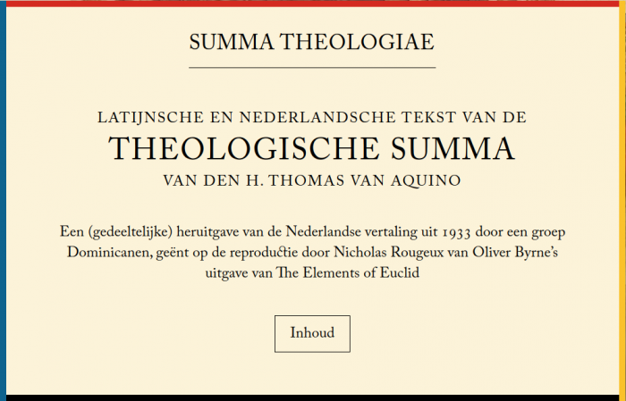
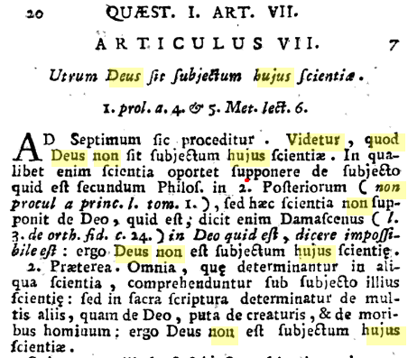

Dat ik bij de opmaak van de website voor de Nederlandse vertaling van de Summa Theologiae van Thomas van Aquino, de layout en lettertypes (zelfs de speciaal ontworpen initialen) van de heruitgegeven "Byrne's Euclid" overneem, ligt voor de hand, als je het artikel ["Thomas van Aquino in een Euclidisch jasje"](/blog/thomas-van-aquino-in-een-euclidisch-jasje/) hebt gelezen. Met één vraag heb ik geworsteld: neem ik ook het gebruik van de lange 's' (ſ ) over?

Rougeux stelt zich dezelfde vraag in de [notities bij zijn ontwerpkeuzes](https://www.c82.net/blog/?id=79): de ſ  heeft immers een negatieve invloed op de leesbarheid van een tekst. Hij wilde echter zo nauw mogelijk bij het origineel blijven. Ik zou daar zelf aan toevoegen dat het helemaal niet erg is dat een oude tekst er oud uitziet (of oud klinkt), hoe goed je ook probeert hem toegankelijk te maken voor hedendaags publiek; dat is een nuttige waarschuwing voor de lezer dat hij er zich steeds rekenschap van geeft dat wat hij leest---ondanks vertalingen, moderne her-talingen en hedendaagse layout--- al honderden, zoniet duizenden jaren geleden uit iemands geest voortkwam.  

Oude uitgave van de Summa Theologiae met gebruik van de lange 's'

Ik heb dus de ſ toegepast; niet behouden, want mijn originele teksten hebben die niet. De oudste drukwerken van de Summa gebruiken ze wel. Ze wordt enkel in de Latijnse tekst gebruikt, want de Nederlandse vertaling dateert uit 1933 en toen was de ſ  al lang niet meer in zwang. De website heeft ook een knop om de ſ  uit te schakelen, helemaal onderaan elke pagina.

De omschakeling naar de ſ doe ik in javascript met deze reguliere expressie: s/(s(\[^f\[^a-z\]\])/ſ\\1/g, die houdt er rekening mee dat aan het einde van een woord en voor de letter 'f' nooit een ſ wordt gebruikt. De [regels voor de toepassing van de ſ](http://babelstone.co.uk/Blog/2006/06/rules-for-long-s.html) zijn wellicht subtieler dan dat, maar wie weet dat ? ;)
