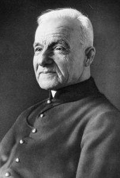

Ik hou van heiligen zoals deze André Bessette, die volgens [Kenteringen.nl](https://www.kenteringen.nl/heilige-van-de-dag/heiligen-januari/06-januari-2/) vandaag, op Driekoningen, op de kalender staat.  

H. André Bessette

> Hij was een eenvoudige en ongeschoolde man en werd conciërge en portier van het Notre Dame College in Côtes-des-Neiges; een nederige taak die hij heel serieus nam. In deze functie ontmoette hij veel mensen die voor nood bij hem aanklopten en zo werd hij door zijn diepe devotie en gebeden op voorspraak van H. Jozef een toevlucht voor wanhopige, zieke en arme mensen en wist hij velen te genezen. Dat deed hij ook door zieken te zalven met olie uit de lamp van het Jozefaltaar. Hij herhaalde telkens bij elke genezing dat het H. Jozef zelf was die genas en niet hijzelf. Vanwege de grote toestroom van mensen liet hij een kapelletje bouwen voor H. Jozef, dat uitgroeide tot een grote basiliek: het Oratorium van de Heilige Jozef (in Montréal), de grootste kerk van Canada.  
> 
> kenteringen.nl

Dat moet zich hebben afgespeeld aan het einde van de negentiende eeuw.  

Ik probeer me dan voor te  stellen of dat nu nog zou kunnen. Hij was ongeschoold, maar wel ingetreden bij een congregatie, een soort van broeder dus, vermoed ik, alleszins geen priester. Hij kreeg de functie van portier. Als er zieken aan de deur kwamen bellen, verzaakte hij blijkbaar aan zijn plicht die door te sturen naar een van de priesters (of hadden die het allemaal te druk?) en hij probeerde zelf de zieken te helpen. Als een soort van pseudo-ziekenzalving haalde hij olie uit het lampje dat bij het altaar van Sint Jozef stond om de zieken te zalven en hij bad voor hen op voorspraak van Sint Jozef. Het moet zijn dat de congregatie dit oogluikend toestond en op de duur had zijn 'winkeltje' zo goed te doen dat de volkstoeloop de bouw van een kapel noodzaakte en later een heuse basiliek.  

Zijn [levensverhaal op wikipedia](https://en.wikipedia.org/wiki/Andr%C3%A9_Bessette) werpt meer licht op de omstandigheden. Blijkbaar werd hij door velen in zijn religieuze gemeenschap buitengekeken als een charlatan. Nochtans maakte hij er een punt van dat de vele genezingen niet te danken waren aan hem, maar aan de voorspraak van Sint Jozef. Het is een kleine eeuw later, in 2010, dat paus Benedictus XVI de man heilig verklaart.  

Ik vraag me dan af: hoeveel zogenaamde charlatans lopen er vandaag nog rond, die we nu in de kerk buitenkijken, die zo rond het jaar 2100 door de danmalige paus zullen worden heiligverklaard? Of zijn we vandaag zo goed geworden in buitenkijken dat ze gewoon geen kans meer maken?
