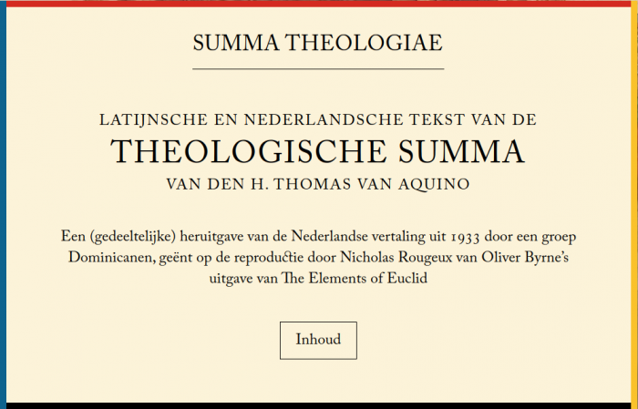

Tijdens mijn zoektocht naar een versie van de Summa in het Latijn in een _structured text-_formaat kwam ik terecht op de website van het [Index Thomisticus Treebank Project](https://wiki.digitalclassicist.org/Index_Thomisticus_Treebank). Het is een academische aangelegenheid waar linguisten de teksten van de werken van Thomas, in het Latijn, gebruiken als oefenveld voor een "morphosyntactische" analyse, zeg maar zinsontleding voor gevorderden. Het project is in de tweede helft van de jaren '40 aangevat door een zekere [pater Busa sj](https://thomistica.net/news/2011/8/19/a-tribute-to-fr-busa-from-stephen-ramsay-repost.html), die de analyses met de hand uitvoerde op een kaartensysteem dat tienduizenden fiches telde. Later zou hij ondersteuning krijgen van IBM om zijn [project te automatiseren](https://www.americamagazine.org/issue/784/signs/jesuit-who-invented-hypertext) op enkele van die reusachtige computers van die tijd en de toenmalige directeur van IBM gaf hem alle krediet, "zolang hij IBM niet veranderde in _International Busa Machines_".  

Het [project loopt nog steeds verder](http://lectures.ms.mff.cuni.cz/view.php?rec=325) en aan de analytische ontleding van de teksten wordt vandaag een "tectogrammatische" laag toegevoegd die ook de semantiek van de woorden inventariseert en modelleert in boomdiagrammen. Geen idee waar het precies toe leidt, maar binnenkort kunnen we ongetwijfeld Thomas' gedachten lezen op de computer! Als je merkt hoezeer de redeneringen van Sint Thomas telkens opgebouwd zijn volgens hetzelfde vaste patroon en gebruik makende van welafgebakende begrippen, zou je nog gaan denken dat het omgekeerde proces heeft plaatsgevonden: dat de redeneringen eerst abstract gemodelleerd zijn en dan door een spraakcomputer omgezet in taal...  

Morfosyntactische analyse van een stukje uit de Summa Theologiae

