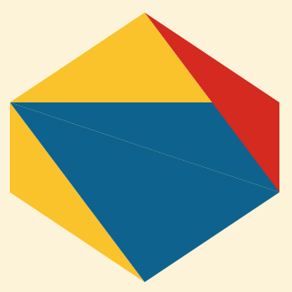
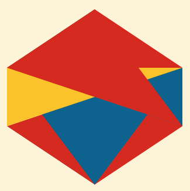
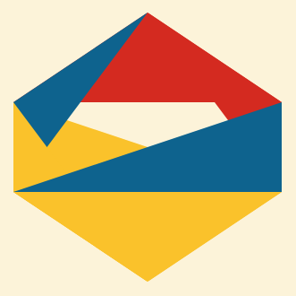
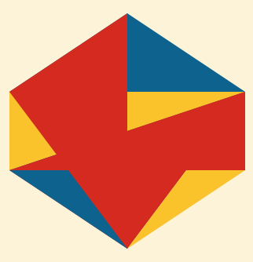

"De Elementen" handelt over meetkunde, dus de teksten van Euclides' werk gaan vanouds vergezeld van de nodige illustraties. Dat maakt deels de charme uit van het [werk dat Byrne presteerde](https://www.c82.net/euclid/). Omdat de website met de [Nederlandse vertaling van de Summa Theologiae van Thomas van Aquino](http://summa.gelovenleren.net/) zich daarop volledig ent en om niet te resulteren in een website die enkel tekst bevat, ben ik teruggevallen op een [_random svg generator_](http://williamsharkey.com/Shapes.html) die ik op het web vond. Elk artikel krijgt zo toch een eigen, ietwat abstracte, illustratie om het geheel te verluchtigen, die---weerom dankzij het toeval---opgebouwd is uit driehoeken, net zoals de meeste van Euclides' illustraties. De driehoek is theologisch het symbool van de Heilige Drievuldigheid, dus dat komt mooi uit!  

- 
    
- 
    
- 
    
- 
    

