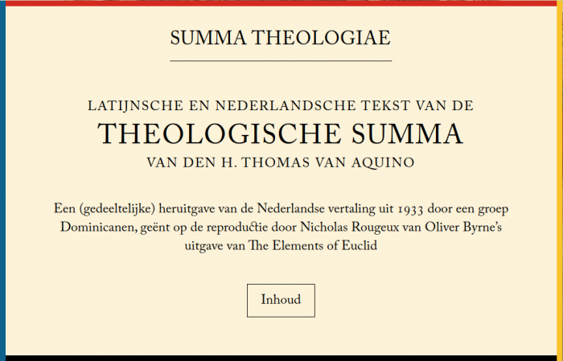

De Nederlandse vertaling van de Summa Theologiae van Sint Thomas van Aquino is (gedeeltelijk) online gepubliceerd op de website:

[http://summa.gelovenleren.net](http://summa.gelovenleren.net)

## De "Summa"  

Enkele weken geleden ontdekte ik dat er van de [Summa Theologiae](https://nl.wikipedia.org/wiki/Summa_theologiae) van Thomas van Aquino slechts één [Nederlandse vertaling](https://ilorentz.org/beenakker/Summa/) bestaat (op internet) en zelfs die dekt slechts een deel af van deze volumineuze "onvoltooide samenvatting" van de theologie van de dertiende eeuw. Het toeval wil dat die vertaling tot stand kwam in het Antwerpse dominicanenklooster waar ik dagelijks langsfiets op en af naar het werk. Nu staat het leeg, maar in de eerste helft van de vorige eeuw was het een bolwerk van [ongeziene geloofsijver](/blog/religieus-militantisme-1933-2018/).  

https://gelovenleren.net/blog/religieus-militantisme-1933-2018/

Van Thomas wist ik al dat hij de theologie benaderde als een systematische wetenschap. Dat vind ik intrigerend, want zelf [nogal wiskundig ingesteld](/blog/zelfs-als-je-twijfelt-aan-god-blijft-het-een-goed-systeem/), hou ik wel van die methode, die vandaag in de theologie (of althans in wat ik daarvan hoor) in onbruik is geraakt. Thomas had dan ook de luxe weinig concurrentie te kennen van wat wij nu de exacte wetenschappen noemen, maar waartoe hij beslist [ook de theologie](/blog/hoe-waar-is-mijn-geloof/) had gerekend, ware het begrip reeds gangbaar geweest.  

https://gelovenleren.net/blog/hoe-waar-is-mijn-geloof/

## Drieduizendhonderdvijftig leerstellingen  

Om een idee te vormen van het volume van de Summa, enkele cijfers. Het hele werk is opgedeeld in vier boeken, nogal gek genummerd als Eerste deel (Prima Pars), Eerste deel van het tweede deel (Prima Secundae), Tweede deel van deel twee (Secunda Secundae) en Derde deel (Tertia Pars).  

In elk boek worden een honderdtal vragen (quaestiones) behandeld.  

Elke vraag wordt behandeld in een stuk of vijf artikels.  

Elk artikel is opgebouwd volgens dezelfde structuur, bv:

- **Ad octavum sic proceditur. Videtur quod…** _Achtste artikel. Men meent dat…_ hier wordt een bemerking geponeerd én geargumenteerd, die ingaat tegen de leer van het geloof.
- **Praerterea…** _En ook…_ nog zo'n geargumenteerde stelling; meestal worden het er drie of vier, soms ook meer.
- **Sed contra videtur quod…** _Maar daartegenover staat dat…_ nu worden argumenten aangereikt die de eerdere stelling ontkrachten.
- **Respondeo dicendum quod…** _Mijn antwoord is dat…_ hier volgt de conclusie uit de voorgaande argumenten, dus de feitelijke "leerstelling".
- **Ad primum ergo dicendum quod…** _Op de eerste bemerking moet dus geantwoord worden dat…_ met het antwoord op de eerste stelling, volgens de leerstelling..
- **Ad secumdum ergo dicendum quod…** _Op de tweede bemerking moet dus geantwoord worden dat…_ en het antwoord op de tweede stelling, en zo voort.

Hierin herken je de systematiek van het ganse werk. 3150 leerstellingen, die een overzicht geven van de theologische kennis die de christenheid op dat moment had verworven, worden besproken en aangetoond, telkens volgens dezelfde rigide theologische methodiek.  

## Over naar Euclides  

Eveneens enkele weken geleden verscheen op co.design, een blog met artikels over _product design_, een artikel over een [heruitgave van Byrne's Euclid](https://www.fastcompany.com/90282910/a-masterpiece-of-ancient-data-viz-reinvented-as-a-gorgeous-website). Byrne was een negentiende-eeuwse wiskundige die een uitgave produceerde van "[De Elementen](https://nl.wikipedia.org/wiki/Elementen_van_Euclides)", het referentiewerk van de alombekende voorchristelijke Griekse wiskundige Euclides. [Byrne's uitgave](https://www.math.ubc.ca/~cass/Euclid/byrne.html) bevat slechts de eerste zes boeken van "De Elementen", maar heeft een baanbrekende layout. De typografie, de opmaak met veel witruimte en het stijlvolle kleurenpalet van de illustraties is naar hedendaagse smaak nog steeds _trendy_. Nicholas Rougeux, een Amerikaans webdesigner---of zeg maar digitaal kunstenaar---heeft de uitgave van Byrne zo getrouw mogelijk gereproduceerd op een website.  

Een klassieke uitgave van de Elementen, Byrne's uitgave uit 1847 en de online reproductie

## Euclides en Thomas  

In zijn tijd deed Euclides net hetzelfde als Thomas van Aquino bijna anderhalf millennium later. Hij inventariseerde de kennis---in zijn geval van de meetkunde---die in de Griekse beschaving tot dan toe was opgebouwd. Zijn inventaris beslaat 13 boeken en in totaal (slechts!) 465 stellingen. Elke stelling krijgt een formele bewijsvoering, net zoals de theologische leerstellingen van Thomas, die eindigt met het bekende Q.E.D. "quod erat demonstrandum".  

Sinds de uitvinding van de boekdrukkunst is "De Elementen", op de Bijbel na, het boek waarvan de meeste edities gepubliceerd werden. Het behoorde dan ook lange tijd tot het vaste curriculum van universiteitsstudenten.  

## Het project  

Het was me al snel duidelijk dat beide werken conceptueel sterke gelijkenissen vertonen. Ik voelde me bovendien onbehaaglijk bij het zien van de  erbarmelijke digitale toestand van de Nederlandse vertaling van de Summa, als slordig ingescande PDF-bestanden op een kale webserver. Zo'n werk verdient beter, want Thomas' Summa is nog even relevant als Euclides' Elementen. Één plus één is gelijk aan twee, dus waarom zou ik niet proberen, al is het maar bij wijze van _proof of concept_, de theologie van Thomas te tooien met de knappe design van Byrne's Euclid?  

De Latijnse brontekst bemachtigen van de Summa Theologiae was al bij al nog het eenvoudigste. _Web scraping_ heeft voor mij geen geheimen (dat heeft de ontwikkeling van [Alledaags Geloven](http://alledaags.gelovenleren.net) me geleerd) en de Duits-Latijnse publicatie op [Bibliothek der Kirchenväter](http://www.unifr.ch/bkv/) was een dankbare tekstbron.  

De naverwerking van de Nederlandse vertaling vraagt het meeste werk. De OCR-techniek vereist nog vele manuele correcties in de tekst en het nodige knip-en-plakwerk. Om het mezelf niet te moeilijk te maken, behoud ik de verouderde spelling van de vertaling.

## Hulp  

Mijn project zal dus weinig meer worden dan een _proof of concept_. Misschien vind ik in de toekomst nog wel eens de tijd om extra _quaestiones_ te verwerken en te publiceren, maar als iemand onder de lezers van dit artikel zich geroepen zou voelen om een steentje bij te dragen, mag die zich altijd aanmelden via [info@gelovenleren.net](mailto:info@gelovenleren.net). De [actuele status van het project](http://summa.gelovenleren.net/about.html) vind je op de website.
