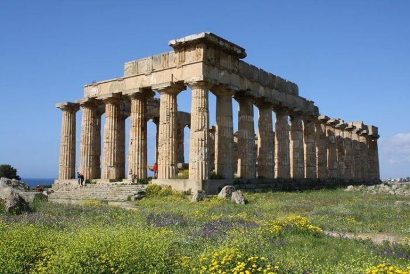
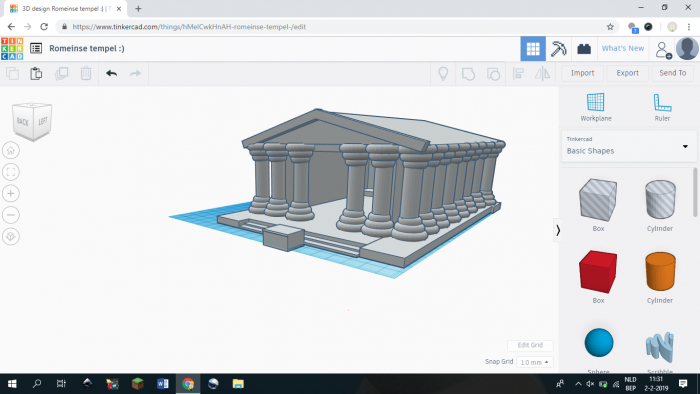
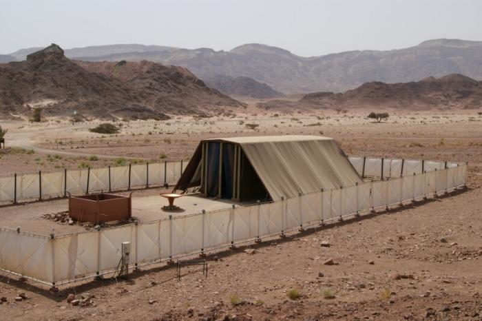
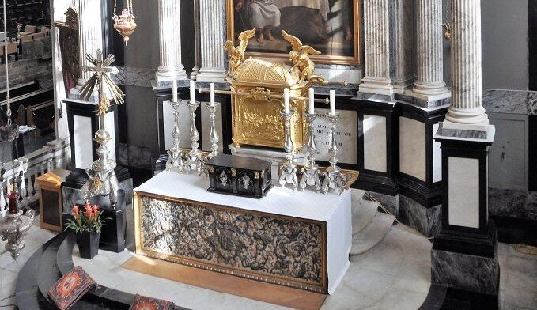
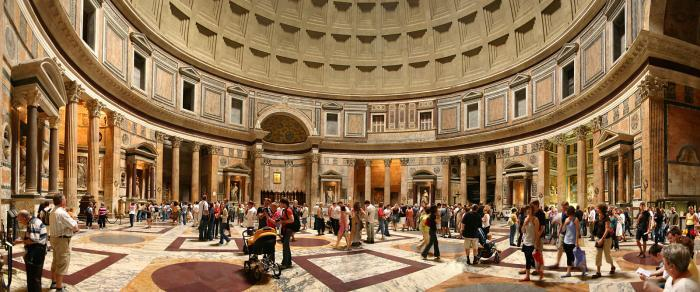
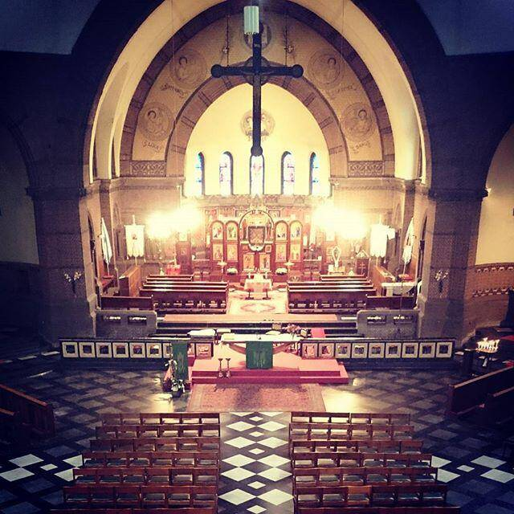
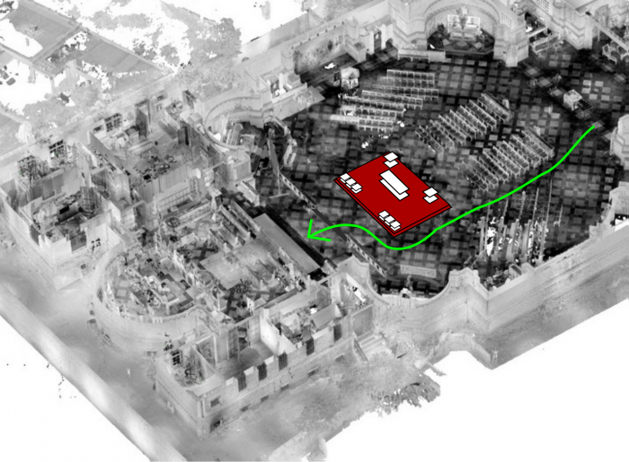

Dochterlief kreeg op school een _workshop 3D printing_. Met het bijhorende 3D-tekenprogramma kwamen verschillende creaties tot stand, mannetjes, een hondenhok, maar ook een heuse klassieke tempel, geïnspireerd op de lessen klassieke cultuur.  

De opbouw is redelijk eenvoudig, want afbeeldingen van klassieke tempels zitten in elk schoolhandboek. Een opgang van treden rondom het ganse gebouw, een overdekte colonnade en binnenin een ommuurde ruimte.  

Tempel van Hera

Dat beeld, dat we kennen van de talloze ruïnes van antieke tempels, is echter niet volledig. Twee belangrijke elementen ontbreken, blijkens mijn (oppervlakkig) opzoekwerk.  

**Ten eerste: het beeld van de godheid.** Dat bevindt zich binnenin de [ommuurde en overdekte ruimte](https://en.wikipedia.org/wiki/Cella) (die "cella" (Latijn) of "naos" (Grieks) heet) en heeft een sacraal karakter. Afhankelijk van de identiteit van de godheid of lokale tradities, was die ruimte slechts beperkt toegankelijk. Zo'n godenbeeld kom behoorlijk imposante proporties aannemen.  

**Ten tweede: het altaar waarop de offers werden gebracht.** De informatie daarover is minder duidelijk. Soms bevindt het zich binnenin de cella, maar ik vond ook beschrijvingen waarbij het tempelaltaar zich buiten bevindt, voor de tempel. Dat laatste lijkt me logisch als er levende offers gebracht worden, dat levert immers een hoop vuiligheid op en dat heb je liever niet in het allerheiligste over de vloer.  

Op mijn aansporen heeft de dochter op haar 3D-model een altaar voorzien vooraan de tempel:

3D-model van een antieke tempel

## Van antieke tempel tot katholieke kerk  

Misschien zou ik over de antieke godsdiensten eens een echt boek moeten lezen in plaats van Wikipedia, want het is een boeiend onderwerp en het verrrast me dat over de essentiële aspecten van het lemma zo weinig informatie online te vinden is. Het verschil tussen dorische en ionische zuilen vind ik eigenlijk minder belangrijk dan de manier waarop zo'n gebouw in de godencultus werd ingericht en gebruikt.  

Het intrigeert me ook hoe het [model van de klassieke tempel](https://www.ancient.eu/temple/) overeenkomt met dat van de joodse tempel in Jeruzalem en bij uitbreiding ook met de inrichting van een katholieke kerk. Terwijl mijn dochter haar 3D-tekening bewerkte, was ik bezig met mijn [artikel over de schikking van het tabernakel](/blog/__trashed/) in de liturgische ruimte.  

Ruïnes van antieke tempels zien er niet uit als kerken, maar als je verder kijkt dan de architectuur en op zoek gaat naar de (in de ruïnes meestal onzichtbare) [cultuselementen](https://nl.wikipedia.org/wiki/Grieks_heiligdom), valt de overeenkomst meteen op.  

Een kerk kent in haar klassieke opbouw een onderverdeling van de ruimte in enerzijds het schip, waar de gelovigen zich verzamelen en anderzijds het koor, waar het altaar zicht bevindt, dat voorbehouden is voor de priester(s) en andere dienaars van de eredienst, zoals acolieten en lectoren. Die laatste ruimte kan je zien als een afspiegeling van de _cella_. Dat het altaar anders dan bij de antieke en joodse tempels systematisch een plaats krijgt binnenin het "heiligdom", is niet verwonderlijk, omdat het offer dat op het altaar wordt gebracht niet zomaar een offer is, maar Christus zelf.  

De tabernakeltent, met daarin de Ark van het Verbond, voor het onderdeel werd van de tempel van Jeruzalem

Ook het tabernakel is een element dat je kan verbinden met de oude tempels. In de [joodse tempel](https://nl.wikipedia.org/wiki/Joodse_tempel) bevond zich in het heiligdom ook een [tabernakel](https://nl.wikipedia.org/wiki/Tabernakel_(tent)), de ruimte waarin de [Ark van het Verbond](https://nl.wikipedia.org/wiki/Ark_van_het_Verbond) werd bewaard, met daarin de stenen tafelen met de tien geboden, het manna uit de woestijn en de staf van Aaron. Het tabernakel in de kathedraal van Antwerpen, waarin het Allerheiligste Sacrament wordt bewaard, is een replica van de Ark.  

Replica van de Ark van het Verbond in de Venerabelkapel van de Antwerpse kathedraal

Het is moeilijk voor te stellen hoe die gelijkenissen tot stand zijn gekomen in de loop van de christelijke geschiedenis. Christus heeft ons geen gedetailleerde bepalingen nagelaten over de uitwerking van onze eredienst, behalve de instructies die Hij zijn leerlingen gaf bij het Laatste Avondmaal. Niet verwonderlijk dus dat christenen om zich heen hebben gekeken om inspiratie te vinden waarmee ze hun godsdienst vorm konden geven.  

## Opportunistische assimilatie of pragmatische inspiratie?  

Dat proces wordt vaak voorgesteld alsof de christenen doelbewust religieuze elementen uit hun omgeving overnamen om op die manier de andere godsdiensten te usurperen. Dat lijkt me voer voor liefhebbers van complottheorieën. Zo zijn er heel wat antieke [tempels die later kerken werden](https://en.wikipedia.org/wiki/Christianized_sites), maar dat gebeurde meestal pas nadat die gebouwen al honderden jaren in onbruik waren geraakt. Het lijkt er meer op dat al die elementen uit antieke en joodse cultussen in het christendom terechtkwamen omdat ze---mits de nodige aanpassingen---een pragmatische oplossing boden voor een concrete vraag.  

Pantheon te Rome, pas in de 7de eeuw omgevormd tot kerk

## Een kerk voor Byzantijnse en Latijnse ritus  

Ook vandaag wordt in de kerk gezocht naar pragmatische oplossingen voor concrete vragen over inrichting van kerkgebouwen. In onze eigen parochie hebben we zo'n probleem. Onze kerk wordt gedeeld door een gemeenschap die de [byzantijnse ritus](https://www.kerknet.be/parochie-heilig-hart-van-jezus-antwerpen/informatie/belarussische-grieks-katholieke-gemeenschap) viert en daarvoor het koor gebruikt (met ikonostase voor het hoofdaltaar) en een gemeenschap die de latijnse ritus viert op een modern volksaltaar dat op een houten verhoog is opgesteld vlak voor de communiebanken.  

Zicht op het koor met de byzantijnse gebedsruimte en vlak daarvoor het "Vlaamse" volksaltaar in de Heilig-Hartkerk, Antwerpen-Noord

De toegang tot de byzantijnse gebedsruimte loopt door het "heiligdom" van de latijnse gebedsruimte. In onze Vlaamse kerk maken we er (jammergenoeg) geen probleem van dat iedereen zomaar langs het altaar rent, maar de gelovigen van de Belarussische gemeenschap vinden het knap lastig. In hun ritus is het heiligdom (achter de ikonostase) dan ook niet zomaar toegankelijk voor gewone gelovigen, ook niet buiten de eredienst.  

Ons kerkbestuur is dus op zoek naar een pragmatische oplossing om de beide gebedsruimten een volwaardige plaats te geven. Concreet denken we er nu aan om het volksaltaar centraler in de kerk op te stellen en tegelijk de kans te grijpen om een echt stenen altaar te bouwen, wat de sacraliteit ervan zeker ten goede zal komen.

Een eerste schets van het binnenzicht van onze kerk waar het volkaltaar iets centraler komt, zodat de doorgang door de communiebanken naar het koor weer vrijkomt. Deze 3D-rendering is niet van de dochter, maar van een studiebureau dat onlangs de mogelijke nevenbestemming van ons kerkgebouw bestudeerde ;)

Bij zo'n proces is het echt wel belangrijk de kerk te beschouwen als een "tempel" en op zoek te gaan naar de best mogelijke vorm om het gebouw te bevestigen als een plaats waar Christus aanwezig is, zowel in de gedaante van de biddende gemeenschap als in zijn sacramentele gedaante, op het altaar en in het tabernakel en dat voor gelovigen van beide ritussen.
