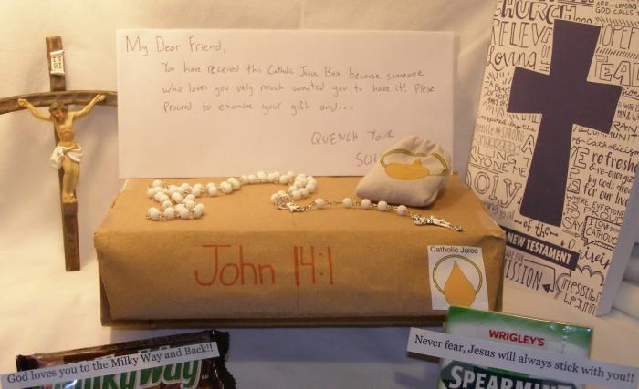

Onze pastoor riep ons vorige week nog op dat iedereen in de kerk de volgende week een extra persoon moest uitnodigen om mee naar de mis te komen, zodat onze gemeenschap kan groeien.  

Gemakkelijker gezegd dan gedaan. Soms moet je echter _out of the box denken._ Dat heeft Dominick gedaan, een zeventienjarige scholier, en wel letterlijk: hij heeft een cadeaubox gemaakt.  

De "Catholic Juice" cadeaubox voor kerkverlaters

De mini-onderneming die hij voor school moest opzetten heeft hij Catholic Juice genoemd en ze produceert en verdeelt geschenkdozen voor kerkverlaters. Ken je iemand die je een handreiking wil geven om opnieuw het geloof te beleven, dan kan je die een doos opsturen met daarin een setje kennismakingsmateriaal. De cadeaubox bevat ludieke attributen in, bijvoorbeeld chocoladerepen met motiverende opschriften, maar ook heel praktische hulpmiddelen: een evangelie, een kruisbeeld, een rozenkrans en een visitekaartje met de mistijden van nabije parochies.  

Als concept vind ik dit geweldig. Niet omdat ik de illusie koester dat zo'n cadeauboxenproject echt van de grond zal komen of een geweldig effect zal hebben. Wel omdat het ideeën aanreikt om zelf te evangeliseren door anderen kleine zetjes te geven. Ik kan me best voorstellen dat veel randkerkelijken rondlopen met het gevoel "ik zou eigenlijk nog wel eens naar de mis willen gaan", maar er om duizend-en-een redenen nooit toe komen, al is het maar omdat ze niet weten waarheen. Dat wordt er niet gemakkelijker op wanneer er in veel parochiekerken niet elke zondag een eucharistie is. Als buitenstaander is het moeilijk die informatie terug te vinden (een nood die ik op mijn blog al heel vaak heb aangekaart en die websites als kerknet.be slechts met mondjesmaat lenigen).

Gelovigen moeten vertegenwoordigers zijn van hun kerk. Dat kan gewoon door mensen aan te spreken of---wie weet---met zo'n cadeaubox, maar er zijn nog manieren te bedenken, die vanuit een bisdom gefaciliteerd zouden kunnen worden.  

**Kerk & Leven**, dat heel wat parochianen in Vlaanderen bereikt, zou jaarlijks als _centerfold_ een wervende raamaffiche kunnen drukken met daarop specifieke praktische informatie per parochie (of federatie) en de slogen "Ik kom hier elke zondag naar de mis". Je ziet genoeg mensen die dat soort affiches uithangen, voor de scouts, voor een school, voor een of andere politieke actie, maar zelden voor een parochie. De Kerk heeft de kans maar voor het grijpen het straatbeeld in Vlaanderen te bepalen!  

**Kerknet** zou haar database met gebruikers- en parochieinformatie kunnen gebruiken om op geautomatiseerde wijze gepersonaliseerd digitaal promotiemateriaal aan te bieden via hun website, dat met een eenvoudige klik door de lezers verspreid kan worden via hun sociale-mediakanalen of dat ze kunnen gebruiken als banner onder hun email.

Mits een beetje programmeerwerk kan je voor elke parochie automatisch een gepersonaliseerde affiche opmaken. De adresgegevens en mistijden haal je van de [vieringendatabank van Kerknet](https://www.kerknet.be/zoeken/vieringen/lijst), een foto van de kerk haal je van Kerken in Vlaanderen en een plattegrond laat je renderen door Google Maps. Varieer een beetje met illustraties en achtergronden en de affiches worden _collector items_. Voor de parochianen die zo'n affiche achter hun raam hangen, voeg je de instructie toe dat ze met een stift op het kaartje de kortste weg van hun huis naar de kerk kunnen aanduiden :) Dat zou dus allemaal zomaar kunnen, en zou er bijvoorbeeld zo kunnen uitzien:

Parochiale raamaffiche

Banner die parochianen op hun emails of sociale-mediaprofielen kunnen aanbrengen

In afwachting wens ik Dominick in elk geval veel succes met zijn mini-onderneming!
