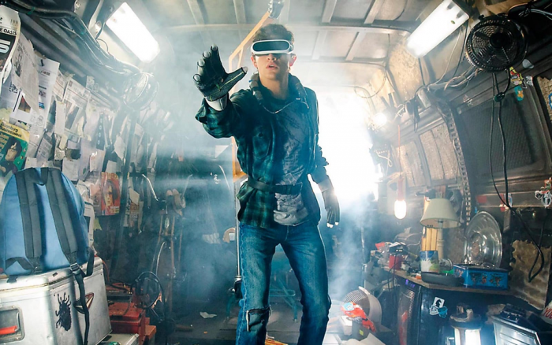
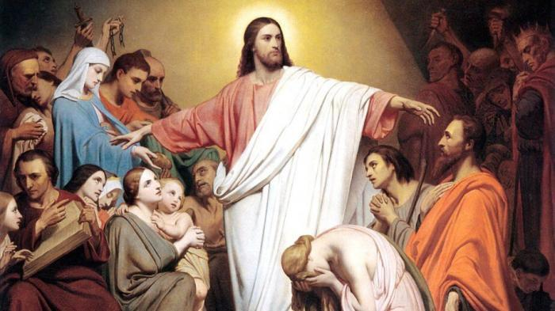

Gisterenavond speelde in onze thuiscinema de film Ready Player One, naar het gelijknamige boek van Ernest Cline uit 2011. De film heeft alle thema's in huis. Een sociaal ineengestorte dystopische toekomstwereld (volgens de wikipediapagina van het boek gevolg van overbevolking en opwarming van het klimaat), een eindeloze reeks verwijzingen naar de film- en popcultuur van de jaren '80,  de eerste coputergames op Atari en Commodore, en tot slot de "Oasis", een virtuele werkelijkheid gebaseerd op uiterst gesofiticeerde computergames, dit alles anno 2044. Er ontwikkelt zich een strijd tussen een kille machtswellusteling die de Oasis wil commercialiseren en een groep jongeren, (uit alle rassen---en geaardheden?), die uiteindelijk de Oasis zullen redden.  

Zoals bij elke Spielbergproductie ligt de moraal er een vinger dik op en de les die we krijgen is niet te vluchten in een _virtuele_ wereld van computergames en sociale media, waar geluk slechts schijn is en relaties tussen mensen nooit echt. Echt geluk, echte relaties, echte liefde, bestaan uitsluitend in de _werkelijke_ wereld.  

Wade vindt het Easter Egg

Vanmorgen in de mis dacht ik even dat ik terug in de film terechtkwam. Ook daar een [setje lezingen](http://alledaags.gelovenleren.net/link/NTUzNDM3MTUyNDQ0NjE=) met duidelijk onderscheid tussen protagonisten en antagonisten en de boodschap om de juiste van twee werelden te kiezen. De eerste lezing uit Jesaja en het Evangelie met de zaligsprekingen draaien helemaal rond dit thema. Echter in dit geval is het de _werkelijke_ wereld waarvoor we moeten oppassen, want net als de virtuele wereld van de Oasis biedt die slechts oppervlakkig en vergankelijk geluk. Het ware geluk vinden we in Gods koninkrijk, door op Hem te vertrouwen en in Hem onze vrede te zoeken  

> Dit zegt de Heer: **Vervloekt** wie op een mens vertrouwt, wie zijn kracht ontleent aan stervelingen, wie zich afkeert van de Heer. Hij is als een struik in een dorre vlakte, hij merkt de komst van de regen niet op. Hij staat in een steenwoestijn, in een verzilt en verlaten land.  
> **Gezegend** wie op de Heer vertrouwt, wiens toeverlaat de Heer is. Hij is als een boom geplant aan water, zijn wortels reiken tot in de rivier. Hij merkt de komst van de hitte niet op, zijn bladeren blijven altijd groen. Tijden van droogte deren hem niet, steeds weer draagt hij vrucht.  
> 
> Jeremia 17:5-8

> Jezus zei: ‘**Gelukkig** jullie die arm zijn, want van jullie is het koninkrijk van God. **Gelukkig** jullie die honger hebben, want je zult verzadigd worden. **Gelukkig** wie nu huilt, want je zult lachen. **Gelukkig** zijn jullie wanneer de mensen jullie omwille van de Mensenzoon haten en buitensluiten en beschimpen en je naam door het slijk halen. Wees verheugd als die dag komt en spring op van blijdschap, want jullie zullen rijkelijk beloond worden in de hemel. Vergeet niet dat hun voorouders de profeten op dezelfde wijze hebben behandeld.  
> Maar **wee jullie** die rijk zijn, jullie hebben je deel al gehad. **Wee jullie** die nu verzadigd zijn, want je zult hongeren. **Wee jullie** die nu lachen, want je zult treuren en huilen. **Wee jullie** wanneer alle mensen lovend over je spreken, want hun voorouders hebben de valse profeten op dezelfde wijze behandeld.
> 
> Lc 6:17,20-26

Voor sommigen zal het overkomen alsof de boodschap van het Evangelie juist het omgekeerde is van de moraal uit de film. Het is alsof Jezus ons oproept de _werkelijke_ wereld te ontvluchten in de _virtuele_ wereld van het geloof. Mensen die niet geloven in God zullen dat zeker en vast zo begrijpen.  

Ik zie het liever anders. In al zijn voorzienigheid heeft Christus in zijn zaligsprekingen een sequel geschreven op het verhaal van Ready Player One. De film leidt je van de _virtuele_ wereld naar de _werkelijke_ wereld. Dat is al heel wat, maar nog niet voldoende. Jezus leidt van de _werkelijke_ wereld naar de _ware_ wereld.  

<table class="wp-block-table"><tbody><tr><td><strong>Virtuele wereld</strong> "Oasis"</td><td><strong>Werkelijke wereld</strong></td><td><strong>Ware wereld</strong> "Koninkrijk Gods"</td></tr><tr><td>uitgevonden door mensen, gefundeerd op hun trots en hoogmoed</td><td>de werkelijkheid waarin we leven, gevuld met waarheid en leugens, die we vaak niet kunnen onderscheiden</td><td>voorbestemd voor de mens, gefundeerd op nederigheid en ontzag voor God</td></tr></tbody></table>

Een andere gelijkenis met het thema van de film zag ik dan weer in de brief van Paulus.  

> Broeders en zusters, wanneer over Christus wordt verkondigd dat Hij uit de dood is opgewekt, hoe kunnen sommigen van u dan zeggen dat de doden niet zullen opstaan? Wanneer de doden niet worden opgewekt, is ook Christus niet opgewekt. Maar als Christus niet is opgewekt, is uw geloof nutteloos, bent u nog een gevangene van uw zonden en worden de doden die Christus toebehoren niet gered. **Als wij alleen voor dit leven op Christus hopen, zijn wij de beklagenswaardigste mensen die er zijn.** Maar Christus is werkelijk uit de dood opgewekt, als de eerste van de gestorvenen.  
> 
> 1 Korintiers 15:12,16-20

In de Oasis, de virtuele wereld van de film, kan je _avatar_ sterven. Je verliest dan al je virtuele bezittingen en je moet dan je _avatar_ "re-spawnen" om opnieuw te beginnen van nul. In de virtuele wereld krijg je als het ware een eeuwig leven, maar dan wel een dat altijd in kringetjes loopt en dat het natuurlijke leven van de eigenaar van de _avatar_ niet verlengt (alhoewel… helemaal op het einde van de film zien we een virtuele ontmoeting tussen onze jonge hoofdrolspeler en Holloway, de uitvinder van de Oasis, die [toch niet helemaal dood](https://scifi.stackexchange.com/questions/184858/in-ready-player-one-is-james-halliday-dead) blijkt te zijn….). In Chrstus' ware wereld krijg je daarentegen na je dood wel een echt eeuwig leven en daarop te hopen is volgens Paulus een _conditio sine qua non_ om als Christen te leven in de werkelijke wereld.

<table class="wp-block-table"><tbody><tr><td><strong>Virtuele wereld</strong> "Oasis"</td><td><strong>Ware wereld</strong> "Koninkrijk Gods"</td></tr><tr><td>na je dood wordt je "ge-respawnd" om van nul te beginnen</td><td>na je dood gaat je leven verder in de verrijzenis tot een eeuwig geluk</td></tr></tbody></table>

En dan als uitsmijter nog een laatste gelijkenis: de film volgt het stramien van een klassieke queeste, en wel naar het zogenaamde "Easter Egg", ergens verborgen in het grote computergame dat de Oasis is. Hoeveel meer cult-referenties heb je nodig ;) ?
