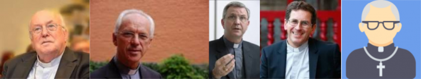

Bij het aantreden van paus Franciscus, nu zes jaar geleden, schreef ik een artikeltje op mijn blog getiteld "[Een nieuw gezicht van Jezus](/blog/een-nieuw-gezicht-van-jezus/)". Ik maakte daarin de bedenking dat we met Johannes-Paulus II, Benedictus XVI en Franciscus drie heel verschillende pausen hebben, die elk een ander gezicht van dezelfde Jezus laten zien.  

> "Voor de buitenwacht zijn dat allemaal heel verschillende gezichten, en lijkt het alsof een andere paus ook meteen een andere kerk betekent. Een gelovige echter herkent de verschillende gezichten van een en dezelfde Christus, die eeuwig en onveranderlijk is."  

Jezus heeft verschillende gezichten. Hij is priester, leraar, rechter. Hij kan zalvend zijn, maar ook boos. Hij kan barmhartig zijn, maar ook op de proef stellen. De Kerk mag blij zijn dat de opeenvolgende plaatsvervangers van Christus op aarde zo'n verscheidenheid van gezichten tonen!

Maar hoe zit dat met de bisschoppen?  

Bij het heengaan van mgr. Danneels beschrijft Emmanuel van Lierde hem in [Tertio](https://www.tertio.be/magazines/996/artikels/Afscheid%20van%20christelijk%20humanist%20en%20consensuszoeker#.XIpI-bAXLkM.twitter) terecht als een _"christelijk humanist en consensuszoeker"_. Pieter Bauwens op [Doorbraak](https://doorbraak.be/danneels-kardinaal-van-zijn-tijd/amp/?utm_term=Autofeed&utm_medium=Social&utm_source=Twitter&__twitter_impression=true) analyseert vervolgens zijn rol in de meest recente bisschopsaanstellingen: _"De opluchting was groot bij Danneels toen zijn ‘poulain’ Josef De Kesel in 2015 de nieuwe aartsbisschop van Mechelen werd. Sommigen zagen er ook zijn hand in en meten hem een groot aandeel in die benoeming aan. Met De Kesel in Mechelen, Johan Bonny in Antwerpen en Lode Aerts in Brugge zijn al zeker drie erfgenamen van Danneels bisschop in Vlaanderen. De kans is groot dat daar met de nieuwe bisschop van Gent, die op dit moment gezocht wordt, nog een vierde bijkomt."_  

"De kans is groot dat daar nog een vierde bijkomt"

Ik tel één en één op en kom tot de slotsom dat we in Vlaanderen met een selectie bisschoppen zitten, die zowat allemaal een doorslagje zijn van mekaar en dan stel ik me de vraag of de Kerk in Vlaanderen wel echt blij moet zijn met vier "christelijke humanisten en consensuszoekers" aan het hoofd?  

Voor zover het profiel van een "christelijk humanist en consensuszoeker" al mag gelden als een gelaat van Jezus, vind ik dat er best wat meer verscheidenheid zou mogen zijn!
