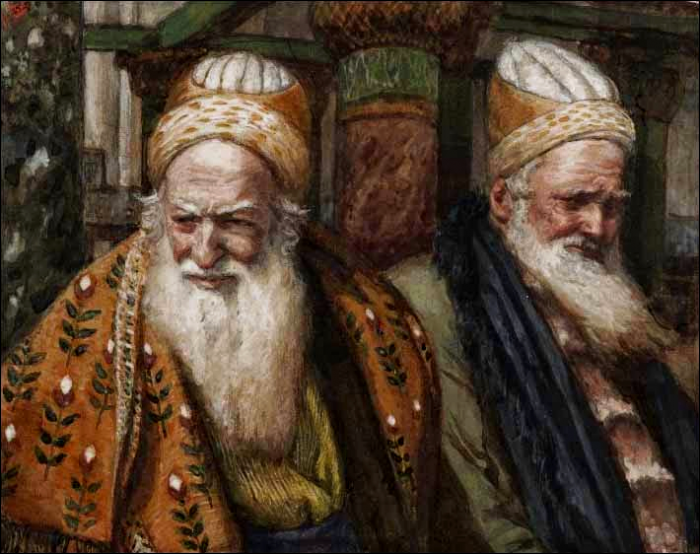

Vanavond stak ik wat op in het eerste deel van de [vastenrecollectie](https://www.kerknet.be/parochie-heilig-hart-van-jezus-antwerpen/evenement/vastenbezinning-elke-woensdag-om-18u30) in onze parochie. EH. Robert Matheus beent voor ons het lijdensverhaal uit. Deze cryptische passage heeft hij mooi uitgelegd:  

> Maar één hunner, Káifas, die dat jaar de hogepriester was, sprak tot hen: Weet gij geen uitkomst? Beseft gij dan niet, dat het goed voor u is, dat één mens sterft voor het heil van het volk, en niet het hele volk te gronde gaat? Dit zei hij niet uit zichzelf. Maar als hogepriester van dat jaar profeteerde hij, dat Jesus sterven zou voor het heil van het volk; en niet voor het volk alleen, maar ook om de verstrooide kinderen Gods bijeen te brengen.
> 
> [Jh 11:49-52](http://alledaags.gelovenleren.net/lectionarium?language=nl&bibleref=Joh+11:49-52)

Hoe kan Kaifas, die toch de laatste zou zijn om Jezus als Heiland te erkennen, nu met deze woorden profeteren? De verklaring zit precies in de ongerijmdheid, die zoals altijd een teken is van Gods inmenging in het gebeuren! Kaifas wil het volk redden _van_ Jezus, maar spreekt daarmee onbewust de profetie uit dat het volk gered zal worden _door_ Jezus. Het is de Goddelijke voorzienigheid die dit heeft beraamd en niet toevallig kwamen deze woorden uit de mond van Kaifas! Die vervult immers als laatste in een lange rij de rol van hogepriester; een rol die enkele dagen na zijn uitspraak zonder betekenis wordt, omdat Jezus door zichzelf te offeren het eeuwig hogepriesterschap opneemt.

O goddelijke ironie!

Kaifas en Annas
