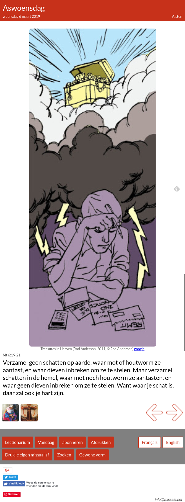
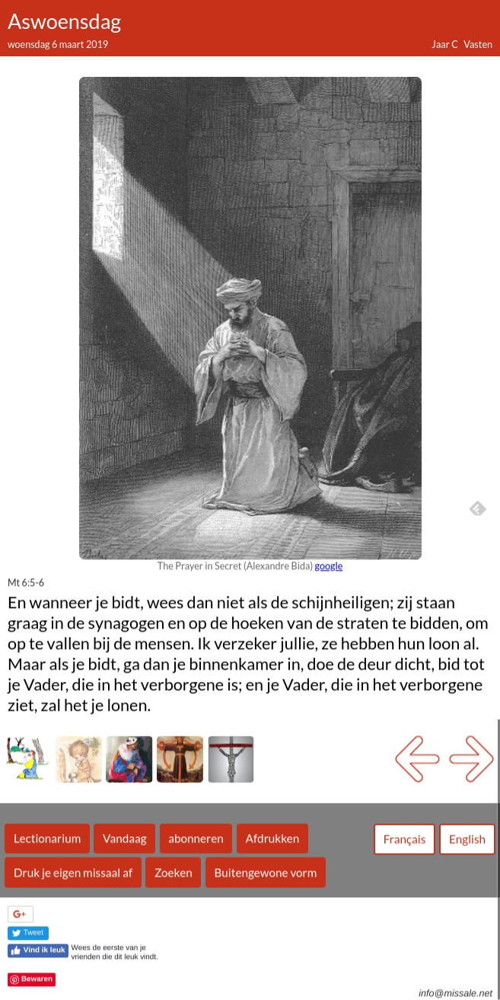
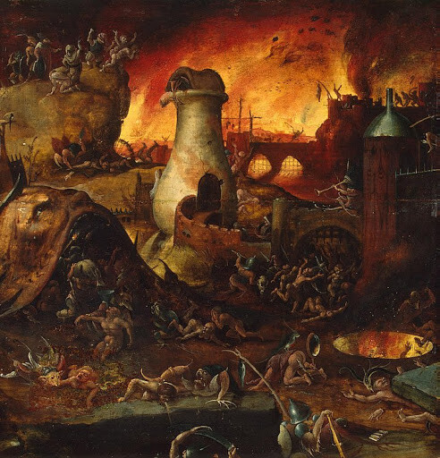

Aswoensdag, buitengewone vorm

Aswoensdag, gewone vorm

Op de website [Missale](http://www.missale.net/nl) vind je voor elke zondagsmis illustraties bij de lezingen uit het lectionarium. Enkele maanden geleden werden de [weekdagen van de Advent en de Kersttijd](/blog/weekdagen-in-advent-op-missale/) toegevoegd. Nu zijn ook de weekdagen van de Vasten elk voorzien van een of meer illustraties.  

De teller van het aantal [afbeeldingen in de database](http://www.missale.net/inventory/nl) staat nu op 1189. 

Bij deze update heb ik getracht niet alleen illustraties voor de evangelielezingen te zoeken, maar ook voor de lezingen uit het Oude Testament of de Epistellezingen.  

## Lectionaria voor en na het Concilie  

Dat was niet altijd even eenvoudig, want het Oude Testament is veel minder populair bij illustratoren en kunstenaars dan het Evangelie. Het was ook een interessante oefening, omdat de website zowel de 'gewone' als de 'buitengewone vorm' van de liturgie bevat. Die 'buitengewone vorm' is de liturgie van voor het tweede Vaticaans concilie, de Tridentijse Mis.  

Als je de lectionaria van voor en na het concilie vergelijkt, zijn er niet zo erg veel verschillen in de Evangelielezingen, maar wel in de lezingen uit het Oude Testament. Ik heb beiden lectionaria voor de veertigdagentijd doorlopen en tref een heel ander genre van lezingen aan in de oude en in de nieuwe mis.  

Als je op internet op zoek gaat naar de verschillen tussen het oude en het nieuwe lectionarium vind je snel de nodige [statistieken](http://catholic-resources.org/Lectionary/Statistics.htm) die aantonen dat het nieuwe lectionarium een veel hoger volume van de Bijbel afdekt dan het oude (zelfs al bevatte de oude mis ook veel [rechtstreekse bijbelcitaten in de vaste gebeden](https://www.praytellblog.com/index.php/2013/07/01/did-the-pre-vatican-ii-mass-really-have-more-scripture-than-now/)).  

Toch blijkt duidelijk dat het niet louter een _toevoeging_ van teksten betreft, maar ook een _weglating_. Het nieuwe lectionarium is dus niet alleen _breder_ dan het oude, het is ook _anders_. Het enige artikel dat wereklijk in detail op het verschijnsel van de weggelaten bijbellezingen focust is de paper van Peter Kwasniewski "[Not Just More Scripture, But Different Scripture](http://www.academia.edu/25621308/Not_Just_More_Scripture_But_Different_Scripture)" (beknopt in deze [review](https://www.hprweb.com/2017/01/index-lectionum-scripture-usage-in-roman-catholic-masses-before-and-after-vatican-ii/)). Andere artikels duiden dat bijbellezingen zijn weggelaten die gevoelig liggen bij een [joods publiek](http://www.jcrelations.net/Removing_Anti-Jewish_Polemic_from_our_Christian_Lectionaries__A_Proposal.2179.0.html) of bij een [homoseksueel publiek](https://taylormarshall.com/2015/10/catholic-mass-lectionary-omits-anti-homosexual-verses-from-romans-1.html).  

"En mijn gerechtigheid Mij gesteund. Ik vertrapte de volkeren in mijn toorn, Maakte ze dronken van mijn gramschap; En Ik liet hun bloed Op de aarde stromen!" (Jes 63:6) - Woensdag in de Goede Week

Als je een afbeelding zoekt voor een bijbelcitaat, treft je de teneur van het citaat. De teksten die me het meeste moeite bezorgden, waren die waar het godsbeeld van de [toornige of straffende God](https://apilgrimsfriend.com/2014/10/06/hellfire-brimstone-wrath-torment-fury/) verbeeld werd. Neem bijvoorbeeld de lezing voor de woensdag in de Goede Week. In het oude lectionarium bevat die Jesaja 62:11; 63:1-7, een tekst die niet voorkomt in het nieuwe lectionarium. Als je de lezing opzoekt op de website Biblegateway in het Engels, krijgt die als titel "[God’s Day of Vengeance and Redemption](https://www.biblegateway.com/passage/?search=Isa+62%3A11%3B+63%3A1-7&version=NIV)" (vertaling New International Version), en in het Nederlands "[De ontfermende liefde van God](https://www.biblegateway.com/passage/?search=Isa+62%3A11%3B+63%3A1-7&version=HTB)" (vertaling Het Boek). De toon van het programma is gezet.  

Het is natuurlijk een uitdaging om "gevoelige" teksten uit de Bijbel te behandelen. Dat merkten we in Vlaanderen laatst nog toen op de TV-mis uit de Paulusbrief werd voorgelezen dat "[vrouwen onderdanig moeten zijn aan hun man](https://www.vrt.be/vrtnws/nl/2018/08/27/bonny-over-eucharistieviering/)". Maar of dat wil zeggen dat we die zonder meer moeten censureren, daarbij heb ik toch serieuze vragen. Wie claimt dat de Kerk sinds het tweede Vaticaans concilie de Bijbel in de liturgie meer aandacht heeft gegeven, heeft gelijk, maar die aandacht heeft een _bias._ Op zich is dat niet abnormaal, maar het is noodzakelijk zich daarvan bewust te zijn. Het Oude Testament is niet het _feel-good_\-boek dat in het lectionarium naar voor komt.

Het [godsbeeld van de toornige God](http://prentencatechismus.org/about/de-toornige-god/) zegt meer over de mens dan over God, maar dat wil niet zeggen dat we het zonder meer onder de mat kunnen schuiven, louter en alleen om onze 'moderne' gevoeligheden ter wille te zijn, want dan worden we slippendragers van de heersende seculiere ideologieën, en dat is toch het laatste wat de Kerk moet zijn.
