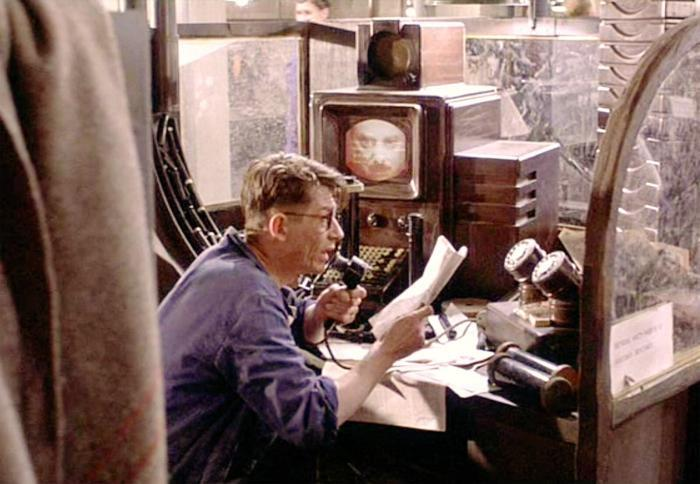
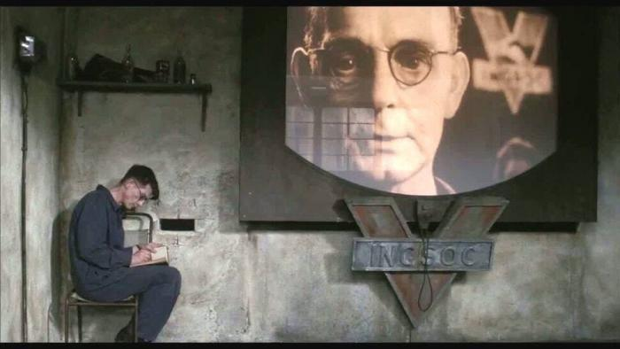
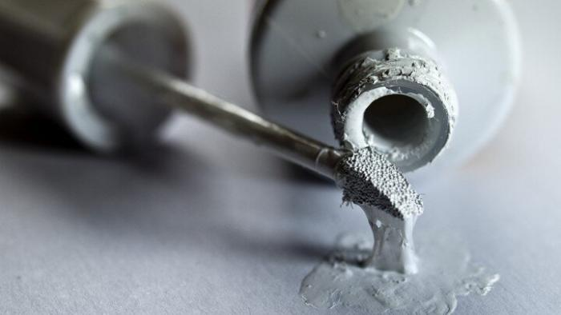
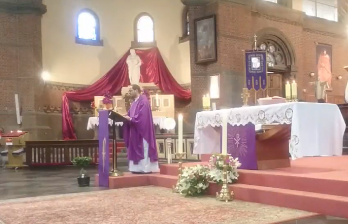

**8 maart.** De conservatief-katholieke blog [Fortes in Fide vertaalt een artikel](https://fortesinfide.nl/index.php/2019/03/10/echtbreuk-en-homoseksualiteit-de-twee-verdwenen-woorden/) van de Italiaanse vatikaankenner Sandro Magister, die schrijft: De woorden “echtbreuk” en “homoseksualiteit” zijn beide verdwenen uit het leergezag van de Kerk, het hoogste leergezag dat van de paus. Lees het artkel om Dom Giulio Meiattini, een benediktijnerabt, aan het woord te horen, die vermoed dat er een bewuste strategie achter schuilt.  

Kantoren in het Minitrue

**21 maart.** We zijn een week na de schietpartij in een moskee in Nieuw-Zeeland. Dat deze veel meer media-aandacht krijgt dan soortgelijke aanslagen op christelijke doelwitten, liet ik aan me voorbijgaan. De empathische en mediagenieke regeringsleidster [Jacinda Ardern](https://twitter.com/Nasrafat/status/1109178801446154241) sprak: "u zult mij zijn naam niet horen uitspreken" en werd terstond zowat de hemel in geprezen, maar ze had het over meer dan een symbolische gevoelsuiting. [The American Conservative wijdt een artikel](https://www.theamericanconservative.com/articles/the-chilling-censorship-of-the-christchurch-shooting/) aan de digitale nasleep van zo'n misdaad: een effectieve massale dieptereiniging van informatie over de dader en over de slachtpartij op het web en in de sociale media.  

**22 maart.** Ondanks bovenstaande berichtgeving, heeft de Nederlandse diversiteitswebsite [NieuwWij het over een studie](https://www.nieuwwij.nl/algemeen/onderzoek-bevestigt-negatieve-berichtgeving-over-moslims-domineert/) die berichten in de pers heeft zitten turven en vaststelt dat "negatieve berichtgeving over moslims domineert". Het bericht beperkt zich tot de percentages, maar de teneur is duidelijk.  

**22 maart.** Via de katholieke nieuwswebsite [Cogitationes Cordis Ejus verneem ik het bericht op RK Documenten](http://www.baasweb.com/site-rknieuws/2019/03/22/een-verdwenen-h-mis-op-donderdag-in-de-goede-week/) dat vaststelt dat in de aankondiging van de missen waaraan de Paus deelneemt, de viering op Witte Donderdag van de instelling van de Eucharistie om onduidelijke redenen blijkt te ontbreken.  

Winston Smith herschrijft het nieuws

**23 maart.** De Vlaamse opiniewebsite Doorbraak kondigt het nieuwe boek aan van Johan Sanctorum "Na het journaal volgt het nieuws", waaruit deze [quote op Twitter](https://twitter.com/MattijnHeijne/status/1109510793773621251) mijn aandacht trok: "De lezer moet dus zelf voor journalist spelen en constateert dat er van alles niet klopt, dat er dingen verzwegen worden, dat de informatie wordt ingekleurd."  

**23 maart.** Eveneens [op Twitter lees ik](https://twitter.com/DoorbraakBe/status/1109583152316641280) dat "de lokale tv-zender van Barcelona  een verbod heeft opgelegd gekregen van de Spaanse Centrale Kiescommissie. @beteve mag de uitdrukking 'politieke gevangenen' niet meer gebruiken, op straffe van geldboetes."  

Winston Smith schrijft in zijn geheime dagboek

Die avond bekeken we thuis de film 1984, naar het boek van Georges Orwell. Het hoofdpersonage is op het Ministerie van Waarheid (Minitrue) belast met het aanbrengen van aanpassingen in de nieuwsberichten. Het heeft toch een zeker profetisch karakter, hoewel de praktijk in de tijd waarin het boek werd geschreven ook niet uit de lucht gegrepen was, evenwel---net als in de film---uitgevoerd met plakband en schaar.  

Als ik een krant of een website open, zie ik geen sporen van het werk met plakband en schaar, maar ik merk dat de equivalent digitale werktuigen meer dan ooit druk gehanteerd worden.  

This shot was taken as a reminder of the embarrassment that can be caused when using this stuff and thinking that no one can read the mistake it is supposedly hiding!!

Wat me de aanzet heeft gegeven om bovenstaande reeks over nepnieuws op te sommen, is dit charmante [bericht dat ik oppikte op de Twitterfeed van @koenfucius](https://twitter.com/koenfucius/status/1109508363182854149), over de verrassend goede verkoopcijfers van archaische middelen om teksten te corrigeren zoals Tipp-Ex. Het artikel besluit met volgende cultuurfilosofische beschouwing:  

> Wite-Out is a strange place for serial-killing Millennials to offer clemency. In part, the attraction to the material is the same as any other handmade or small-batch product: **The physical act of covering up a mistake is imperfect but more satisfying than simply hitting backspace.** There’s also a poignancy to a screwed generation gravitating toward Wite-Out. You can’t erase the past anymore than you can erase a printed typo or a written error—but you can paper it over and pretend it didn’t happen.  

Broeder Marcin over metanoia

Het deed me denken aan de [preek die onze pastoor vanmorgen hield over bekering, in het Grieks _metanoia_](https://youtu.be/pTVUubgErZw?t=1559). Als je in je huis een vochtplek hebt, zei hij, volstaat het niet die opnieuw te overschilderen. Je moet het pleisterwerk en misschien zelfs de muur afbreken en opnieuw opbouwen, bezetten en dan pas schilderen. Het geeft veel werk en stof, maar het resultaat is mooi.  

_Fake news_ of _newspeak_ is oplapwerk, het zorgt niet voor een bekering van binnen.
