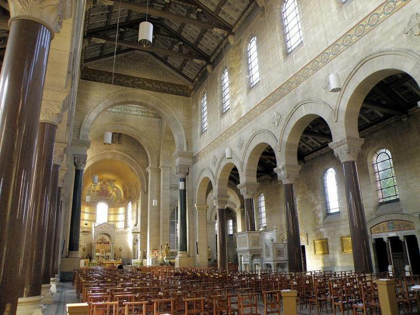

Via epost ontving ik onderstaand bericht:  

> **DE TRIDENTIJNSE H. MIS**  
> **VERHUIST**  
> vanaf zondag 7 april 2019 om 9.00 u.  
> NIEUWE LOCATIE:  
> **KERK VAN SINT-MICHIEL EN SINT-PETRUS**  
> CUYLITSSTRAAT 24, 2018 ANTWERPEN  
> (ingang langs de Amerikalei)  
> VAN HARTE WELKOM!

> _L.S.,  
> Na bijna 4 jaar te gast te zijn geweest in de kerk van Kristus Koning, verhuist de Tridentijnse H. Mis. Alle praktische aspecten zoals aanvangsuur, priester, biechtgelegenheid enz. blijven identiek. Deze H. Mis wordt ingericht door het bisdom omdat een aantal gelovigen dit destijds vroegen. Eén van die gelovigen was wijlen_ **_Kris Clauw_**_. Gedenk hem in uw gebeden.  
> Financieel wordt de H. Mis ondersteund door het verbond Pro Petri Sede. Wenst u te steunen dan kan dat op rekening IBAN BE92 0689 0252 6423, p/a Hemelstraat 36, 2018 Antwerpen, met mededeling Tr. H. Mis. Dank bij voorbaat._

De Sint-Michiels-en-Sint-Petruskerk behoort misschien officieel niet tot de reeks van [Antwerpse monumentale kerken](https://www.mkaweb.be/site/index.html), maar het is vast en zeker één van de mooiste---en grootste---kerken van onze stad. Ik bezoek ze zelf af en toe om de [mis op zondagavond](/blog/les-excuses-sont-faites-pour-sen-servir-maar-niet-in-antwerpen/) bij te wonen, een ideale fall-back als het 's ochtends niet lukt. Wie de kerk niet kent, kan het [interieur bewonderen in 3D](/blog/antwerpse-kerken-in-3d/) of de [drone-opname bekijken](/blog/een-drone-in-de-kerk/).  

Kerk van Sint-Michiel en Sint-Pieter in Antwerpen

Zoek je elders een Tridentijnse mis, dan is er een [kaart met een overzicht van Tridentijnse missen in Vlaanderen](/blog/biechtgelegenheid-en-tridentijnse-missen-in-vlaanderen/). Via dezelfde link krijg je ook een kaart met een overzicht waar er biechtgelegenheid is, dat kan in de Vasten zeker van pas komen! De gegevens voor biechtgelegenheid pluk ik van de website van het Nederlandse [Sint-Janscentrum](http://sint-janscentrum.nl/index.php?p=biecht). Voor de tridentijse missen vond ik de website [Mysterium Fidei](http://tridentijnsemis.blogspot.be/) als bron.
