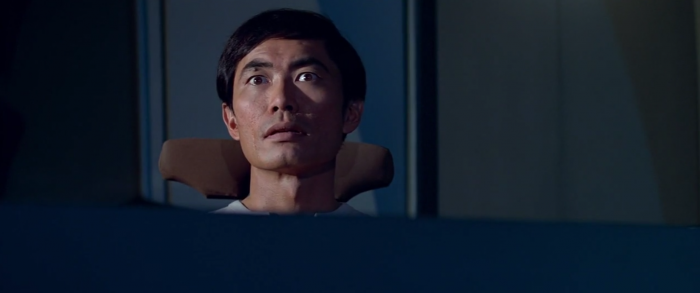
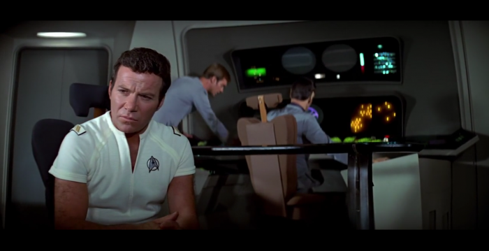
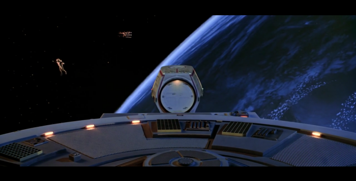
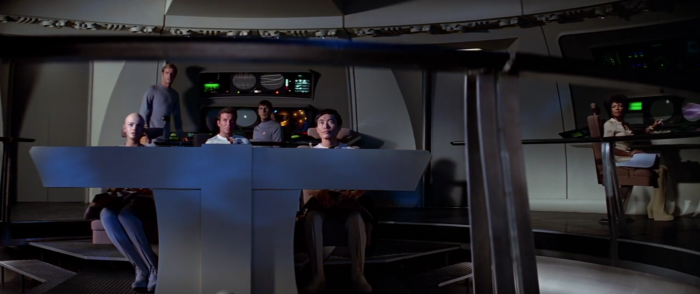
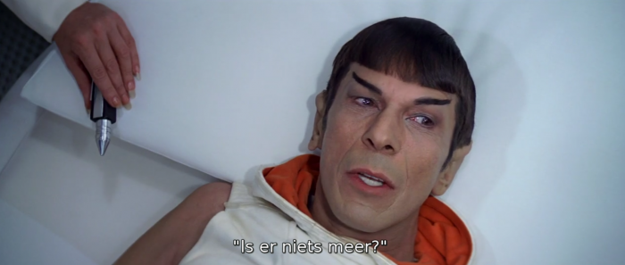
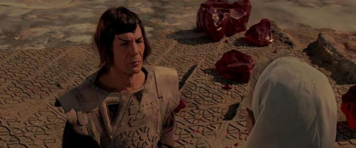

Ik ben de laatste om over "de jeugd van tegenwoordig" te beginnen. Het is me al lang duidelijk dat oudere generaties zonder het te beseffen de jeremiaden van hun eigen ouders herhalen en dat dit verschijnsel een eindeloos weerkerend fenomeen is.  

**Toch ben ik tot de slotsom gekomen dat de generatie die nu opgroeit, van alle hoop verstoken is!**  

Gisteren keek ik met de kinderen naar _Star Trek The Motion Picture._ Voor nummer één draaide het gebeuren eigenlijk om de pauze, wanneer er dessert was. De tweede zat heel de tijd te draaien en te woelen, want het was allemaal veel te moeilijk en de derde heeft lekker liggen slapen.  

- 
    
- 
    
- 
    
- 
    
- 
    

Mij viel de film buitengewoon goed mee. Ik had hem een kleine dertig jaar geleden al gezien en ik herinnerde me enkel de ontknoping. Dat gebeurt me uiterst zelden: een aflevering van een detectivereeks kan ik al binnen het half jaar met evenveel spanning opnieuw bekijken. Wat ik me niet meer herinnerde was de sfeer van de film. Ik verwachtte me aan toch enigszins actieve confrontaties met onbekende buitenaardse wezens, maar die confrontatie speelde zich uitsluitend af op het niveau van psychologie en emoties. Een "trage" film dus, met veel abstracte beelden, verstilde gelaatsuitdrukkingen en goeie sf-muziek, waarin het eigenlijke plot in de suspens verscholen zit.  

**/!\\** _verklappingswaarschuwing voor het vervolg van dit artikel_ **/!\\**  

De boodschap die de film geeft, is er een van hoop. De mechanische levensvorm die Aarde bedreigt, heeft qua wetenschappelijke kennis zowat alles wat er te kennen valt in het heelal doorgrond en is nu op zoek naar de Schepper van het geadopteerde ruimtetuig V'ger, dat de opdracht heeft om alle verzamelde kennis terug te sturen naar de Aarde (en dat uiteindelijk de fictieve NASA-ruimtesonde [Voyager VI](https://memory-alpha.fandom.com/wiki/Voyager_6) blijkt te zijn). Vanop Aarde wordt er na 300 jaar natuurlijk niet meer geantwoord op de antieke radiosignalen van de ruimtesonde en daardoor raakt de mechanische levensvorm behoorlijk gefrustreerd. Door de confrontatie met de "koolstofgebaseerde infectie" (lees: de bemanning) van het ruimteschip Enterprise, leert de mechanische levensvorm echter ontdekken dat er toch nog evolutie mogelijk is, voorbij de maximalisatie van wetenschappelijke kennis, in het voor een mechanische geest onvatbare verschijnsel van de "hoop".  

## De moraal van het verhaal

De hoop, een beetje veralgemeend, is de menselijke capaciteit om verwachtingen te koesteren die helemaal niet empirisch gefundeerd zijn. Hoop is dus ook een beetje wat je nodig hebt om een film te appreciëren die een verhaal brengt dat zich niet klip en klaar in flitsende actie voor de ogen van de kijker ontvouwt, om achter de beelden en de muziek op zoek te gaan naar de emoties en onuitgesproken ideeën.  

Wordt planeet Aarde bedreigd door een mechanische intelligentie? Of erdoor gered? Of geen van beide?

De steekproefsgewijze vaststelling van een totaal gebrek aan waardering voor deze film bij de hedendaagse jeugd, stemt me pessimistisch. Wat rest er hen nog aan verbeelding en aan hoop? Zelfs de klimaatmarsen, die door de 'oudere generatie' worden opgehemeld als tekenen van hoop in de jonge generatie, zijn---in de beleving van deze film---slechts een bevestiging van hun gebrek aan hoop, want zij zoeken evolutie naar een nieuwe toekomst uitsluitend in de mechanische controle over het klimaat, het "systeem".

Ik zou ze voorwaar liever op straat zien gaan met een slogan als "de verbeelding aan de macht!"

Of herhaal ik nu toch de jeremiade van alle tijden?

Mr. Spock speelt een belangrijke rol in de film. Zijn logische brein blijkt niet verbeeldingloos genoeg naar Vulcaanse normen, maar is toch het meest ontvankelijk voor communicatie met de mechanische intelligentie.
