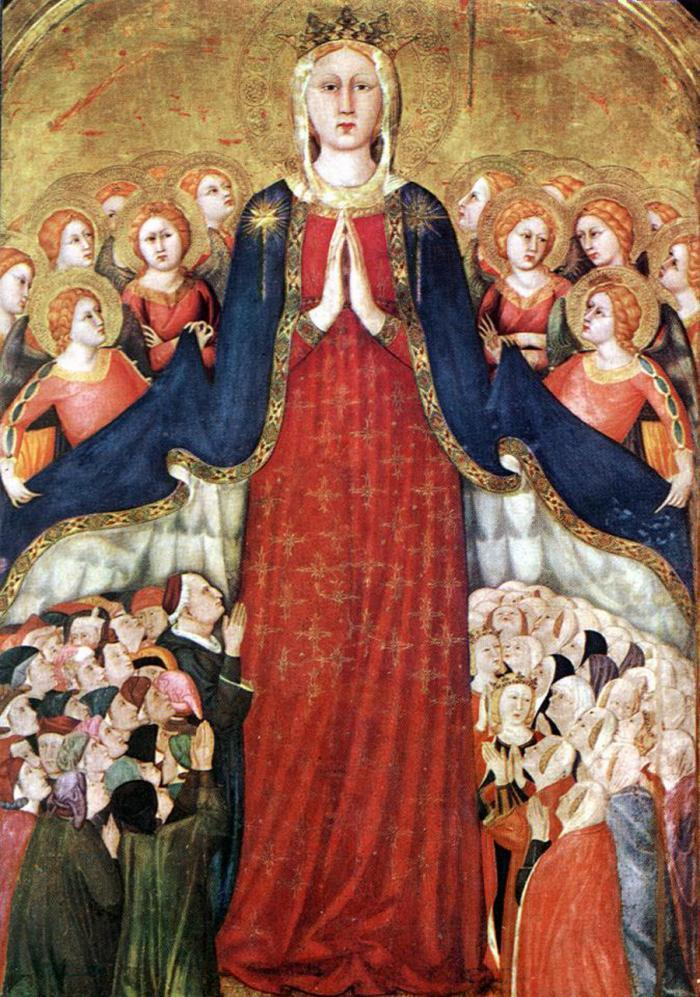

Vrome logica charmeert mij bijzonder. In onderstaand uittreksel van De Ware Godsvrucht, neemt de heilige Louis-Marie Grignon de Montfort ons bij de hand om, uitgaande van het beeld van het mystieke lichaam van Christus dat de apostel Paulus gebruikt in zijn eerste brief aan de Corinthiërs, via logische gevolgtrekkingen aan te tonen dat wijzelf ook Maria als onze moeder moeten beschouwen. En daar is geen speld tussen te krijgen!  

> Een mens en een mens is in haar geboren, zegt de heilige Geest: _Homo et homo natus est in ea_. Sommige vaders leggen deze tekst aldus uit: De eerste mens, die uit Maria werd geboren, is de Godmens, Jezus Christus; en de tweede een gewone mens, kind van God en van Maria door aanneming. Wanneer het hoofd van het menselijk geslacht Jezus Christus in haar werd geboren, dan is het logisch, dat ook de uitverkorenen, de ledematen van zijn mystiek Lichaam, in Maria het leven ontvangen. Een moeder brengt toch niet alleen het hoofd ter wereld zonder de ledematen; ook niet de ledematen zonder het hoofd. Dat zou immers een monster zijn in de natuur. Welnu, zo is het ook in de bovennatuur: zowel hoofd als ledematen komen voort uit dezelfde moeder. Indien dus een lid van het mystiek Lichaam van Jezus Christus, een voorbeschikte, een andere moeder zou hebben dan Maria, die het hoofd gebaard heeft, dan zou hij allerminst een uitverkorene of lidmaat van Jezus Christus zijn, maar een monster in de orde van de genade.  
> 
> Louis-Marie Grignon de Montfort, De Ware Godsvrucht, §32

Die Gottesmutter von Lippo Memmi
