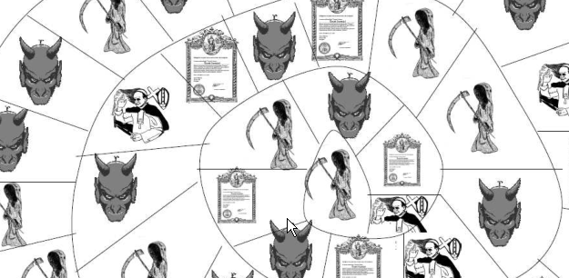
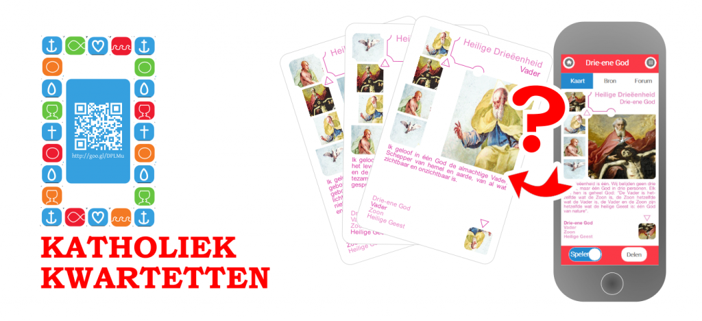
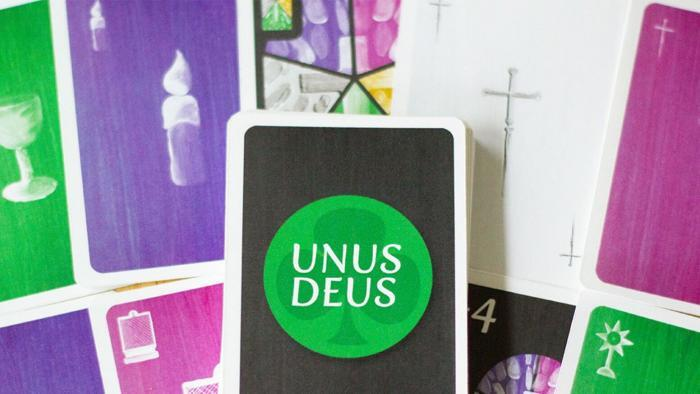
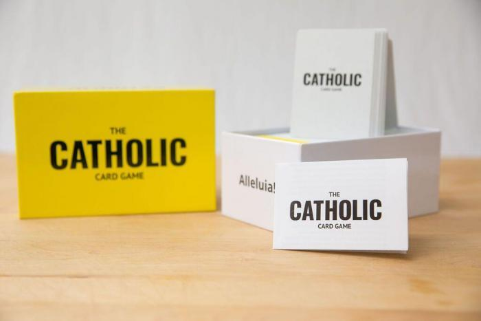

"Al spelend leren" klinkt geweldig en educatieve spelletjes zijn wel populair, maar niet zo in de nichemarkt van geloofsopvoeding. Misschien omdat er nogal veel moeite kruipt in het maken van een goed spel. Misschien omdat zo'n spelletje toch een minimum aan voorkennis vereist, die de meeste gelovigen niet meer meekrijgen. Toch bestaan ze, de katholieke spelletjes. Je kan ze gemakkelijk op internet terugvinden, maar hier krijg je niettemin een lijst met enkele verwijzingen.  

## Nederlandstalige spelletjes  

### Het is nooit te laat voor een aflaat.  

Het meest in het oog springende spelletje is ongetwijfeld gepubliceerd op de Thomaswebsite van het katholiek onderwijs. Het is een doe-het-zelfspelletje, dat wil zeggen dat je alle benodigdheden kan downloaden, afdrukken en zelf ineenknutselen.  

Het is nooit te laat voor een aflaat

Het thema van het spel zijn de "uitersten": Hemel, Hel en Vagevuur. Persoonlijk vind ik dat een interessant thema, maar het is een eufemisme om te zeggen dat deze elementen van ons geloof vandaag in brede katholieke kringen stiefmoederlijk bejegend worden. Daarom ben ik er nog niet helemaal uit of dit spel opgevat is als een cynische _practical joke_, dan wel als educatief leermiddel. Ik kan me niet voorstellen dat hiervoor onder godsdienstleerkrachten veel interesse bestaat, mocht het thema al in de leerplannen voorkomen. Niettemin lijkt er wel grondig over nagedacht te zijn en laat de [mededeling bij de publicatie](https://www.kuleuven.be/thomas/page/nieuwsbrief/view/58389/#item58392) toch uitschijnen dat het serieus is bedoeld---van de aangekondigde [spelendatabank](https://www.kuleuven.be/thomas/page/spelendatabank/) is voor de rest niet veel in huis gekomen.  

Het spel doet een beetje denken aan _Levensweg_. De spelers zijn echter niet de zieltjes, maar ze nemen de rol op van familiehoofd, duivel, dossiermanager, biechtvader, aflatenverkoper en God en ze hebben als taak zoveel mogelijk zieltjes in de Hemel te krijgen.  

[Spelregels en materiaal voor "Het is nooit te laat voor een aflaat"](https://www.kuleuven.be/thomas/page/spelendatabank-het-is-nooit-te-laat-voor-een-aflaat/) vind je op de Thomaswebsite.  

Elders op de Thomaswebsite vind je nog een reeks [katholieke varianten van bestaande spelen](https://www.kuleuven.be/thomas/page/werkvormen-gezelschapsspelen/): Pictionary, Domino, Kwartet, Memory, Time's up en Taboe.  

### Katholiek Kwartetten  

Katholiek kwartetten is een spel dat gelanceerd is op deze website, eveneens om zelf ineen te knutselen of om [online te bestellen](https://www.drivethrucards.com/product/146547/Katholiek-Kwartetten). Het is een klassiek kwartetspel, optioneel gekoppeld aan een digitale spelvariant met online kwis uit de Mechelse Catechismus.  

Katholiek Kwartetten

[Spelregels en materiaal voor Katholiek Kwartetten](/page/katholiek-kwartetten/) vind je op Geloven Leren.  

## Engelstalige spelletjes  

### Unus Deus  

Dit spel is nog niet beschikbaar, het is een lopend project op Kickstarter, dus er moeten nog voldoende fondsen gevonden worden om het spel te realiseren. Het wordt een variant op Uno, maar dan met liturgische kleuren en symbolen en de nodige uitleg daarbij op de achterkant van de kaarten.  

Unus Deus

De pagina van [Unus Deus op Kickstarter](https://www.kickstarter.com/projects/346904431/unus-deus-a-catholic-liturgical-card-game-for-kids?ref=creator_nav&fbclid=IwAR3EsEGGBXnypc7QgwFibfYX_YSBJOtXbFGOay_95LAAPbGAFM00vexwJ4s).  

### The CATHOLIC Card Game  

Afgaande op de beschrijving op de website lijkt dit meer een spel voor volwassenen. Het is een heel interactief en gevat spel gebaseerd op een set van 480 speelkaarten (met uitbreidingspacks). Je kan het spel bestellen of het [aan een goedkopere prijs aankopen om zelf af te drukken](https://catholiccardgame.com/products/print-at-home-base-game).  

The CATHOLIC Card Game

_"A fun party game that combines the love of your faith and your incredible sense of humor."_  

De website van [The CATHOLIC Card Game](https://catholiccardgame.com/pages/about).  

Elders vind je ook reeksen katholieke [quizzes](https://www.sporcle.com/games/tags/catholic), een eindeloze lijst [DIY-games](http://catholicblogger1.blogspot.com/p/games.html) en een [online winkel met tal van katholieke games](https://www.catholiccompany.com/catholic-games-activities-c1287/).
