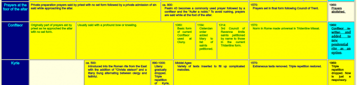

Op Twitter lees ik bij [Stefan Paas](https://twitter.com/StefanPaas) regelmatig prikkelende stukjes. Paas is in Nederland dit jaar "Theoloog des Vaderlands". Zijn katholieke [voorgangers](https://nl.wikipedia.org/wiki/Theoloog_des_vaderlands) lagen me minder, die zaten niet in mijn Twittervolglijst. Hijzelf is niet katholiek, maar zit ergens in het protestantse spectrum, vraag me niet precies waar, maar zijn Wikipagina vermeldt wel dat zijn [benoeming als hoogleraar gecontesteerd](https://nl.wikipedia.org/wiki/Stefan_Paas#Hoogleraarschap) werd. Misschien omdat hij stiekem een [beetje te katholiek](https://www.theoblogie.nl/een-rooms-katholiek-priester-over-de-priesterkerk-van-paas/) is om fatsoenlijk te zijn?  

Laatst was hij op Twitter [druk aan het citeren](https://twitter.com/StefanPaas/status/1125034330454134784) uit een boek van Anton van Duinkerken, waaronder deze passage:  



De context van het citaat heb ik niet mee, dus wat Van Duinkerken er precies mee bedoelde is me niet duidelijk. Ik lees het citaat in de context van het debat over de plaats van geloof in de samenleving. Geloof kan je niet terugdringen tot de private ruimte, hoewel velen dat zouden willen. Dat zegt ook Saskia van den Kieboom op Logia:  

https://www.logia.be/algemeen/saskia-van-den-kieboom-religie-kan-niet-zomaar-geweerd-worden-uit-de-publieke-ruimte/

Als gelovigen mogen we ons echter niet teveel focussen op die publieke ruimte. Misschien vind je het raar, maar ik heb de neiging het standpunt van de vrijzinnigen te beamen, dat we als gelovigen de publieke ruimte _te snel_ willen inpalmen als speelveld van ons geloofsleven en dat we er meer aan zouden hebben het zwaartepunt van ons geloofsleven in de private ruimte te leggen.  

Als gelovige ben je natuurlijk voor vrede, maar ik ben van mening dat je niet moet gaan betogen voor vrede in de wereld, als je geen vrede kan maken met je collega's, klasgenoten, buren of familieleden. En je moet geen vrede willen maken in de kleine gemeenschap van collega's, klasgenoten, buren of familie, als je geen vrede hebt in je eigen hart.  

Jezus richt ons op onze _naaste_ en Hij maant ons aan geen offer naar de tempel te brengen als we nog ruzie hebben met onze buur.

Het heeft alleen maar zin tekenen van je geloof achter te laten in de publieke ruimte, als die ook stevig gegrondvest zijn in de private ruimte, in de allerkleinste (geloofs)gemeenschap van je persoonlijk geloofsleven, je gezin, je straat of je parochie. En het heeft maar zin je geloof te beleven in je gezin of in je parochie, als het berust op de vrede van het geloof in je eigen hart.  

Vanuit die idee, voel ik me altijd goed als aan het begin van de zondagsmis het _confiteor_, de [schuldbelijdenis](https://nl.wikipedia.org/wiki/Confiteor), wordt gebeden. Het is het moment in de liturgie waarop je als gelovige beroep doet op je aanwezige medegelovigen, op de engelen die zich rond het altaar voorbereiden op de komst van hun Heer en op de gemeenschap van de heiligen in de Hemel, om te bidden voor vergiffenis van je zonden. En op hun beurt vragen mijn medegelovigen mij mee te bidden voor de vergiffenis van hun zonden.

> Ik belijd voor de almachtige God, **en voor u allen**, dat ik gezondigd heb in woord en gedachte, in doen en laten, door mijn schuld, door mijn schuld, door mijn grote schuld. Daarom smeek ik de heilige maagd Maria, alle engelen en heiligen, **en u, broeders en zusters**, voor mij te bidden tot de Heer, onze God.

Als dat geen intieme verbondenheid schept!  

Vanuit de nederige verbondenheid in die kleine gemeenschap, zal het geloof zich krachtig kunnen ontplooien en---wie weet---zelfs zijn tekenen achterlaten in de publieke ruimte, na de mis. Maar niet zonder die verbondenheid.  

Dat is blijkbaar niet de mening van sommige theologen, zoals geciteerd op de Engelse Wikipagina: [_Liturgical theologians ask_](https://en.wikipedia.org/wiki/Penitential_Rite#Usage_in_Roman_Catholicism) _"why run the risk of individualizing members of the assembly in a penitential mode after they have gathered precisely as a worshipping community?"..._ Mijn ervaring is dat dit gebed _niet_ individualiseert, _integendeel:_ het verbindt! Veel meer dan het gewone kyriegebed en het gaat ook dieper dan (of alleszins: vooraf aan) het handjes schudden tijdens de vredeswens.  

Mijn sympathie voor het [_confiteor_](https://gebeden.gelovenleren.net/#h2-confiteor) is nog sterker omdat het op vele plaatsen _niet_ wordt gebeden. Dat is geen liturgische inbreuk, want het missaal voorziet nog drie alternatieven om de boeteritus te voltrekken, te weten, in volgorde van populariteit: (1) de [kyrieverzen](https://gebeden.gelovenleren.net/#h2-lit-kyrie), voorafgegaan door aanroepingen, (2) de besprenkeling met wijwater, en (3) dan nog een [derde vorm](https://gebeden.gelovenleren.net/#h2-misericordiam), volgens mijn missaal, maar ik heb hem nog nooit meegemaakt \[1\].  

Bij de afsluitende formule die de priester na het _confiteor_ uitspreekt ("Moge de almachtige God zich over ons ontfermen, onze zonden vergeven en ons geleiden tot eeuwig leven"), maak ik ook steevast een kruisteken, om het sacramentale te bekrachten (dat [_geen sacrament_](https://zenit.org/articles/penitential-rite-and-absolution/) is), zoals dat in de oude mis ook volgt op het _confiteor_, een gewoonte die gelukkig ongevaarlijk is en die ik dan maar opvat als een eerherstel voor het optioneel maken van dit gebed.  

De geschiedenis van het confiteor

In de loop van de geschiedenis is er wel wat [gesleuteld aan het _confiteor_](https://www.ecclesiadei.nl/docs/timeline.html)_,_ heiligen toegevoegd en dan weer weggehaald en op zijn 'hoogtepunt' werd het [wel tot driemaal toe](https://en.wikipedia.org/wiki/Confiteor#Occasions_of_recitation) gehoord in de mis: tweemaal tijdens de gebeden aan de voet van het altaar, door de priester en vervolgens door de misdienaar en nogmaals voor de uitreiking van de communie.  

Gelukkig is het er nog, want ik zou geen mis meer zonder kunnen!  

* * *

\[1\] Die derde vorm van de boeteritus gaat als volgt: _℣ Heer, ontferm U over ons. ℟ Wij hebben gezondigd. ℣ Toon ons, Heer, uw barmhartigheid. ℟ En schenk ons Uw heil. ℣ Moge de almachtige God zich over ons ontfermen, onze zonden vergeven, en ons geleiden tot het eeuwig leven. ℟ Amen._
