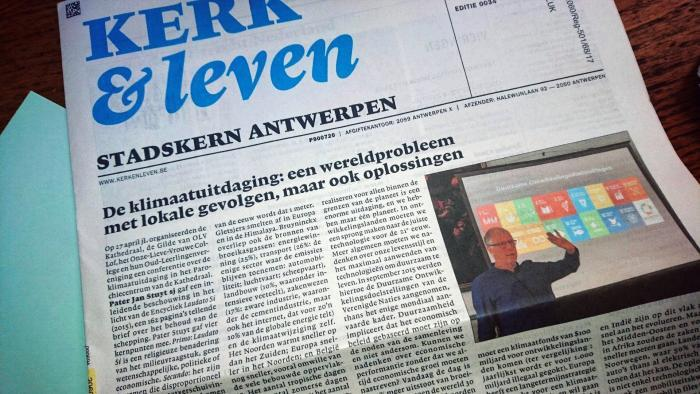
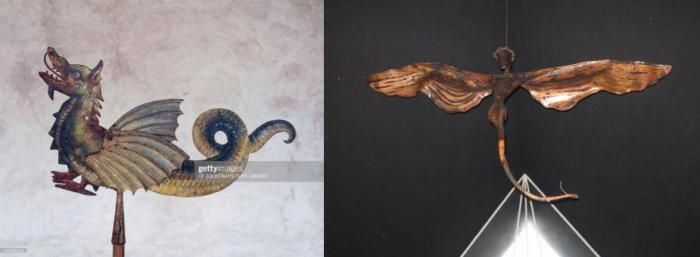

Vanmorgen zat er in mijn RSS-feed een artikeltje over _Rogation Days._ In het Nederlands heet dat "Kruisdagen" (ik heb het even moeten opzoeken, want eerst dacht ik aan de quatertemperdagen, maar dat heet in het Engels "ember days").

Die Kruisdagen zijn we net gepasseerd, het zijn immers de drie dagen voor het hoogfeest van Hemelvaart. In jouw parochie zal je er niet veel van gemerkt hebben, want sinds het concilie zijn ze van de kalender weggehaald, maar in meer traditionele kringen bestaan ze nog, zo [bijvoorbeeld in de Priorij Thabor](https://priorijthabor.blogspot.com/2019/05/kruisdagen-en-kruisprocessie-we-zijn.html) te Sint Odiliënberg, leer ik op hun blog.

Op de Kruisdagen wordt er processie gehouden en gebeden voor een goede oogst. De gelovigen hopen dus dat ze door hun gebed het klimaat een beetje naar hun hand kunnen zetten. In die zin is de kruisdagprocessie een klimaatmars _avant la lettre_.

Ook vandaag nog is de Kerk in de ban van het klimaat. De voorpagina van ons parochieblad was gevuld met het verslag van een lezing over dat onderwerp. Dat vindt men in brede kringen belangrijk, maar van een hernieuwde belangstelling voor de Kruisdagen heb ik nog niet vernomen. We hebben immers God niet meer nodig om het klimaat te regelen, dat kunnen we tegenwoordig beter zelf!

Kerk & Leven met thema van de Kruisdagen

Nog een interessant weetje vernam ik op de website [New Liturgical Movement](http://www.newliturgicalmovement.org/2019/05/how-medieval-christians-celebrated.html). Op kruisdagprocessies werd vroeger behalve relikwieën van heiligen ook een beeld van een draak meegedragen. Die verbeeldt de Duivel en zijn bekoring. Op de eerste twee dagen was de staart van de draak opgeheven en de derde dag hing de staart slap. Dat verzinnebeeldt de periode voor de Wet, onder de Wet en na de Verlossing. Misschien is dat [spuuglelijke beeld dat in de kerk van Sleihage hangt](/blog/moderne-kunst-vrijgeleide-voor-godslastering/) wel een moderne versie van zo'n processiebeeld!  

Een modern beeld voor de Kruisdagprocessie?

In elk geval is op de klimaatmarsen uit de meegedragen spandoeken met obscene slogans wel duidelijk geworden dat die Duivel met zijn bekoringen nog steeds lustig aan het werk is. En ook het nieuwe geloof dat we het klimaat zelf gaan regelen, zou wel eens een ingefluisterde vorm van hoogmoed kunnen zijn.
