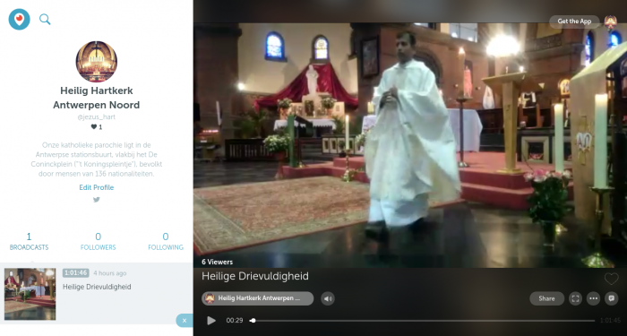
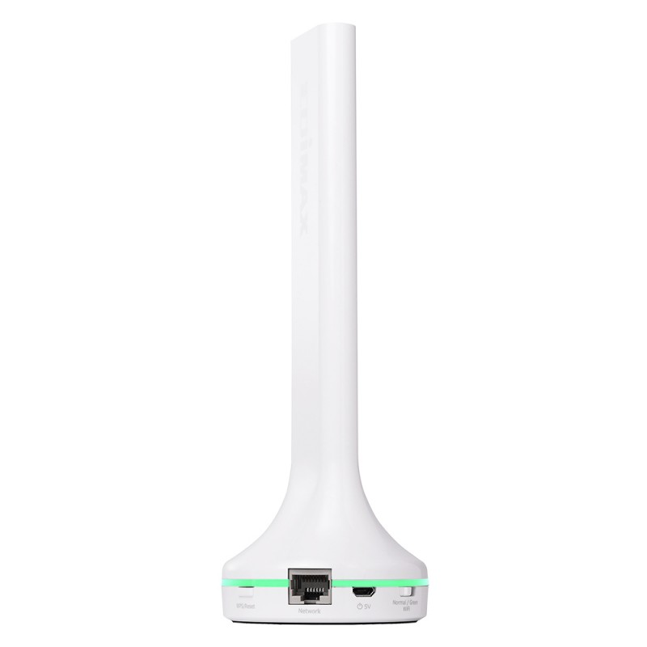
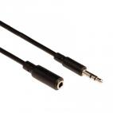
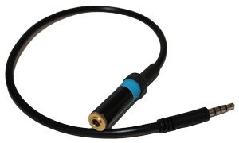
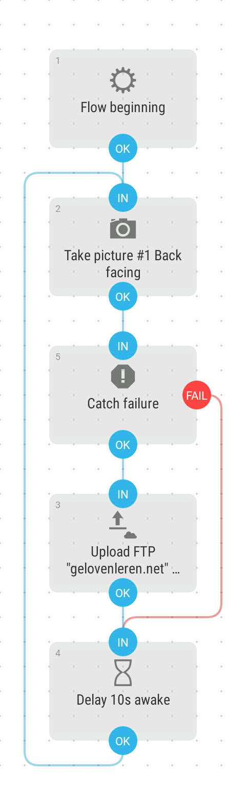

Twee jaar geleden kreeg ik de suggestie om eens uit te zoeken of we de zondagsmis op onze parochie niet live zouden kunnen uitzenden via internet. Na een jaar bezinken, sudderen en experimenteren was het met Pasen 2018 eindelijk zo ver: mijn oude gsm en een wirwar aan kabeltjes volstonden om [zonder veel moeite elke zondag de mis uit te zenden](/blog/een-oude-gsm-gebruiken-als-camera-voor-webcam-en-live-streaming/). De voornaamste onderdelen van de oplossing waren:

- een oude gsm op een vaste opstelling in de kerk
- 30m audiosnoer naar de versterker van de geluidsinstallatie
- de apps [TeamViewer Host](https://play.google.com/store/apps/details?id=com.teamviewer.host.market) en [TeamViewer](https://play.google.com/store/apps/details?id=com.teamviewer.teamviewer.market.mobile) om de gsm vanop afstand te kunnen bedienen met mijn eigen gsm
- de app [Audio Visualizer](https://play.google.com/store/apps/details?id=com.drstaf.audiovisualizer) om eenvoudig een soundcheck te doen alvorens de opname te starten
- de app [YouTube](https://play.google.com/store/apps/details?id=com.google.android.youtube) om de eucharistievieringen op voorhand in te plannen en om op het moment zelf de opname en live uitzending op te starten.

Dat liep bijna een jaar heel goed, totdat…

1. Youtube (Google dus) van de ene dag op de ander besloot dat er met de mobiele app niet meer kan gestreamd worden als je [geen 1000 abonnees in je kanaal](https://support.google.com/youtube/thread/3612372?hl=en) hebt (wij hadden er op dat moment 12)
2. TeamViewer even plots weigert te verbinden met de gsm, omdat ze denken dat ik de tool voor commerciele doeleinden gebruik en dus eerst een licentie moet aanschaffen.
3. Proximus onze bandbreedte decimeert, omdat de kerkraad een probleem heeft met cash flow en de domiciliering van de laatste twee facturen niet doorgekomen was.

Probleem 3 was het snelst opgelost. Probleem 2 is intussen ook opgelost. Het volstaat blijkbaar een aanvraag te richten aan de mensen bij TeamViewer met een verklaring dat er _geen_ commerciele activiteiten gemoeid zijn met het gebruik van hun tool. Na een kleine twee weken hebben ze mij terug toegang gegeven, maar intussen had ik al een alternatief, waarover meer. Probleem 1 is niet zomaar op te lossen. Ook daarvoor was een alternatief noodzakelijk.

### Probleem 1: Youtube beperkt het gebruik van de mobiele app voor streaming

Het meest voor de hand liggende alternatief voor Youtube is Facebook. Daar kan je ook via de mobiele app live streamen. We willen echter een open platform. Niet iedereen heeft (gelukkig) een Facebookaccount. Op Youtube kan iedereen kijken, zonder zich te moeten aanmelden.

Na veel zoeken en experimenteren had ik mijn hoop gevestigd op [Streamlabs](https://streamlabs.com/). StreamLabs is een volledig platform voor opname, uitzending en publicatie van filmpjes met een hoop toeters en bellen waarvan ik nauwelijks iets snap, maar ze hebben ook een mobiele app, en die is wel gebruiksvriendelijk. Wat nog mooier is: met Streamlabs kan je uitzenden op Youtube! Ons kanaal zou dus gewoon kunnen blijven bestaan en iedereen zou nog steeds alle opnames kunnen blijven bekijken. Wat blijkt echter: Streamlabs werkt voor geluid [uitsluitend met de ingebouwde microfoon](https://ideas.streamlabs.com/ideas/SL-I-1260) van de gsm. Voor een grote ruimte met geluidsversterking is dat hopeloos. De verlengkabel naar de versterker ligt trouwens al gereed!

Conclusie: er is **geen werkbaar alternatief om via Youtube** te blijven uitzenden.

Dus verder op zoek. Je merkt al gauw dat livestreaming tegenwoordig vooral iets is van _gamers_ en _vloggers_. [Twitch](https://www.twitch.tv/) bijvoorbeeld is een platform waar je ongeveer hetzelfde kan doen als op Youtube. [Erg welkom](https://www.reddit.com/r/Twitch/comments/8geudp/can_you_stream_church_services_on_twitch/) zijn kerkdiensten echter niet op dit platform!

### Periscope up!

[Periscope](https://www.pscp.tv/) blijkt uiteindelijk het platform dat aan al onze vereisten voldoet:

- live streaming en opname om achteraf te bekijken
- toegankelijk voor iedereen om te kijken, je moet geen speciaal account hebben
- gratis: geen tools met betalende licenties, geen dure apparatuur
- geluid via externe geluidsbron
- eenvoudige workflow: het opstarten en afsluiten van de opnames moet op een paar minuten te regelen zijn, via afstandsbediening, zonder de vaste opstelling te moeten verbreken

Ik zie twee nadelen tegenover Youtube:

- je zit niet meer op een Google-platform, dus als je wil dat mensen je vinden via de zoekmachine, zal je ook werk moeten maken van een eigen website
- je kan geen evenementen op voorhand inplannen

Periscope is een dienst van Twitter, dus je vindt nu de [parochie van het Heilig Hart van Jezus op Periscope](https://www.pscp.tv/jezus_hart/) en op [Twitter](https://twitter.com/jezus_hart).  

Videokanaal op Periscope

Om op de hoogte te blijven van de uitzendingen, kan je onze parochie [volgen op Twitter](https://twitter.com/jezus_hart).

Wat we nu met ons [Youtubekanaal](https://www.youtube.com/channel/UCHEqX9lP-1Ro2zHy0kIdWwA?view_as=subscriber) gaan doen, is niet duidelijk. De oude uitzendingen blijven online, evenals de [timelapse-video](https://youtu.be/tQoZW0HBuPs) met geluidsfragmenten uit onze liturgie.

Op de [website](https://www.kerknet.be/organisatie/parochie-heilig-hart-van-jezus-antwerpen/) of op [facebook](https://www.facebook.com/antonius.heilighart.antwerpen/) zullen vanaf nu links naar de nieuwe uitzendingen via Periscope verschijnen.

### Probleem 2: Teamviewer blokkeert het account omdat ze commerciële activiteiten vermoeden

Zoals gezegd, is het probleem intussen opgelost door Teamviewer een mailtje te sturen met een verantwoording van het gebruik. Intussen had ik reeds enige prospectie gedaan naar alternatieven. AirDroid is een valabel alternatief (met AirMirror op de "afstandsbediening"), maar alleen als je camera-gsm _"root"_\-toegang heeft. Da's een vorm van _hacking_ waarmee je niet alleen de garantie op je toestel verliest, maar het in het ergste geval kan herleiden tot een leuke presse-papier. Mij is het gelukt, maar ik ben er wel een avondje mee zoet geweest.

Alle onderdelen op een rijtje gezet:

### Apps















### Materiaal

- 
    
    Een oude gsm met werkende camera, hoofdtelefoonaansluiting en netwerk.
    
- 
    
    Extra access point
    
- 
    
    Heel wat meters netwerkkabel
    
- 
    
    Verloopplug voor de versterker
    
- 
    
    Audio-verlengsnoer
    
- 
    
    Line out verbindingskabel met de hoofdtelefoonaansluiting van de gsm
    

Zo ziet een scriptje op Automate eruit, dat voor de registratie van de webcambeelden zorgt:

